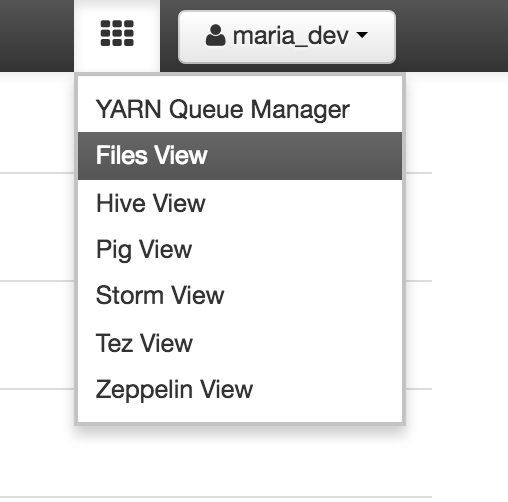
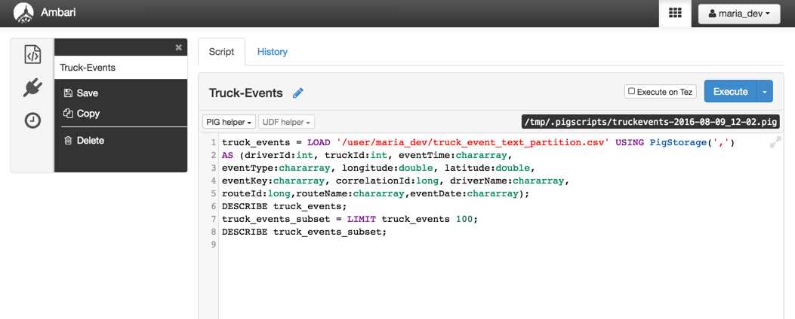
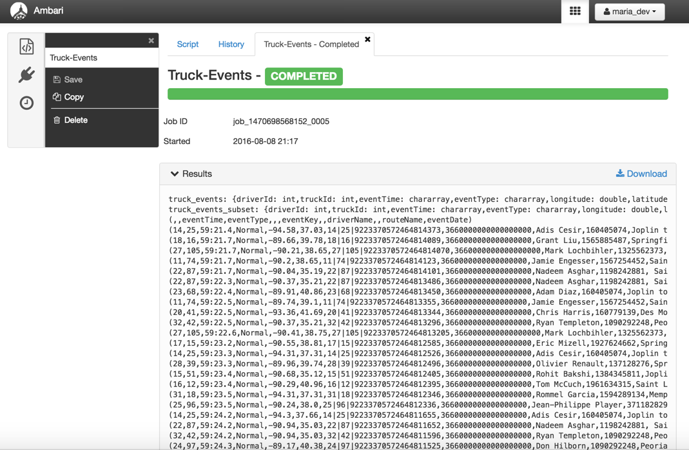
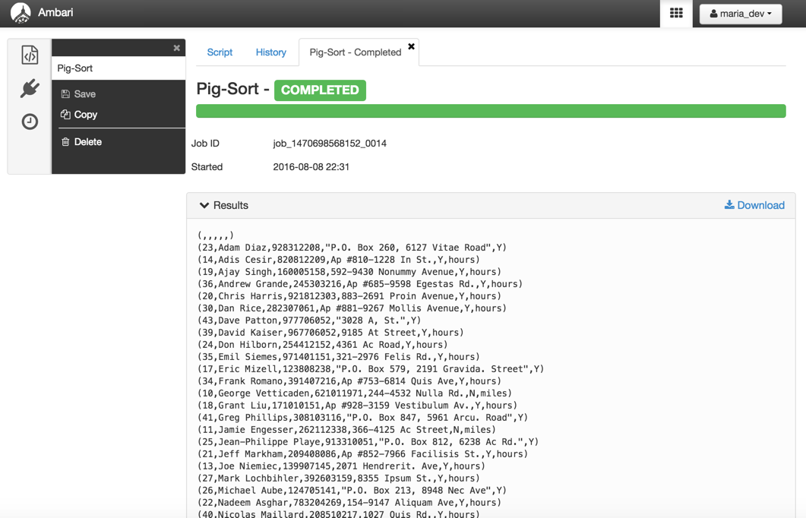

# Beginners Guide to Apache Pig

## Introduction

In this tutorial you will gain a working knowledge of Pig through the hands-on experience of creating Pig scripts to carry out essential data operations and tasks.

We will first read in two data files that contain driver data statistics, and then use these files to perform a number of Pig operations including:

*   Define a relation with and without `schema`
*   Define a new relation from an `existing relation`
*   `Select` specific columns from within a relation
*   `Join` two relations
*   Sort the data using `‘ORDER BY’`
*   FILTER and Group the data using `‘GROUP BY’`

## Prerequisites
-  Downloaded and Installed latest [Hortonworks Sandbox](https://hortonworks.com/downloads/#sandbox)
-  [Learning the Ropes of the Hortonworks Sandbox](https://hortonworks.com/hadoop-tutorial/learning-the-ropes-of-the-hortonworks-sandbox/)
-  Allow yourself around one hour to complete this tutorial

## Outline
- [What is Pig?](#what-is-pig)
- [Step 1: Download the Data](#download-the-data)
- [Step 2: Upload the data files](#step-2-upload-the-data-files)
- [Step 3: Create Your Script](#step-3-create-your-script)
- [Step 4: Define a relation](#step-4-define-a-relation)
- [Step 5: Save and Execute the Script](#step-5-save-and-execute-the-script)
- [Step 6: Define a Relation with a Schema](#step-6-define-a-relation-with-a-schema)
- [Step 7: Define a new relation from an existing relation](#step-7-define-a-new-relation-from-an-existing-relation)
- [Step 8: View the Data](#step-8-view-the-data)
- [Step 9: Select specific columns from a relation](#step-9-select-specific-columns-from-a-relation)
- [Step 10: Store relationship data into a HDFS File](#step-10-store-relationship-data-into-a-hdfs-file)
- [Step 11: Perform a join between 2 relations](#step-11-perform-a-join-between-2-relations)
- [Step 12: Sort the data using “ORDER BY”](#step-12-sort-the-data-using-order-by)
- [Step 13: Filter and Group the data using “GROUP BY”](#step-13-filter-and-group-the-data-using-group-by)
- [Further Reading](#further-reading)

## What is Pig? 

`Pig` is a high level scripting language that is used with Apache Hadoop. Pig enables data workers to write complex data transformations without knowing Java. Pig’s simple SQL-like scripting language is called Pig Latin, and appeals to developers already familiar with scripting languages and SQL.

Pig is complete, so you can do all required data manipulations in Apache Hadoop with Pig. Through the User Defined Functions(UDF) facility in Pig, Pig can invoke code in many languages like JRuby, Jython and Java. You can also embed Pig scripts in other languages. The result is that you can use Pig as a component to build larger and more complex applications that tackle real business problems.

Pig works with data from many sources, including structured and unstructured data, and store the results into the Hadoop Data File System.

Pig scripts are translated into a series of MapReduce jobs that are run on the Apache Hadoop cluster.

## Step 1: Download the Data 

Download the driver data file from [here](assets/driver_data.zip).
Once you have the file you will need to unzip the file into a directory. We will be uploading two csv files - `truck_event_text_partition.csv` and `drivers.csv`.

## Step 2: Upload the data files 

Select the `HDFS Files view` from the Off-canvas menu at the top. That is the `views menu`. The HDFS Files view allows you to view the Hortonworks Data Platform(HDP) file store. The HDP file system is separate from the local file system.

Navigate to `/user/maria_dev` or a path of your choice, click `Upload` and `Browse`, which brings up a dialog box where you can select the `drivers.csv` file from your computer. Upload the `truck_event_text_partition.csv` file in the same way. When finished, notice that both files are now in HDFS.

## Step 3: Create Your Script 

Open the Pig interface by clicking the `Pig View` in the `views menu`.

On the left we can choose between our saved `Pig Scripts`, `UDFs` and the `Pig Jobs` executed in the past. To the right of this menu bar we see our saved Pig Scripts.

Click on the button ``"New Script"``, enter “Truck-Events” for the title of your script and leave the location path empty:

Below you can find an overview about which functionalities the pig interface makes available. A special feature of the interface is the PIG helper at the top left of the composition area, which provides templates for Pig statements, functions, I/O statements, HCatLoader() and Python user defined functions.

## Step 4: Define a relation 

In this step, you will create a script to load the data and define a relation.

* On line 1 define a relation named `truck_events` that represents all the truck events
* On line 2 use the `DESCRIBE` command to view the `truck_events` relation

The completed code will look like:

~~~
truck_events = LOAD '/user/maria_dev/truck_event_text_partition.csv' USING PigStorage(',');
DESCRIBE truck_events;
~~~

> **Note:** In the LOAD script, you can choose any directory path. Verify the folders have been created in HDFS Files View.

## Step 5: Save and Execute the Script 

Click the `Save` button to save your changes to the script. Click `Execute` to run the script. This action creates one or more MapReduce jobs. After a moment, the script starts and the page changes. Now, you have the opportunity to Kill the job in case you want to stop the job.

Next to the `Kill job button` is a `progress bar` with a text field above that shows the `job’s status`.

When the job completes, check the results in the green box. You can also download results to your system by clicking the download icon. Notice truck_events does not have a schema because we did not define one when loading the data into relation truck_events.

## Step 6: Define a Relation with a Schema 

Let’s use the above code but this time with a schema. Modify line 1 of your script and add the following `AS` clause to define a schema for the truck events data. The complete code will be:

~~~
truck_events = LOAD '/user/maria_dev/truck_event_text_partition.csv' USING PigStorage(',')
AS (driverId:int, truckId:int, eventTime:chararray,
eventType:chararray, longitude:double, latitude:double,
eventKey:chararray, correlationId:long, driverName:chararray,
routeId:long,routeName:chararray,eventDate:chararray);
DESCRIBE truck_events;
~~~

Save and execute the script again. This time you should see the schema for the truck_events relation:

## Step 7: Define a new relation from an existing relation 

You can define a new relation based on an existing one. For example, define the following truck_events_subset relation, which is a collection of 100 entries (arbitrarily selected) from the truck_events relation.
Add the following line to the end of your code:

~~~
truck_events_subset = LIMIT truck_events 100;
DESCRIBE truck_events_subset;
~~~

Save and execute the code. Notice `truck_events_subset` has the same schema as `truck_events`, because  `truck_events_subset` is a subset of `truck_events` relation.

## Step 8: View the Data 

To view the data of a relation, use the `DUMP` command.
Add the following `DUMP` command to your Pig script, then save and execute it again:

~~~
DUMP truck_events_subset;
~~~

The command requires a MapReduce job to execute, so you will need to wait a minute or two for the job to complete. The output should be 100 entries from the contents of `truck_events_text_partition.csv` (and not necessarily the ones shown below, because again, entries are arbitrarily chosen):

## Step 9: Select specific columns from a relation 

Delete the `DESCRIBE truck_events`, `DESCRIBE truck_events_subset` and `DUMP truck_events_subset` commands from your Pig script; you will no longer need those.
One of the key uses of Pig is data transformation. You can define a new relation based on the fields of an existing relation using the `FOREACH` command. Define a new relation `specific_columns`, which will contain only the `driverId`, `eventTime` and `eventType` from relation `truck_events_subset`.
Now the completed code is:

~~~
truck_events = LOAD '/user/maria_dev/truck_event_text_partition.csv' USING PigStorage(',')
AS (driverId:int, truckId:int, eventTime:chararray,
eventType:chararray, longitude:double, latitude:double,
eventKey:chararray, correlationId:long, driverName:chararray,
routeId:long,routeName:chararray,eventDate:chararray);
truck_events_subset = LIMIT  truck_events 100;
specific_columns = FOREACH truck_events_subset GENERATE driverId, eventTime, eventType;
DESCRIBE specific_columns;
~~~

Save and execute the script and your output will look like the following:

## Step 10: Store relationship data into a HDFS File 

In this step, you will use the `STORE` command to output a relation into a new file in HDFS. Enter the following command to output the `specific_columns` relation to a folder named `output/specific_columns`:

~~~
STORE specific_columns INTO 'output/specific_columns' USING PigStorage(',');
~~~

Save and Execute the script. Again, this requires a MapReduce job (just like the DUMP command), so you will need to wait a minute for the job to complete.

Once the job is finished, go to `HDFS Files view` and look for a newly created folder called `“output”` under `/user/maria_dev`:

> **Note:** If you didn't use the default path above, then the new folder will exist in the path you created.

Click on `“output”` folder. You will find a subfolder named `“specific_columns”`.

Click on `“specific_columns”` folder. You will see an output file called `“part-r-00000”`:

Click on the file `“part-r-00000”` and then click on `Open` :

## Step 11: Perform a join between 2 relations 

In this step, you will perform a `join` on two driver statistics data sets: `truck_event_text_partition.csv` and the `driver.csv` files. Drivers.csv has all the details for the driver like driverId, name, ssn, location, etc.

You have already defined a relation for the events named truck_events. Create a new Pig script named `“Pig-Join”`. Then define a new relation named `drivers` then join truck_events and drivers by `driverId` and describe the schema of the new relation `join_data`.
The completed code will be:

~~~
truck_events = LOAD '/user/maria_dev/truck_event_text_partition.csv' USING PigStorage(',')
AS (driverId:int, truckId:int, eventTime:chararray,
eventType:chararray, longitude:double, latitude:double,
eventKey:chararray, correlationId:long, driverName:chararray,
routeId:long,routeName:chararray,eventDate:chararray);
drivers =  LOAD '/user/maria_dev/drivers.csv' USING PigStorage(',')
AS (driverId:int, name:chararray, ssn:chararray,
location:chararray, certified:chararray, wage_plan:chararray);
join_data = JOIN  truck_events BY (driverId), drivers BY (driverId);
DESCRIBE join_data;
~~~

Save the script and execute it. Notice `join_data` contains all the fields of both `truck_events` and `drivers`.

Scroll right in Results section to view other attributes, or simply click `Download` button. Open that file and you will something like this:

## Step 12: Sort the data using “ORDER BY” 

Use the `ORDER BY` command to sort a relation by one or more of its fields. Create a new Pig script named `“Pig-Sort”` and enter the following commands to sort the drivers data by name then date in ascending order:

~~~
drivers =  LOAD '/user/maria_dev/drivers.csv' USING PigStorage(',')
AS (driverId:int, name:chararray, ssn:chararray,
location:chararray, certified:chararray, wage_plan:chararray);
ordered_data = ORDER drivers BY name asc;
DUMP ordered_data;
~~~

Save and execute the script. Your output should be sorted as shown here:

## Step 13: Filter and Group the data using “GROUP BY” 

The `GROUP` command allows you to group a relation by one of its fields. Create a new Pig script named `“Pig-Group”`. Then, enter the following commands, which group the `truck_events` relation by the `driverId` for the `eventType` which are not ‘Normal’.

~~~
truck_events = LOAD '/user/maria_dev/truck_event_text_partition.csv' USING PigStorage(',')
AS (driverId:int, truckId:int, eventTime:chararray,
eventType:chararray, longitude:double, latitude:double,
eventKey:chararray, correlationId:long, driverName:chararray,
routeId:long,routeName:chararray,eventDate:chararray);
filtered_events = FILTER truck_events BY NOT (eventType MATCHES 'Normal');
grouped_events = GROUP filtered_events BY driverId;
DESCRIBE grouped_events;
DUMP grouped_events;
~~~

Save and execute the script. Notice that the data for eventType which are not Normal is grouped together for each driverId.

Scroll right to view all non-Normal events grouped under each driverId. You can also download the results file by clicking Download button.

Congratulations! You have successfully completed the tutorial and well on your way to pigging on Big Data.

## Further Reading 
- [Apache Pig](https://hortonworks.com/hadoop-tutorial/how-to-process-data-with-apache-pig/)
- [Welcome to Apache Pig!](https://pig.apache.org/)
- [Pig Latin Basics](https://pig.apache.org/docs/r0.12.0/basic.html#store)
- [Programming Pig](http://www.amazon.com/Programming-Pig-Alan-Gates/dp/1449302645)
