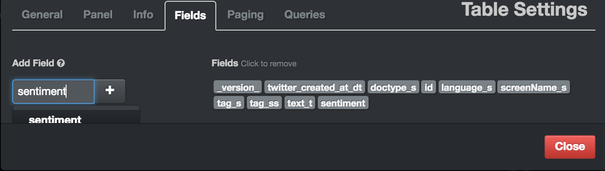

# Deploying Machine Learning Models using Spark Structured Streaming

## Introduction

This is the third tutorial in a series about building and deploying machine learning models with Apache Nifi and Spark. In [Part 1](https://hortonworks.com/hadoop-tutorial/how-to-refine-and-visualize-sentiment-data/) of the series we learned how to use Nifi to ingest and store Twitter Streams. In Part 2 we ran Spark from a Zeppelin notebook to design a machine learning model that classified tweets as happy or sad. In this tutorial we'll combine our results from Part 1 and Part 2 to stream tweets and perform sentiment analysis in real-time. To accomplish this we're going to build a Spark Streaming program which will deploy our model.

## Prerequisites

-   [Install the Hortonworks Sandbox](https://hortonworks.com/downloads/)
-   Complete [Part 1](https://hortonworks.com/hadoop-tutorial/how-to-refine-and-visualize-sentiment-data/) and Part 2 of the tutorial


## Outline

-   [Overview](#overview)
-   [Configuring Nifi](#configuring-nifi)
-   [Building a Spark Streaming Application](#building-a-spark-streaming-application)
-   [Deploying the Model](#deploying-the-model)
-   [Summary](#summary)

## Overview

To quickly recap, in part 1 we built a Nifi workflow that streamed from Twitter and stored tweets in HDFS, Solr, and the local file system. We then ran SQL queries in Hive and visualized the tweets in Banana, a UI for Solr. This showed Nifi's strength as a data integration engine that is able to easily transform and stream data between multiple sources. Our Nifi flow looked like this:


In Part 2 we used Spark to process our raw tweets and build a sentiment analysis classification model using Gradient Boosting. We then used Spark to serialize our trained model to HDFS.

We now want to integrate this sentiment model back into Nifi so we can visualize the sentiment score of each tweet with Solr. First, we need to choose an engine to run the model. Since we built the model using Spark, we'll also leverage Spark Streaming to deploy the model.

Next, we'll need a way to connect Nifi to Spark. While we could connect Nifi to Spark [directly](https://community.hortonworks.com/articles/12708/nifi-feeding-data-to-spark-streaming.html), we're going to connect them using Apache Kafka. Kafka is a message broker that has become a de facto standard in the Hadoop community because of its efficiency and reliability. One reason to use a message broker like Kafka instead of connecting streaming services directly is so that messages have somewhere to land if one of your streaming services were unavailable temporarily. This is especially important for situations where one streaming program can't keep up with the output generated by the other one. When this happens the messages will buffer in Kafka until the program can catch up. For this reason sending messages to Kafka as an intermediary is considered best practice. Fortunately, Kafka support is already built into Nifi and Spark so integration will be simple.

## Configuring Nifi

Let's start by configuring Nifi to stream tweets to Kafka. Download the Nifi template [here](https://github.com/hortonworks/data-tutorials/tree/master/tutorials/hdp/hdp-2.6/deploying-machine-learning-models-using-spark-structured-streaming/assets/nifi.xml) and load it into Nifi by clicking on the upload template button. Then drag the template icon onto the canvas and select NifiToSpark. Your Nifi canvas should look like this:


As you can see, Nifi has a Publish Kafka processor that lets you easily export tweets to Kafka. In our case we're sending tweets formatted as JSON to the Kafka topic "tweets". Our Spark Streaming program will listen for this topic and process any JSON messages that land in Kafka. It will then add a sentiment field to the JSON and send it back to Kafka using the topic "tweetsSentiment". We've added a ConsumeKafka processor to Nifi that is listening for messages on this topic, which it sends to Solr for visualization and search with Banana. You'll notice we also added a sentiment field to the Solr processor in Nifi.

## Building a Spark Streaming Application

We're now ready to build a Spark Streaming application to deploy our model. Clone this Scala application using your terminal:

``
git clone https://github.com/Gregw135/sentimentAnalysis
``

You should load this into your favorite text editor or IDE so you can follow along. Open the file /src/main/scala/Collect.scala, which is where we stream from Kafka.

In Spark 2.0 introduced SparkSession, which is a simpler way of initializing a Spark program. We create a Spark Session using this line:

```
val spark = SparkSession
      .builder
      .appName("SentimentAnalysis")
      .getOrCreate()
```

Spark 2.0 also introduced a new API for streaming called Structured Streaming. One advantage of  Structured Streaming versus the older streaming API is for its ability to send incremental updates to its output data stores. For example, suppose we wanted to stream in tweets and record the average sentiment for each word for every five minute window. In previous versions of Spark Streaming it's possible to build a rolling aggregate for each word and send these to an external data store, like HBase or MySQL. However, if a tweet arrives late there was no way for Spark to update the aggregates sent to the data store. With Structured Streaming Spark can be setup to remember the aggregates for some time after they've been sent, and if late data arrives, it can retrieve the aggregate and send an update to the external data store.

Loading our model from HDFS is done in one line:
```
model = GradientBoostedTreesModel.load(spark.sparkContext, options.modelLocation)
```

We then stream from Kafka using Structured Streaming syntax:

```
val rawTweets = spark
      .readStream
      .format("kafka")
      .option("kafka.bootstrap.servers", options.kafkaBrokerList)
      .option("subscribe", options.tweetsTopic)
      .load()
      .selectExpr("CAST(value AS STRING)")
      .as[String]
```
Notice how support for Kafka is directly built into Structured Streaming.

We now need to extract the message from each JSON tweet, evaluate it using our trained model, then add the sentiment score to the JSON.

```
val tweetsWithSentiment = rawTweets.mapPartitions((iter) => {
      val pred = new Predictor(model)
      val parser = new JsonParser()
      iter.map(
      tweet =>
        //For error handling, we're mapping to a Scala Try and filtering out records with errors.
        Try {
            val element = parser.parse(tweet).getAsJsonObject
            val msg = element.get("text").getAsString
            val sentiment = pred.predict(msg)
            element.addProperty("sentiment", pred.predict(tweet))
            val json = element.toString
            println(json)
            json
          }
      ).filter(_.isSuccess).map(_.get)
    })
```

There's a couple things going on here that we want to unpack. Notice how inside the map function we're building a Predictor class and a JsonParser class. JsonParser is imported from Google's GSON library, which we're using to parse the input JSON. Predictor is a wrapper class for the sentiment model that transforms messages and predicts their sentiment. Since these classes can't be serialized across mappers, we are using the mapPartitions function instead of map. Inside the map we use GSON to extract the message from the twitter JSON input and pass it into the Predictor class to evalutate sentiment. We then use GSON to insert the sentiment value back into the input JSON. Also note how we're mapping each tweet to a Scala Try object and filtering on only the successful results. Without some kind of error handling the program would end as soon as it receives data that can't be parsed.

Now that we've evaluated each tweet's sentiment, we need to send it back to Kafka to be picked up by Nifi. Structured Streaming doesn't yet have a built-in way of sending data back to Kafka, so we have to construct a custom ForeachWriter class:

```
tweetsWithSentiment
      .writeStream
      .foreach(
      new ForeachWriter[(String)] {

        var producer:KafkaProducer[String, String] = null

        override def process(value: (String)) = {
          val message = new ProducerRecord[String, String](options.tweetsWithSentimentTopic, null,value)
          println("sending windowed message: " + value)
          producer.send(message)
        }

        override def close(errorOrNull: Throwable) = ()

        override def open(partitionId: Long, version: Long) = {
          producer = new KafkaProducer[String, String](kafkaProps)
          true
        }
    }).start()
```

Notice that we have to call start() at the end of the program.

## Deploying the Model

To submit the code to Spark we need to compile it and submit it to Spark. Since our code depends on other libraries (like GSON) to run, we ought to package our code with these dependencies into an assembly that can be submitted to Spark. To do this we're using a dependency manager called SBT, which you'll need to install on your machine. (You'll notice we also added this line of code to the plugins.sbt file, which is also required.) Once you've installed it, you can package your code and dependencies into a single jar like this:

```
cd sentimentAnalysis
sbt assembly
```
This will create a single jar file inside the target folder. You can copy this jar into the sandbox like this:
```
scp -P 2222 ./target/scala-2.11/SentimentAnalysis-assembly-2.0.0.jar root@sandbox.hortonworks.com:/root

```

Once this has been copied to the sandbox, you want to make sure Kafka, Spark2, Nifi and Solr are turned on. Make sure the Nifi flow is turned on and tweets are flowing to Kafka. You'll also need to create the register the topics with Kafka:

```
/usr/hdp/current/kafka-broker/bin/kafka-topics.sh --create --zookeeper sandbox.hortonworks.com:2181 --replication-factor 1 --partition 10 --topic tweets

/usr/hdp/current/kafka-broker/bin/kafka-topics.sh --create --zookeeper sandbox.hortonworks.com:2181 --replication-factor 1 --partition 10 --topic tweetsSentiment
```


Then use spark-submit to deploy the jar to Spark:

```
/usr/hdp/current/spark2-client/bin/spark-submit --class "main.scala.Collect" --master local[4] ./SentimentAnalysis-assembly-2.0.0.jar
```

Here we're deploying the jar on a single machine only by using --master local[4]. In production you want to change these settings to run on Yarn. Once you submit the job you should see output on the terminal as Spark scores each tweet. You should also see Nifi pick up data from Kafka and send it to Solr.

To visualize the data stored in Solr, you can use banana by going to this url:
```
http://sandbox.hortonworks.com:8983/solr/banana/index.html#/dashboard
```
To see the sentiment scores, click on the configure tab of the tweets panel and add the sentiment field.


You'll then be able to see a sentiment score for each tweet, where 1 indicates happy and 0 indicates unhappy or neutral.

## Summary

In this series of tutorials you've now seen how to ingest data using Nifi, how to build a machine learning model using Spark and Zeppelin, and how to deploy models into production using Spark Streaming. You've also learned how to use Kafka, and how to compile code using SBT and deploy it to a cluster. Now that you're ready to build sophisticated Spark programs, you may be interested in this guide about debugging Spark jobs from an IDE.
