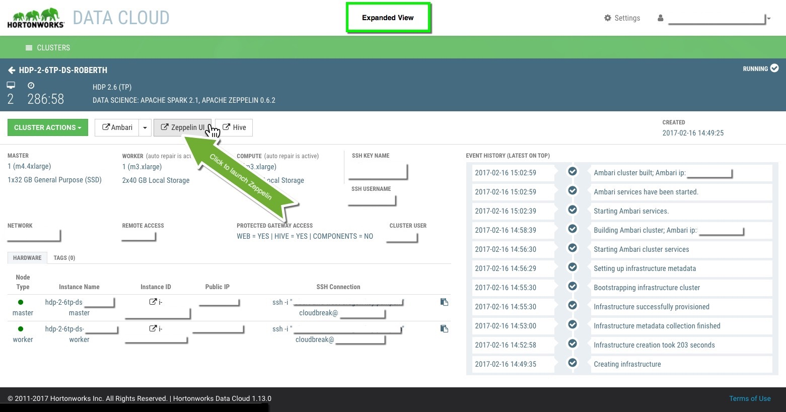
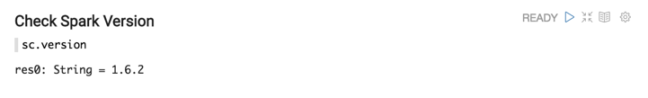
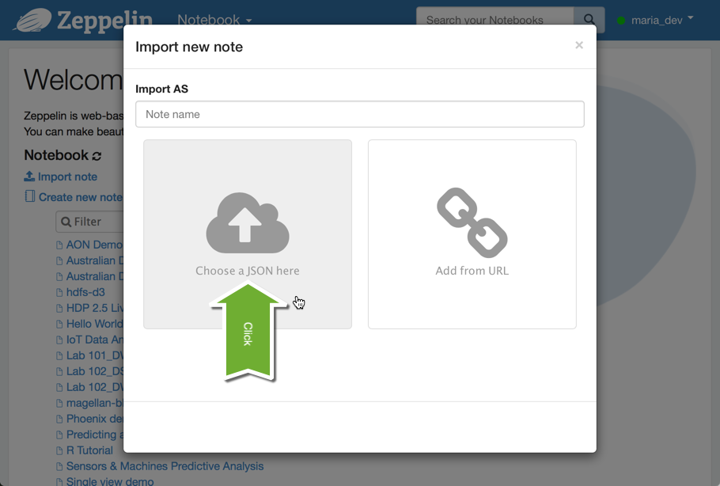

# Getting Started with Apache Zeppelin

## Introduction

Apache Zeppelin is a web-based notebook that enables interactive data analytics. With Zeppelin, you can make beautiful data-driven, interactive and collaborative documents with a rich set of pre-built language backends (or interpreters) such as Scala (with Apache Spark), Python (with Apache Spark), SparkSQL, Hive, Markdown, Angular, and Shell.

With a focus on Enterprise, Zeppelin has the following important features:

-   Livy integration (REST interface for interacting with Spark)
-   Security:
    -   Execute jobs as authenticated user
    -   Zeppelin authentication against LDAP
    -   Notebook authorization

## Prerequisites

-   HDP 2.5 or later
-   Spark 1.6.2 or later

## Outline

-   [Launching Zeppelin](#launching-zeppelin)
    -   [Case 1: Launching Zeppelin from HDCloud](#case-1-launching-zeppelin-from-hdcloud)
    -   [Case 2: Launching Zeppelin from HDP Sandbox](#case-2-launching-zeppelin-from-hdp-sandbox)
-   [Creating a Notebook](#creating-a-notebook)
-   [Importing Notebooks](#importing-notebooks)
-   [Importing External Libraries](#importing-external-libraries)

## Launching Zeppelin

How you launch Zeppelin differs depending on whether you are using a Hortonworks Data Cloud (HDCloud) or a Hortonworks Data Platform (HDP) Sandbox. We cover both cases below.

### Case 1: Launching Zeppelin from HDCloud

If you're in the Cluster home view, then select your *Data Science* cluster and click the `CLUSTERS UIs` -> `Zeppelin UI` button.


If you're in the Cluster detail, then click the `Zeppelin UI` button directly.



Finally, login with your **cluster** *User Name* and *Password* combination.


### Case 2: Launching Zeppelin from HDP Sandbox

If you haven't already, login to Ambari (operations console) using `maria_dev`/`maria_dev` as a username/password combination. Remember that Ambari is accessible on port 8080.

E.g. on a VirtualBox Sandbox, Ambari would be accessible at http://127.0.0.1:8080.

Note: If you're new to the HDP Sandbox environment, make sure to review [Learning the Ropes of the Hortonworks Sandbox](http://hortonworks.com/hadoop-tutorial/learning-the-ropes-of-the-hortonworks-sandbox/).


Okay, once you're in Ambari just click the Views dropdown (upper-right corner) and select Zeppelin.


Voila, you should see default Zeppelin menu with a list of demos and labs that you can run to explore great examples to get you quickly up and running.


Now let's create your first notebook.

## Creating a Notebook

To create a notebook:

1. Under the “Notebook” tab, choose **+Create new note**.

2.  You will see the following window. Type a name for the new note (or accept the default): <br><br>

3.  Type sc.version into a paragraph in the note, and click the “Play” button (blue triangle): <br><br><br>
SparkContext, SQLContext, ZeppelinContext will be created automatically. They will be exposed as variable names ‘sc’, ‘sqlContext’ and ‘z’, respectively, in scala and python environments.<br><br>
**Note:** The first run will take some time, because it is launching a new Spark job to run against YARN. Subsequent paragraphs will run much faster.<br><br>

4.  When finished, the status indicator on the right will say "FINISHED". The output should list the version of Spark in your cluster: <br>

~~~
res0: String = 1.6.2
~~~

## Importing Notebooks

Alternatively, instead of creating a new notebook, you may want to import an existing notebook instead.

There are two ways to import Zeppelin notebooks, either by pointing to json notebook file local to your environment or by providing a url to raw file hosted elsewhere, e.g. on github. We'll cover both ways of importing those files.

**1. Importing a JSON file**

Click Import.


Next, click "Choose a JSON here" button.



Finally, select the notebook you want to import.


Now you should see your imported notebook among other notebooks on the main Zeppelin screen.

**2. Importing a Notebook with a URL**

Click Import.


Next, click "Add from URL" button.


Finally, copy and paste the url to the (raw) json file.


Now you should see your imported notebook among other notebooks on the main Zeppelin screen.

## Importing External Libraries

As you explore Zeppelin you will probably want to use one or more external libraries. For example, to run [Magellan](http://hortonworks.com/blog/magellan-geospatial-analytics-in-spark/) you need to import its dependencies; you will need to include the Magellan library in your environment. There are three ways to include an external dependency in a Zeppelin notebook: **Using the %dep interpreter** (**Note**: This will only work for libraries that are published to Maven.)

```
%dep
z.load("group:artifact:version")
%spark
import ...
```

Here is an example that imports the dependency for Magellan:

```
%dep
z.addRepo("Spark Packages Repo").url("http://dl.bintray.com/spark-packages/maven")
z.load("com.esri.geometry:esri-geometry-api:1.2.1")
z.load("harsha2010:magellan:1.0.3-s_2.10")
```
