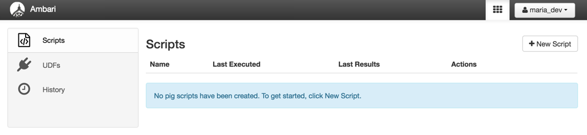

# Concepts

## はじめに

このチュートリアルでは，Hortonworks Data Platform（HDP）の基礎を固める重要な概念について説明します．Apache Hadoopは膨大な量のデータを処理し，保存するための階層構造です．私達の場合，Apache（TM）HadoopはHDPという形式のエンタープライズ・ソリューションとして知られていますHDPの基盤には，Hadoop分散ファイルシステムと呼ばれる弊社のデータストレージ環境が存在します．HiveやPig，他のコーディング言語でデータファイルにアクセスするとき，YARNはデータの分析や操作，処理を可能にするデータオペレーティングシステムとなります．HDPには，人々に影響を与えるヘルスケア，ファイナンス，保険，その他の産業に新しい機会と効率を提供するコンポーネントが含まれています．

## 前提条件
-   [Hortonworks Sandbox](https://hortonworks.com/downloads/#sandbox)をダウンロードおよびインストール済み
-   [Hortonworks Sandboxの使い方を学習している](https://hortonworks.com/hadoop-tutorial/learning-the-ropes-of-the-hortonworks-sandbox/)

## 概要

-   [1. Concept: Hadoop & HDP](#concepts-hadoop-hdp)
-   [2. Concept: HDFS](#concepts-hdfs)
-   [3. Concept: MapReduce & YARN](#concepts-mapreduce-yarn)
-   [4. Concept: Hive and Pig](#concepts-hive-pig)
-   [参考文献](#further-reading)

## 1. Concept: Hadoop & HDP 

このモジュールでは，Apache Hadoopについて学び，大規模なデータセットを拡張することについて説明します．Apache HadoopエンタープライズをHortonworks Data Platform（HDP）ディストリビューションの形式で用意したHadoopエコシステムの様々なコンポーネントについても説明します．このモジュールでは，Apache Hadoopとそのデータプラットフォームとしての機能について説明します．Hadoopのコアとその周辺のエコシステムソリューションベンダーは，データウェアハウスや他のエンタープライズデータシステムと統合するためのエンタープライズ要件を提供します．これらは，最新のデータアーキテクチャの実装に向けたステップであり，エンタープライズの「データレイク」の提供に向けたステップです．

### 1.1 このモジュールの目的

- Hadoopについて理解すること
- HDPの5つの中核について理解すること
- HDPコンポーネントとその目的を理解すること

### 1.2 Apache Hadoop
- **Apache Hadoop**は，汎用ハードウェア上の大量のデータを分散格納および処理するためのオープンソースのフレームワークです． Hadoopを使用すると，大量の構造化データや非構造化データから迅速に洞察を得ることができます． 数多くのApache Software Foundationプロジェクトは，Hadoopを導入，統合，および使用するために企業が必要とするサービスを構成します． Hadoopの詳細については，下記のブログのリファレンスを参照してください．

-   Hortonworks Blog : [Understanding Hadoop 2.0](https://hortonworks.com/blog/understanding-hadoop-2-0/)

基本的なApache Hadoopフレームワークは以下のモジュールで構成されています:

-   **Hadoop Common** – 他のHadoopモジュールに必要なライブラリとユーティリティが含まれています．
-   **Hadoop Distributed File System (HDFS)** – コモディティマシン上にデータを格納する分散ファイルシステムで，クラスタ全体で非常に高い帯域幅を提供します．
-   **Hadoop YARN** – クラスタ内のコンピューティングリソースを管理し，ユーザのアプリケーションのスケジューリングに利用するリソース管理プラットフォームです．
-   **Hadoop MapReduce** – 大規模データ処理のためのプログラミングモデルです．

各プロジェクトは，明示的な機能を提供するように開発されており，それぞれ独自の開発コミュニティと個々のリリースサイクルがあります．Hadoopにはエンタープライズ向けの5つの中枢があります．

-   **Data Management** – ストレージレイヤに膨大な量のデータを線形に格納して処理します．Hadoop分散ファイルシステム（HDFS）は，効率的なスケールアウトストレージレイヤのコアテクノロジであり，低コストのコモディティハードウェアで動作するように設計されています．Apache Hadoop YARNは，さまざまなデータアクセス方法を実現するためのリソース管理とプラグインが利用可能なアーキテクチャを提供するために必要なエンタープライズHadoopの前提条件となります．予測可能なパフォーマンスとサービスレベルでHadoopに格納されたデータを操作します．
    -   **[Apache Hadoop YARN](https://hortonworks.com/hadoop/yarn)** – Hadoopプロジェクトの中核の一部であるYARNは，他のプログラミングモデルに関連する非MapReduceワークロードのサポートをすることで，MapReduce機能を拡張するHadoopのデータ処理用の次世代フレームワークです．
    -   **[HDFS](https://hortonworks.com/hadoop/hdfs/)** – Hadoop分散ファイルシステム（HDFS）は，大規模な汎用サーバクラスタにまたがるよう設計されたスケーラブルで信頼性の高いデータストレージを提供する，Javaベースのファイルシステムです．

-   **Data Access** – 様々な方法でデータと対話します． – バッチからリアルタイムまで，Apache Hiveは，最も広く採用されているデータアクセス技術ですが，多くの特殊なエンジンが存在します．例えば，Apache Pigはスクリプト機能を提供し，Apache Stormはリアルタイム処理を，Apache HBaseはNoSQLストレージを提供，Apache Accumuloはセルレベルのアクセス制御を提供します．これらのエンジンは全て，対話型アクセス用のApache Tezや長時間実行するアプリケーション用のApache SliderなどのYARNと中間エンジンのおかげで，1セットのデータとリソースで動作します．YARNは，Cascadingのような検索およびプログラミングフレームワークのApache Solrなどの新しく登場するデータアクセス方法にも柔軟性を提供します．
    -   **[Apache Hive](https://hortonworks.com/hadoop/hive)** -MapReduceフレームワーク上に構築されたHiveは，HDFSに格納された大規模なデータセットに対して，SQLライクなインターフェースを介し，簡単なデータ集計とアドホッククエリを可能にするデータウェアハウスです．
    -   **[Apache Pig](https://hortonworks.com/hadoop/pig)** -大規模なデータセットを処理および分析するためのプラットフォームです．Pigはこれらのプログラムを処理するためのMapReduceフレームワークと組み合わせたデータ分析プログラムを表現するための高水準言語（Pig Latin）で構成されています．    
    -   **[MapReduce](https://hortonworks.com/hadoop/mapreduce/)** -MapReduceは，大量の構造化データおよび非構造化データを信頼性の高いフォールトトレラントな方法で，何千ものマシンクラスタに渡って並列に処理するアプリケーションを作成するためのフレームワークです．
    -   **[Apache Spark](https://hortonworks.com/hadoop/spark)** -Sparkはメモリ内データ処理に最適です．データセットのクラスタリングや分類などの高度な分析のための，高速で反復的なアルゴリズムを実装できます．    
    -   **[Apache Storm](https://hortonworks.com/hadoop/storm)** -Stormは高速かつ大量のデータストリームを処理するための分散型リアルタイムコンピューティングシステムで，Apache Hadoop 2.xに信頼性の高いリアルタイムデータ処理機能を追加しています．
    -   **[Apache HBase](https://hortonworks.com/hadoop/hbase)** - ユーザアプリケーション用の大きなデータへのランダムなリアルタイムアクセスを提供する列指向のNoSQLデータストレージシステムです．   
    -   **[Apache Tez](https://hortonworks.com/hadoop/tez)** -TezはMapReduceをほぼリアルタイムのビッグデータ処理のための複雑なDAG（有効非周期グラフ）を実行するための強力なフレームワークとして一般化します．    -   **[Apache Kafka](https://hortonworks.com/hadoop/kafka)** -Kafkaは，スループット，レプリケーション，およびフォールトトレランスが高いため，伝統的なメッセージブローカーの代わりに頻繁に利用される高速でスケーラブルなパブリッシュサブスクライブメッセージングシステムです．
    -   **[Apache HCatalog](https://hortonworks.com/hadoop/hcatalog)** - データ管理システムがApache Hadoopに格納されているデータの構造と場所を理解するために集中化されたテーブルとメタデータ管理サービスです．
    -   **[Apache Slider](https://hortonworks.com/hadoop/slider)** -Hadoopで長時間実行されるデータアクセスアプリケーションを展開するためのフレームワークです．Sliderは，YARNのリソース管理機能を活用して，それらのアプリケーションを配備し，ライフライクルを管理して，それらの規模を拡大または縮小します．
    -   **[Apache Solr](https://hortonworks.com/hadoop/solr)** -Solrは，Hadoopに格納されたデータを検索するためのオープンソースプラットフォームです．Solrは，世界最大のインターネットサイトの多くで，強力なフルテキスト検索とほぼリアルタイムでのインデックス作成を可能にします．
    -   **[Apache Mahout](https://hortonworks.com/hadoop/mahout)** -Mahoutは，クラスタリング，分類，バッチベースの協調フィルタリングのためのデータサイエンスを支援するスケーラブルな機械学習アルゴリズムをHadoopに提供します．
    -   **[Apache Accumulo](https://hortonworks.com/hadoop/accumulo)** -Accumuloは，セルレベルのアクセス制御を備えた高性能データストレージおよび検索システムです．これはApache HadoopとApache ZooKeeperの上で動作するGoogle Big Tableのスケーラブルな実装です．
-   **Data Governance and Integration** – すばやく簡単にデータを読み込み，ポリシーに従って管理します．Workflow Managerはデータガバナンスのワークフローを提供しますが，Apache FlumeとNFSとWebHDFSのHDFSインターフェースと同様にデータの取り込みを容易にします．
    -   **[Workflow Management](http://docs.hortonworks.com/HDPDocuments/HDP2/HDP-2.6.0/bk_workflow-management/content/index.html)** - Workflow Managementを利用すると，ワークフローを簡単に作成およびスケージュルし，ワークフロージョブを監視できます．これはApache Oozieワークフローエンジンに基づいており，ユーザは大きなデータ処理タスクの実行を定義されたワークフローに接続して自動化できます．
    -   **[Apache Flume](https://hortonworks.com/hadoop/flume)** -Flumeを利用すると，多数の異なるソースから大量のログデータを効率的に集約してHadoopに移すことができます．
    -   **[Apache Sqoop](https://hortonworks.com/hadoop/sqoop)** -Sqoopは，Hadoop内外のデータの移動を高速化し，容易にするツールです．一般的な様々なエンタープライズデータソースに対して，信頼性の高い並列読み込みを提供します．

-   **Security** – 認証，認可，経理，データ保護の要件を満たします．HDFSとYARNからHiveまでのHadoopスタックの全てのレイヤと，Apache knox経由でクラスタ全てにわたる他のデータアクセスコンポーネントにセキュリティが提供されます．
    -   **[Apache Knox](https://hortonworks.com/hadoop/knox)** -The Knox Gateway（Knox）は，クラスタ内のApache Hadoopサービスに対する認証とアクセスの単一ポイントを提供します．このプロジェクトの目的は，クラスタデータにアクセスしてジョブを実行するユーザおよびクラスタへのアクセスを制御する管理者のHadoopセキュリティを簡素化することです．
    -   **[Apache Ranger](https://hortonworks.com/hadoop/ranger)** -Apache Rangerは，Hadoopクラスタのセキュリティに対する包括的なアプローチを提供します．これは認証やアカウンティング，およびデータ保護の主要なエンタープライズセキュリティ要件全体にわたる，コアなセキュリティポリシー管理を提供します．
-   **Operations**–  Hadoopクラスタのプロビジョニング，管理，監視，運用を提供します．
    -   **[Apache Ambari](https://hortonworks.com/hadoop/ambari)** -Apache Hadoopクラスタ用のオープンソースインストールライフサイクル管理，運用，および監視システムを提供します．
    -   **[Apache Oozie](https://hortonworks.com/hadoop/oozie)** -Oozie Java Webアプリケーションは，Apache Hadoopジョブをスケジューリングするために利用されます．Oozieは複数のジョブを1つの作業をロジカルユニットに順次結合します．
    -   **[Apache ZooKeeper](https://hortonworks.com/hadoop/zookeeper)** -分散プロセスを調整する高可用性システムを提供します．分散アプリケーションは，ZooKeeperを利用して，重要な構成情報への更新を保存および仲介をします．

Apache Hadoopは，ほぼすべての業種にまたがるさまざまなユースケースで役立ちます． 大量のデータを格納，処理，分析する必要があるあらゆる場所に普及しています． 例としては，デジタルマーケティング自動化，詐欺の検出と防止，ソーシャルネットワークと関係分析，新薬の予測モデリング，小売店内行動分析，モバイルデバイスの位置情報ベースのマーケティングなどがあります． Apache Hadoopの詳細については，以下を参照してください．

[https://www.youtube.com/watch?v=6UtD53BzDNk](https://www.youtube.com/watch?v=6UtD53BzDNk)

### 1.3 Hortonworks Data Platform (HDP)

Hortonworks Data Platform（HDP）は，Hadoopクラスタの展開と管理を容易にするパッケージ化されたソフトウェアHadoopディストリビューションです．さまざまなApache製品をダウンロードしてシステムを同時実行するのと比較すると，HDPはHadoopの利用を大幅に簡素化します．オープンに構築，開発，構築されたHDPは，エンタープライズ対応のデータプラットフォームを提供し，企業は最新のデータアーキテクチャを採用することができます．

YARNをアーキテクチャセンターとして使用することで，エンタープライズデータプラットフォームに必要な主要機能（ガバナンス，セキュリティ，および運用）に対応したバッチ処理からインタラクティブ処理まで，一連の処理方法にわたるマルチワークロードデータ処理のためのデータプラットフォームを提供します．

Hortonworks **Sandbox**はHDPの単一ノード実装です． HDPの評価と実験を迅速かつ容易に行うための仮想マシンとしてパッケージ化されています． Sandboxのチュートリアルと機能は，HDPがビジネス上の大きなデータ問題を解決する方法を探ることに向けられています． Sandboxチュートリアルでは，サンプルデータをHDPに取り込む方法と，HDPに組み込まれたツールを利用してサンプルデータを操作する方法について説明します．このアイデアは，HDPでどのように作業を開始するかを示すことができます． HDPは，企業内で自由にダウンロードして使用でき，ここからダウンロードできます．[Hortonworks Data Platform](https://hortonworks.com/download/)

## 2. Concept: HDFS 

単一の物理マシンは，データが増加するにつれてそのストレージ容量が飽和します． このような経過に伴い，データを別々のマシンに分割する必要があります． ネットワークのマシン間でデータのストレージを管理するこのタイプのファイルシステムは，分散ファイルシステムと呼ばれます． [HDFS](https://hortonworks.com/blog/thinking-about-the-hdfs-vs-other-storage-technologies/)はApache Hadoopの中心的なコンポーネントであり，コモディティハードウェアのクラスタ上で動作するストリーミングデータアクセスパターンを含む大きなファイルを格納するように設計されています． Hortonworks Data Platform HDP 2.2では，HDFSがHDFSクラスタ内の[heterogeneous storage](https://hortonworks.com/blog/heterogeneous-storage-policies-hdp-2-2/)メディアをサポートするように拡張されました．

### 2.1 このモジュールの目的

-   HDFSアーキテクチャについて理解すること
-   Hortonworks Sandbox Amabri File User Viewについて理解すること

### 2.2 Hadoop Distributed File System

HDFSは，大きなデータファイルを格納するために設計された分散ファイルシステムです． HDFSは，スケーラブルで信頼性の高いデータストレージを提供するJavaベースのファイルシステムであり，コモディティサーバの大規模なクラスタにまたがるように設計されています． HDFSは，最大200PBのストレージと1台の4500台のサーバの生産スケーラビリティを実証し，10億に近いファイルとブロックをサポートしています． HDFSはスケーラブルでフォールトトレラントな分散ストレージシステムであり，さまざまな同時データアクセスアプリケーションと緊密に連携し，YARNによって調整されています． HDFSは，さまざまな物理的および体系的な状況下で適任でしょう． ストレージと計算を多くのサーバーに分散することにより，ストレージリソースを組み合わせることで，必要なストレージ容量を直線的に増やすことができます．

HDFSクラスタは，クラスタメタデータを管理するNameNodeと，データを格納するDataNodeで構成されています．ファイルとディレクトリは，inodeによってNameNodeで表されます． inodeは，パーミッション，変更，アクセス時間，名前空間，ディスクスペースクォータなどの属性を記録します．

ファイルの内容は大きなブロック（通常128MB）に分割され，ファイルの各ブロックは複数のDataNodeで独立して複製されます．ブロックは，DataNodeのローカルファイルシステムに格納されます．

NameNodeは，ブロックのレプリカ数を積極的に監視します． DataNodeの障害またはディスクの障害によってブロックのレプリカが失われた場合，NameNodeはブロックの別のレプリカを作成します． NameNodeは名前空間ツリーとブロックのデータノードへのマッピングを保持し，名前空間イメージ全体をRAMに保持します．

NameNodeはDataNodeに要求を直接送信しません．これらのDataNodeによって送信されたハートビートに応答することによって，DataNodeに指示を送信します．指示には次のコマンドが含まれています．

- ブロックを他のノードに複製し，
- ローカルブロックの複製を削除し，
- 即時ブロックレポートを再登録して送信し，
- ノードをシャットダウンします．

-   HDFSの詳細について: [https://hortonworks.com/hadoop/hdfs/](https://hortonworks.com/hadoop/hdfs/)

HDFS 2.4に付属している[次世代のHDFSデータアーキテクチャ]((https://hortonworks.com/blog/hdfs-2-0-next-generation-architecture/))では，HDFSは，完全なスタックの[復元性を備えた](https://hortonworks.com/blog/namenode-high-availability-in-hdp-2-0/)ホットスタンバイで自動化された障害を提供するようになりました． 詳細は動画をご覧ください．

[https://www.youtube.com/watch?v=1_ly9dZnmWc](https://www.youtube.com/watch?v=1_ly9dZnmWc)

### 2.3 Ambari Files User View on Hortonworks Sandbox

Ambari Files User View

Ambari Files User Viewは，データをアップロード，保存，移動するための使いやすいインターフェイスを提供します． Hadoopのすべてのコンポーネントには，Hadoop分散ファイルシステム（[HDFS](https://hortonworks.com/hadoop/hdfs/)™）があります． これはHadoopクラスタの基礎です． HDFSファイルシステムは，データセットがHadoopクラスタにどのように格納されるかを管理します． データノード全体にデータを分散し，冗長性のためのレプリケーションを管理し，データノードの追加，削除，回復などの管理タスクを担当します．

## 3. Concept: MapReduce & YARN 

クラスタコンピューティングは，データを永続的に格納する方法，ノードが失敗した場合に利用可能に，長期間の計算中にノード障害を処理する方法など，いくつかの課題に直面しています． また，データ処理の時間が遅くなるネットワークボトルネックもあります． MapReduceは，計算処理をデータに近づけることでデータ移動を最小限に抑えることで解決策を提供します． これは，ジョブを独立したタスクのセットに分割することによって，大量のデータを並列処理するように設計された単純なプログラミングモデルです．

MapReduceプログラミングの最大の制限は，MapジョブとReduceジョブがステートレスではないということです． つまり，ReduceジョブはMapジョブが最初に完了するのを待たなければなりません． この最大の並列性を制御するため，[YARN](https://hortonworks.com/blog/philosophy-behind-yarn-resource-management/)は一般的なリソース管理と分散アプリケーションフレームワークとして開発されました．

### 3.1 このモジュールの目的

-   MapとReduceジョブについて理解すること
-   YARNについて理解すること

### [3.2 Apache MapReduce](https://hortonworks.com/hadoop/mapreduce/)

MapReduceは，Hadoopのデータ処理エンジンがクラスタの周りに作業を分散するために使用する重要なアルゴリズムです． MapReduceジョブは，大きなデータセットを独立したチャンクに分割し，それらを並列処理用のキー，値ペアに整理します． この並列処理により，クラスターの速度と信頼性が向上し，より迅速かつ信頼性の高いソリューションが返されます．

**Map**機能は，入力をInputFormatで範囲に分割し，入力内の各範囲のマップタスクを作成します． JobTrackerは，これらのタスクをワーカーノードに配布します． 各マップタスクの出力は，それぞれの削減のためのキーと値のペアのグループに分割されます．

-   `map(key1,value) -> list<key2,value2>`

**Reduce**機能は，さまざまな結果を収集し，それらを組み合わせて，マスターノードが解決する必要のあるだろうより大きな問題に答えるものです．各reduceは，マップが実行されたマシンから該当するパーティションを取り出し，その出力をHDFSに書き戻します． したがって，reduceはキーのすべてのマップからデータを収集し，それらを組み合わせて問題を解決することができます．

-   `reduce(key2, list<value2>) -> list<value3>`

現在のApache Hadoop MapReduceシステムは，マスタであるJobTrackerとTaskTrackersと呼ばれるノードごとのスレーブで構成されています． JobTrackerは，リソース管理（ワーカーノードを管理，つまりTaskTrackers），資源消費量/可用性，ライフサイクル管理ジョブの個々のタスクのスケジューリング，進行状況の追跡，タスクのフォールトトレランスの提供などを担当します．

TaskTrackerは，JohnTrackerからの要求を起動/分解し，JobTrackerにタスクステータス情報を定期的に提供します．

Apache Hadoopプロジェクトには，巨大なデータの問題を解決するための一連のツールが用意されています． Hadoopクラスタは，安価なコモディティハードウェアを利用して並列コンピューティングクラスタを実装します． クラスタは，ほぼ直線的なスケーラビリティを提供するために多数のサーバーに分割されています． クラスタ設計の哲学は，コンピューティングをデータにもたらすことです． したがって，各データノードは全体のデータの一部を保持し，保持しているデータを処理することができます． 処理ソフトウェアの全体的なフレームワークはMapReduceと呼ばれます． MapReduceの紹介動画をご覧ください．

[https://www.youtube.com/watch?v=ht3dNvdNDzI](https://www.youtube.com/watch?v=ht3dNvdNDzI)

### [3.3 Apache YARN](https://hortonworks.com/blog/apache-hadoop-yarn-background-and-an-overview/) (Yet Another Resource Negotiator)

Hadoop HDFSはHadoopのデータストレージレイヤーで，MapReduceはHadoop 1xのデータ処理レイヤーでした． しかし，MapReduceアルゴリズムだけでは，Hadoopを使用して解決する非常に幅広いユースケースには十分ではありません． Hadoop 2.0は，一般的なリソース管理および分散アプリケーションフレームワークとしてYARNを提供します．これにより，手元にあるタスク用にカスタマイズされた複数のデータ処理アプリケーションを実装できます． YARNの基本的な考え方は，JobTrackerの2つの主要な責任，すなわちリソース管理とジョブスケジューリング/モニタリングを別々のデーモン，すなわちGlobal**ResourceManager**とアプリケーションごとの**ApplicationMaster**（AM）に分割することです．

ResourceManagerとノード単位のスレーブであるNodeManager（NM）は，分散してアプリケーションを管理するための新しい汎用の**システム**を形成します．

ResourceManagerは，システム内のすべてのアプリケーション間でリソースを調停する最終的な権限です． アプリケーションごとのApplicationMasterは事実上_framework specific_エンティティであり，ResourceManagerからリソースをネゴシエートし，NodeManagerと連携してコンポーネントのタスクを実行および監視することが任されています．

[ResourceManager](https://hortonworks.com/blog/apache-hadoop-yarn-resourcemanager/)にはプラグイン可能な**スケジューラ**があり，キャパシティ，キューなどに慣れ親しんだ制約のもとで実行中のさまざまなアプリケーションにリソースを割り当てる役割を担っています．スケジューラは，アプリケーションのステータスの監視や追跡を行わない純粋なスケジューラです． アプリケーションの障害やハードウェアの障害のために，失敗したタスクの再起動を保証するものではありません． スケジューラは，アプリケーションのリソース要件に基づいてスケジューリング機能を実行します． メモリ，CPU，ディスク，ネットワークなどのリソース要素を組み込んだ**リソースコンテナ**の抽象概念に基づいています．

[NodeManager](https://hortonworks.com/blog/apache-hadoop-yarn-nodemanager/) is the per-machine slave, which is responsible for launching the applications’ containers, monitoring their resource usage (CPU, memory, disk, network) and reporting the same to the ResourceManager.

[NodeManager](https://hortonworks.com/blog/apache-hadoop-yarn-nodemanager/)はマシンごとのスレーブであり，アプリケーションのコンテナを起動し，リソースの使用状況（CPU，メモリ，ディスク，ネットワーク）を監視し，ResourceManagerに報告します．

アプリケーションごとのApplicationMasterは，スケジューラから適切なリソースコンテナをネゴシエートし，ステータスを追跡し，進行状況を監視します． システムの観点から見ると，ApplicationMaster自体は通常のコンテナとして実行されます．

YARNのアーキテクチャは次のとおりです：

新しいYARN**システム**内のMapReduceの重要な実装の詳細の1つは，大きな改変をせずに既存のMapReduce**フレームワーク**を再利用したことです． これは，既存のMapReduceアプリケーションとユーザーの**互換性**を確保するために非常に重要でした． ここにYARNの短い動画紹介があります．

[https://www.youtube.com/watch?v=wlouNFscZS0](https://www.youtube.com/watch?v=wlouNFscZS0)

## 4. Concept: Hive and Pig 

### 4.1 はじめに： Apache Hive

Apache Hiveは，Hadoopと統合された様々なデータベースやファイルシステムに格納されたデータを照会するためのSQLインターフェースを提供します．Hiveを利用すると，SQLに慣れている方は，大量のデータに対してクエリを実行できます．Hiveには主に，データの要約，クエリ，分析の3つの機能があります．またHiveは，簡単なデータ抽出（Extraction）や変換（Transformation），ローディング（Loading）を可能にする（ETL）ツールを提供します．

### 4.2 このモジュールの目的

-   Apache Hiveについて理解すること
-   Apache Tezについて理解すること
-   Ambari Hive User Views on Hortonworks Sandboxについて理解すること

### [4.3 Apache Hive](https://hive.apache.org/)**™**

データアナリストは，Hiveを利用してデータを探索，構造化，分析し，それをビジネス視点に置き換えます．Hiveは分析に重点をおいたSQL（Hive QL）言語を実装し，OLAP関数，サブクエリ，共通テーブル式など豊富なSQLセマンティクスを提供します．Hiveを利用すると，SQL開発者やSQLツールを持つユーザは，Hadoopに保存されたデータを簡単にクエリ，分析，処理することができます．Hiveは，MapReduceフレームワークに精通したプログラマが，カスタムマッパーやレデューサーを拡張して，言語の組み込み機能でサポートされていない分析を行うこともできます．

Hive users have a choice of 3 runtimes when [executing SQL queries](https://hortonworks.com/blog/5-ways-make-hive-queries-run-faster/). Users can choose between Apache Hadoop MapReduce, Apache Tez or Apache Spark frameworks as their execution backend.

Hiveユーザは，SQLクエリを実行するときに3ランタイムを選択できます． ユーザは，バックエンドとしてApache Hadoop MapReduce，Apache Tez，またはApache Sparkフレームワークを選択できます．

HadoopのエンタープライズSQLに対するHiveのいくつかの利点を以下に示します：

| Feature | Description |
|---------|-------------|
| 慣れ親しんだ文法| SQLベースの言語によるデータの照会 |
| 速度    | 巨大なデータセットであってもインタラクティブな応答時間 |
| スケーラブルで拡張可能| データの種類や量が増えても性能を低下させず，より多くのコモディティマシンを追加できる|

### 4.3.1 Hiveの動作

Hiveのテーブルは，リレーショナルデータベースのテーブルと似ています．データユニットは，より大きな単位からより細かい単位まで分類されています． データベースは，テーブルで構成され，パーティションで構成されています． データは簡単なクエリ言語でアクセスでき，Hiveはデータの上書きまたは追加をサポートします．

特定のデータベース内では，テーブル内のデータがシリアライズされ，各テーブルには対応するHadoop分散ファイルシステム（HDFS）ディレクトリがあります． 各テーブルは，テーブルディレクトリのサブディレクトリ内でのデータの分散方法を決定し，パーティションに細分することができます． パーティション内のデータは，さらにバケットに分割できます．

### 4.3.2 Hiveコンポーネント

[**HCatalog**](https://cwiki.apache.org/confluence/display/Hive/HCatalog)はHiveのコンポーネントです． これは，Hadoop用のテーブルとストレージ管理レイヤで，PigやMapReduceなどのさまざまなデータ処理ツールを持つユーザが，グリッド上のデータをより簡単に読み書きできるようにします． HCatalogは，Hadoopクラスタ内のデータに関する一連のファイルパスとメタデータを保持します． これにより，スクリプト，MapReduce，Tezジョブを，データの場所とスキーマのようなメタデータから切り離すことができます． さらに，HCatalogはHiveやPigのようなツールもサポートしているので，ツール間で場所とメタデータを共有することができます． Teradata Asterなど，統合したいHCatalogの外部ツールのオープンAPIを使用すると，HCatalogでファイル・パスの場所とメタデータを活用することもできます．

> 以前，HCatalogは独自のApacheプロジェクトでした． しかし，2013年3月，HCatalogのプロジェクトは[Hiveと合併]((https://hive.apache.org/hcatalog_downloads.html))しました． HCatalogは現在，Hiveの一部としてリリースされています．

- [**WebHCat**](https://cwiki.apache.org/confluence/display/Hive/WebHCat)は，Hadoop MapReduce（またはYARN），Pig，Hiveジョブを実行したり，HTTP（RESTスタイル）インターフェイスを利用してHiveメタデータ操作を実行するために使用できるサービスを提供します．

Hiveの紹介動画をご覧ください：

[https://www.youtube.com/watch?v=Pn7Sp2-hUXE](https://www.youtube.com/watch?v=Pn7Sp2-hUXE)

### [4.3.3 Apache Tez](https://tez.apache.org/)

Apache Tezは，Apache HadoopのYARNによって調整された高性能バッチおよび対話型データ処理アプリケーションを構築するための拡張可能なフレームワークです． TezはMapReduceのスピードを飛躍的に向上させ，MapReduceのペタバイト（PB）のデータに拡張できるようにします． Apache HiveやApache Pigのような重要なHadoopエコシステムプロジェクトはApache Tezを利用しています．

Apache Tezは，開発者向けのAPIとフレームワークを提供し，インタラクティブなワークロードとバッチワークロードのスペクトルを橋渡しするネイティブの[YARN](https://hortonworks.com/hadoop/yarn/)アプリケーションを作成します．これにより，これらのデータアクセスアプリケーションは数千のノードを超えるペタバイトのデータで動作することができます． Apache Tezコンポーネントライブラリを利用すると，開発者は，Hadoopアプリケーションを作成して，Apache Hadoop YARNとネイティブに統合し，複数のワークロードクラスタでうまく動作するようにできます．

Tezは拡張性と組込み性があり，高度に最適化されたデータ処理アプリケーションを表現する目的に合わせた自由さを提供し，[MapReduce](https://hortonworks.com/hadoop/mapreduce/)や[Apache Spark](https://hortonworks.com/hadoop/spark/)などのエンドユーザ向けエンジンに優位性をもたらします． Tezはまた，データフローグラフとして複雑な計算を表現できるカスタマイズ可能な実行アーキテクチャを提供し，データとその処理に必要なリソースに関する実際の情報に基づいて動的なパフォーマンスの最適化を可能にします．

Tezの紹介動画をご覧ください：

[https://www.youtube.com/watch?time_continue=50&v=cPSfA1bhgVA](https://www.youtube.com/watch?time_continue=50&v=cPSfA1bhgVA)

### 4.3.4 StingerとStinger.next

Stinger Initiativeは，Hiveが真にビッグデータスケールでより広範なユースケースをサポートできるようにしました．バッチルーツを超えてインタラクティブなクエリをサポートします．すべてが共通のSQLアクセスレイヤでサポートされています．

Stinger.nextは，Hiveで真にリアルタイムにアクセスできるように，SQLサポートの[速度](https://hortonworks.com/blog/benchmarking-apache-hive-13-enterprise-hadoop/)，規模，幅をさらに強化し，トランザクション機能をサポートすることに重点を置いたこのイニシアチブの継続です． また，オリジナルのStingerイニシアチブと同様に，これは使い慣れた3段階の配信スケジュールで対処され，完全にオープンなApache Hiveコミュニティで開発されます．

### 4.3.5 Ambari Hive View 2.0 on Hortonworks Sandbox

Hiveとのやり取りを簡単にするために，Hortonworks SandboxのAmbari Hive Viewというツールを利用しています．[Ambari Hive View 2.0](https://docs.hortonworks.com/HDPDocuments/Ambari-2.5.0.3/bk_ambari-views/content/ch_using_hive_view.html)は，Hiveへのインタラクティブなインターフェースを提供します．クエリの作成や編集，保存，実行をすることができ，MapReduceジョブまたはTezジョブを利用して，Hiveに評価させることができます．

それではAmbari Hive View 2.0を開いて，その環境を体験してみましょう．Ambari User Viewアイコンのメニューから，Hive View 2.0を選択します．

Ambari Hive View 2.0

次に，Hive ViewのSQL編集機能を詳しく見ていきましょう．

- SQLを利用するための6つのタブがあります．
  - QUERY：これは先程の画像で示したメインのインターフェースであり，新しいSQL文の記述や編集，実行をすることができます．
  - JOBS：過去のクエリや現在実行中のクエリを確認することができます．また，表示可能な全てのSQLクエリを表示させることもできます．例えば，管理者や分析者がクエリのヘルプを必要とするとき，Hadoop管理者は履歴機能を利用してレポートツールから送信されたクエリを表示させることができます．
  - TABLES：選択したデータベースのテーブルを表示や作成，削除および管理するための中心地を提供します．
  - SAVED QUERIES：現在のユーザによって保存された全てのクエリを表示します．クエリの履歴を表示または削除するには，クエリのリストの右側にある歯車アイコンをクリックします．
  - UDFs：HDFS上のJARファイルとUDF定義を含むJavaのClassPathを示すことで，ユーザ定義関数（UDFs：User-defined functions）をクエリに追加できます．ここにUDFを追加すると，UDF挿入ボタンがクエリエディタに表示され，UDFをクエリに追加できます．
  - SETTINGS：Hive Viewで実行するクエリに設定を追加できます．

Apache Hiveプロジェクトは，HDFS内のデータのデータウェアハウスビューを提供します． [HiveQL](https://cwiki.apache.org/confluence/display/Hive/LanguageManual)（HQL）というSQL言語を使用すると，データの要約を作成し，Hadoopクラスタの大規模なデータセットのアドホッククエリと分析を実行できます． Hiveの全体的なアプローチは，データセットにテーブル構造を投影し，それをSQLで操作することです． ファイルにテーブル構造を投影するという考え方は，しばしば[スキーマ・オン・リード](https://hortonworks.com/blog/hivehcatalog-data-geeks-big-data-glue/)と呼ばれます． HDFSでデータを使用しているため，すべてのデータノードで操作を拡張でき，巨大なデータセットを操作できます．

### 4.4 はじめに: Apache Pig

MapReduceでは，マップや関数を指定することができますが，データ処理をこのパターンに合わせる方法を検討すると，複数のMapReduceステージを記述する必要が生じることがあります． Pigでは，データ構造がより豊富になり，データに適用できる変換がはるかに強力になります．

### 4.4.1 このモジュールの目的

-   Apache Pigについて理解すること
-   Apache Pig on Tezについて理解すること
-   Ambari Pig User Views on Hortonworks Sandboxすること

### [4.4.2 Apache Pig](https://pig.apache.org/)**™**

Apache Pigにより，Apache Hadoopユーザは，Pig Latinと呼ばれる簡単なスクリプト言語を使用して複雑なMapReduce変換を記述できます． Pig LatinスクリプトをMapReduceに変換して，Yado内でHadoop分散ファイルシステム（HDFS）に格納された単一のデータセットにアクセスできるようにします．

Pig was designed for performing a long series of data operations, making it ideal for three categories of Big Data jobs:
Pigは長い一連のデータ操作を実行するように設計されており，Big Dataジョブの3つのカテゴリに対して理想的です．

-   データ抽出（Extraction）や変換（Transformation），ローディング（Loading）の（**ETL**）データパイプライン，
-   生データに関する**リサーチ**，
-   **反復データ処理**．

ユースケースが何であろうと，Pigは次のようになります：

| Characteristic | Benefit |
|----------------|---------|
| 拡張可能 | Pigユーザーは，特定の処理要件を満たすカスタム関数を作成できます
| 簡単なプログラミング | Pigプログラムは巨大な作業を実現できる上，記述やメンテナンスが容易です．相互に関連するデータ変換をを含む複雑なタスクはデータフローシーケンスとして単純化，符号化できます．
| 自己最適化 | システムはPigジョブの実行を自動的に最適化するため，ユーザは内容に集中できます．

より理解を深めるために，次の動画を参照してください：

[https://www.youtube.com/watch?v=PQb9I-8986s](https://www.youtube.com/watch?v=PQb9I-8986s)

### 4.4.3 How Pig Works

PigはApache Hadoop YARNで動作し，MapReduceとHadoop分散ファイルシステム（HDFS）を利用します． プラットフォームの言語はPig Latinと呼ばれ，Java MapReduceイディオムからSQLに似た形式に抽象化されています． SQLはデータを照会するように設計されていますが，Pig Latinでは，データの変換方法（集計，結合，ソートなど）を記述するデータフローを記述できます．

Pig Latinスクリプトは（単一の出力を必要とするのではなく）グラフにすることができるので，複数の入力，変換，および出力を含む複雑なデータフローを構築することが可能です． ユーザは，Java，Python，Ruby，その他のスクリプト言語を使用して，独自の関数を記述してPig Latinを拡張できます． Pig LatinはUDF（ユーザー定義関数）を使用して拡張されることがあります．ユーザはこれらの言語のいずれかで記述し，Pig Latinから直接呼び出すことができます．

ユーザは，`pig`コマンドまたは`java`コマンドのいずれかを利用して，Pigを2つのモードで実行できます．

-   **MapReduce Mode.** これはHadoopクラスタへのアクセスを必要とするデフォルトモードです． クラスタは，擬似または完全に分散されたものでも動作します．
-   **Local Mode.** 単一のマシンにアクセスすると，すべてのファイルがローカルホストとファイルシステムを使用してインストールされ実行されます．

#### 4.4.4 Ambari Pig User Views on Hortonworks Sandbox

サンドボックスのAmbari Pig User Viewにアクセスするには，右上のUser Viewsアイコンをクリックし，**Pig**を選択します：

Ambari Pig User Viewのインターフェースには，まだスクリプトが存在しないので以下のように表示されます．

左側にはスクリプトのリストがあり，右側にはスクリプトを書くための構成ボックスがあります．特別なインターフェース機能は，スクリプトファイルの名前の下に存在する`PIG helper`です．Pigヘルパーはステートメント，関数，I/Oステートメント，HCatLoader()およびPythonユーザ定義関数のテンプレートを提供します．一番下にはスクリプトとログファイルの結果を示すステータス領域があります．

次のスクリーンショットでは，Pig Viewの様々なコンポーネントと機能を示しています：．

## Further Reading

- HDFSは[Apache Hadoop](http://hadoop.apache.org/)の4つのコンポーネントの1つで，残りの3つはHadoop Commonと[Hadoop YARN](http://hadoop.apache.org/docs/current/hadoop-yarn/hadoop-yarn-site/YARN.html)，[Hadoop MapReduce](https://hortonworks.com/hadoop/mapreduce/)です．

- YARNの詳細については，以下の紹介動画をご覧ください．[YARN introduction video](https://www.youtube.com/watch?v=ZYXVNxmMchc&list=PL2y_WpKCCNQc-7RJNoYym4_g7EZb3yzJW)

- [Hadoop 2.7.0 Blog](https://hortonworks.com/blog/apache-hadoop-2-7-0-released/)

- [Understanding Hadoop 2.0](https://hortonworks.com/blog/understanding-hadoop-2-0/)

- [Apache Ambari](https://ambari.apache.org/)は．Hadoop操作のためのオープンソースおよびオープンソースコミュニティベースのWebベースのツールであり，[Ambari User Views](https://cwiki.apache.org/confluence/display/AMBARI/Views)を介して拡張され，ユーザビューとして開発ツールの一覧を提供しています．

- [Ambari User Views included in HDP](https://hortonworks.com/hadoop/ambari/)の詳細についてはこのリンクをクリックしてください．

**Hive Blogs**:

-   [Cost-Based Optimizer Makes Apache Hive 0.14 More Than 2.5X Faster](https://hortonworks.com/blog/cost-based-optimizer-makes-apache-hive-0-14-more-than-2-5x-faster/)
-   [Discover HDP 2.2: Even Faster SQL Queries with Apache Hive and Stinger.next](http://www.slideshare.net/hortonworks/discoverhdp22faster-sql-queries-with-hive)
-   [Announcing Apache Hive 2.1](https://hortonworks.com/blog/announcing-apache-hive-2-1-25x-faster-queries-much/)
-   [HIVE 0.14 Cost Based Optimizer (CBO) Technical Overview](https://hortonworks.com/blog/hive-0-14-cost-based-optimizer-cbo-technical-overview/)
-   [5 Ways to Make Your Hive Queries Run Faster](https://hortonworks.com/blog/5-ways-make-hive-queries-run-faster/)
-   [Secure JDBC and ODBC Clients’ Access to HiveServer2](https://hortonworks.com/blog/secure-jdbc-odbc-clients-access-hiveserver2/)
-   [Speed, Scale and SQL: The Stinger Initiative, Apache Hive 12 & Apache Tez](https://hortonworks.com/blog/speed-scale-sql-stinger-initiative-apache-hive-12-apache-tez/)
-   [Hive/HCatalog – Data Geeks & Big Data Glue](https://hortonworks.com/blog/hivehcatalog-data-geeks-big-data-glue/)

**Tez Blogs**

-   [Apache Tez: A New Chapter in Hadoop Data Processing](https://hortonworks.com/blog/apache-tez-a-new-chapter-in-hadoop-data-processing/)
-   [Data Processing API in Apache Tez](https://hortonworks.com/blog/expressing-data-processing-in-apache-tez)

**ORC Blogs**

-   [Apache ORC Launches as a Top-Level Project](https://hortonworks.com/blog/apache-orc-launches-as-a-top-level-project/)
-   [ORCFile in HDP 2: Better Compression, Better Performance](https://hortonworks.com/blog/orcfile-in-hdp-2-better-compression-better-performance/)
-   HDFSの詳細については，以下の紹介動画をご覧ください．[HDFS introduction video](https://www.youtube.com/watch?v=1_ly9dZnmWc)

**HDFS Blogs:**

- [Heterogeneous Storage Policies in HDP 2.2](https://hortonworks.com/blog/heterogeneous-storage-policies-hdp-2-2/)
- [HDFS Metadata Directories Explained](https://hortonworks.com/blog/hdfs-metadata-directories-explained/)
- [Heterogeneous Storages in HDFS](https://hortonworks.com/blog/heterogeneous-storages-hdfs/)
- [HDFS 2.0 Next Generation Architecture](https://hortonworks.com/blog/hdfs-2-0-next-generation-architecture/)
- [NameNode High Availability in HDP 2.0](https://hortonworks.com/blog/namenode-high-availability-in-hdp-2-0/)
- [Introducing… Tez: Accelerating processing of data stored in HDFS](https://hortonworks.com/blog/introducing-tez-faster-hadoop-processing/)

**YARN Blogs:**

-   [YARN series-1](https://hortonworks.com/blog/resource-localization-in-yarn-deep-dive/)
-   [YARN series-2](https://hortonworks.com/blog/apache-hadoop-yarn-hdp-2-2-substantial-step-forward-enterprise-hadoop/)

**Slider Blogs:**

-   [Announcing Apache Slider 0.60.0](https://hortonworks.com/blog/announcing-apache-slider-0-60-0/)
-   [Onboarding Long Running Services to Apache Hadoop YARN Using Apache Slider](https://hortonworks.com/blog/onboarding-long-running-services-apache-hadoop-yarn-using-apache-slider/)
-   [Build YARN Apps on Hadoop with Apache Slider: Technical Preview Now Available](https://hortonworks.com/blog/apache-slider-technical-preview-now-available/)

**Capacity Scheduler Blogs:**

-   [Understanding Apache Hadoop’s Capacity Scheduler](https://hortonworks.com/blog/understanding-apache-hadoops-capacity-scheduler/)
-   [Configuring YARN Capacity Scheduler with Ambari](https://hortonworks.com/hadoop-tutorial/configuring-yarn-capacity-scheduler-ambari/)
-   [Multi-Tenancy in HDP 2.0: Capacity Scheduler and YARN](https://hortonworks.com/blog/multi-tenancy-in-hdp-2-0-capacity-scheduler-and-yarn/)
-   [Better SLAs via Resource-preemption in YARN’s Capacity Scheduler](https://hortonworks.com/blog/better-slas-via-resource-preemption-in-yarns-capacityscheduler/)
