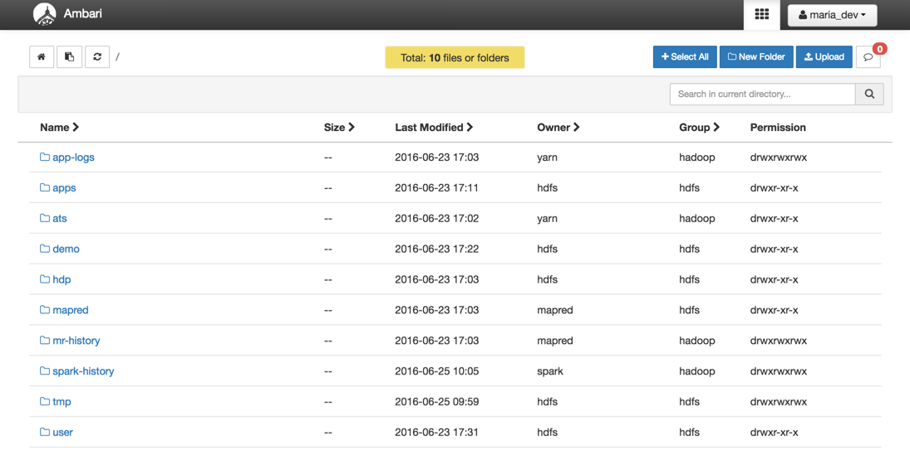

# Hadoop Tutorial – Getting Started with HDP

## Lab 1: Loading Sensor Data into HDFS

## Introduction

In this section, you will download the sensor data and load that into HDFS using Ambari User Views. You will get introduced to the Ambari Files User View to manage files. You can perform tasks like create directories, navigate file systems and upload files to HDFS.  In addition, you’ll perform a few other file-related tasks as well.  Once you get the basics, you will create two directories and then load two files into HDFS using the Ambari Files User View.

## Prerequisites

The tutorial is a part of series of hands on tutorial to get you started on HDP using Hortonworks sandbox. Please ensure you complete the prerequisites before proceeding with this tutorial.

-   Downloaded and Installed [Hortonworks Sandbox](https://hortonworks.com/downloads/#sandbox)
-   [Learning the Ropes of the Hortonworks Sandbox](https://hortonworks.com/hadoop-tutorial/learning-the-ropes-of-the-hortonworks-sandbox/) (Optional)
-   Allow yourself around **20 minutes** to complete this tutorial.

## Outline

-   [HDFS backdrop](#hdfs-backdrop)
-   [Step 1.1: Download and Extract the Sensor Data Files](#step1.1) – [**Geolocation.zip**](https://app.box.com/HadoopCrashCourseData)
-   [Step 1.2: Load the Sensor Data into HDFS](#step1.2)
-   [Summary](#summary-lab1)
-   [Further Reading](#further-reading)

## HDFS backdrop 

A single physical machine gets saturated with its storage capacity as the data grows. This growth drives the need to partition your data across separate machines. This type of File system that manages storage of data across a network of machines is called Distributed File Systems. [HDFS](https://hortonworks.com/blog/thinking-about-the-hdfs-vs-other-storage-technologies/) is a core component of Apache Hadoop and is designed to store large files with streaming data access patterns, running on clusters of commodity hardware. With Hortonworks Data Platform HDP 2.2, HDFS is now expanded to support [heterogeneous storage](https://hortonworks.com/blog/heterogeneous-storage-policies-hdp-2-2/)  media within the HDFS cluster.

## Step 1.1: Download and Extract the Sensor Data Files 

1.  You can download the sample sensor data contained in a compressed (.zip) folder here:  [**Geolocation.zip**](https://app.box.com/HadoopCrashCourseData)
2.  Save the Geolocation.zip file to your computer, then extract the files. You should see a Geolocation folder that contains the following files:
    -   geolocation.csv – This is the collected geolocation data from the trucks. It contains **records** showing _truck location, date, time, type of event, speed, etc_.
    -   trucks.csv – This is data was exported from a relational database and it shows **info** on _truck models, driverid, truckid, and aggregated mileage info_.

## Step 1.2: Load the Sensor Data into HDFS 

1\.   Go to Ambari Dashboard and open the **HDFS Files** view. Click on the 9 square Ambari User Views icon next to the username button and select the **HDFS Files** menu item.

2\.  Start from the top root of the HDFS file system, you will see all the files the logged in user (_maria_dev_ in this case) has access to see:

3\. Navigate to `/user/maria_dev` directory by clicking on the directory links.

4\.  Let's create a data directory to upload the data that we are going to use for this use case.  Click the  button to create the data directory inside the `maria_dev` directory. Now navigate into the `data` directory.

### 1.2.1 Upload Geolocation and Trucks CSV Files to data Folder

1\.   If you're not already in your newly created directory path `/user/maria_dev/data`, go to the **data** folder. Then  click on the  button to upload the corresponding **geolocation.csv** and **trucks.csv** files into it.

2\. An **Upload file** window will appear, click on the cloud symbol.

3\. Another window will appear, navigate to the destination the two csv files were downloaded. Click on one at a time, press open to complete the upload. Repeat the process until both files are uploaded.

Both files are uploaded to HDFS as shown in the Files View UI:

You can also perform the following operations on a file or folder by clicking on the entity's row: **Open**, **Rename**, **Permissions**, **Delete**, **Copy**, **Move**, **Download** and **concatenate**.

### 1.2.2 Set Write Permissions to Write to data Folder

1.  click on the `data` folder's row, which is contained within the directory path `/user/maria_dev`.
2.  Click **Permissions**.
3.  Make sure that the background of all the **write** boxes are checked (**blue**).

Refer to image for a visual explanation.

## Summary 

Congratulations! Let’s summarize the skills and knowledge we acquired from this tutorial. We learned **Hadoop Distributed File System (HDFS)** was built to manage storing data across multiple machines. Now we can upload data into the HDFS using Ambari’s HDFS **Files view**.

## Further Reading
-   [HDFS](https://hortonworks.com/hadoop/hdfs/)
-   [Manage Files on HDFS with Command Line: Hands-on Tutorial](https://hortonworks.com/hadoop-tutorial/using-commandline-manage-files-hdfs/)
-   [HDFS User Guide](https://hadoop.apache.org/docs/stable/hadoop-project-dist/hadoop-hdfs/HdfsUserGuide.html)
-   Build your HDFS Architecture Knowledge [HDFS Architecture Guide](https://hadoop.apache.org/docs/r1.0.4/hdfs_design.html)
-   [HDP OPERATIONS: HADOOP ADMINISTRATION](https://hortonworks.com/training/class/hdp-operations-hadoop-administration-fundamentals/)
