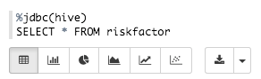

# Lab 5：Zeppelinでデータレポーティングをしよう
## はじめに

このチュートリアルでは，Apache Zeppelinについて説明します．このセクションでは，Zeppelinを利用してデータを視覚化する方法について学びましょう．

## 前提条件

このチュートリアルは，Hortonworks Sandboxを利用して，HDPに入門するための一連のチュートリアルの一部です．このチュートリアルを進める前に，以下の条件を満たしていることを確認してください．


- Hortonworks Sandbox
- [Hortonworks Sandboxの使い方を学習している](https://hortonworks.com/hadoop-tutorial/learning-the-ropes-of-the-hortonworks-sandbox/)
- Lab 1：センサデータをHDFSに読み込ませよう
- Lab 2：Hiveでデータ操作をしよう
- Lab 3：Pigでリスクファクタを算出しよう
- Lab 4：Spackでリスクファクタを算出しよう
- このチュートリアルを完了するのに1時間ほど掛かります．

## 概要
- [Apache Zeppelin](#zeppelin)
- [Step 5.1：Zeppelin Notebookを作成する](#step5.1)
- [Step 5.2：Hiveクエリを実行する](#step5.2)
- [Step 5.3：Zeppelinを利用してグラフを生成しよう](#step5.3)
- [まとめ](#summary)
- [参考文献](#further-reading)

## Apache Zeppelin <a id="zeppelin"></a>

Apache Zeppelinは，データ分析と発見のための強力なWebベースのノートブックプラットフォームを提供します．Spark上での他の言語バインディングと同様のSpark分散コンテキストもサポートしています．

このチュートリアルでは，Apache Zeppelinを利用して，以前に収集したgeolocation，trucks，riskfactorのデータに対してSQLクエリを実行し，グラフを利用して結果を視覚化します．

注：sparkやhawqおよびpostgresqlなどについては，様々なインタプリタを介してクエリを実行することもできます．

## Step 5.1：Zeppelin Notebookを作成する <a id="step5.1"></a>

**Step 5.1.1：Zeppelin Notebookの案内**

ブラウザにURLを入力して，Zeppelinを開く

```
http://sandbox.hortonworks.com:9995
```


上部の**Notebook**タブをクリックして，**Create new note**を選択する．ノートブックの名前を`Driver Risk Factor`に設定します．


## Step 5.2：Hiveクエリを実行する <a id="step5.2"></a>


**Step 5.2.1： 最終結果を表形式で視覚化する**

前のSparkとPigのチュートリアルでは，全てのドライバにリスクファクタが関連付けられたriskfactorテーブルとfinalresultsテーブルを作成しました．この表で生成したデータを利用して，どのドライバが最も高いリスクファクタを持っているかを視覚化します．Zeppelinでクエリを記述するために，jdbc hiveインタプリタを利用します．


1. 以下のコードをコピーしてZeppelinノートに貼り付けます．

	```
	%jdbc(hive)
	SELECT * FROM riskfactor
	```

2.  readyまたはfinishedの横にある**play**ボタンをクリックして，Zeppelinノートブックでクエリを実行します．**Shift+Enter**でもクエリを実行することができます．

	最初に，クエリは表形式のデータを生成します．

	


## Step 5.3：Zeppelinを利用してグラフを生成しよう <a id="step5.3"></a>


**Step 5.3.1：最終結果をグラフ形式で可視化する**


1. クエリの下に表示される各タブを選択します．クエリで返されるデータに応じて，それぞれ異なる種類のグラフが表示されます．

	


2. グラフをクリックすると，追加の詳細設定が表示され，必要なデータの表示を調整できます．

	


3. 設定をクリックして，高度なチャート機能を開きます．
4. `riskfactor.driverid`と`riskfactor.riskfactor SUM`のグラフを作成するには，下の画像のようにテーブルをボックスにドラッグします．

	


5. 次のような画像が表示されます．

	


6. 大きいデータにホバーすれば，driveridとriskfactorのそれぞれが表示されます．

	


7. 様々な種類のグラフを試す，異なるテーブルをドラッグするなどをして，どのような結果が得られるか確認してください．
8. どの都市や州に最も大きいリスクファクタを持つドライバがいるかを見つけるために，別のクエリを試してみましょう．

	```
	%jdbc(hive)
	SELECT a.driverid, a.riskfactor, b.city, b.state
	FROM riskfactor a, geolocation b where a.driverid=b.driverid
	```

	


9. いくつかの設定を変更して，どの都市に大きいリスクファクタがあるかを探しましょう．散布図アイコンをクリックしてグラフを変更してみてください．その後，a.driveridキーがxAxisフィールドに，a.riskfactorがyAxisフィールドに，b.cityがグループフィールド内にあることを確認します．グラフは次のようになります．

	

	最高値のポイントにカーソルを合わせると，どのドライバが最も大きいリスクファクタを持ち，どのドライバがどこにいるのかを知ることができます．

## まとめ <a id="summary"></a>


Apache Zeppelinを利用して，データを取得して視覚化する方法を学習しました．HiveやPig，Sparkのチュートリアルで学んだスキルを利用して，データの数値の意味をより深く理解してみましょう！

## 参考文献 <a id="further-reading"></a>

- [Zeppelin on HDP](https://hortonworks.com/hadoop/zeppelin/)
- [Apache Zeppelin Docs](https://zeppelin.incubator.apache.org/docs/)
- [Zeppelin Homepage](https://zeppelin.incubator.apache.org/)

