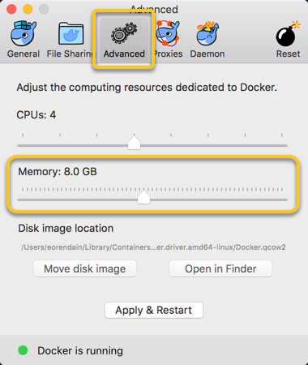

# Hortonworks Sandbox Guide

## Hortonworks Sandbox with VMware

## Introduction

This tutorial walks through installing the Hortonworks Sandbox onto Docker on your computer.

## Prerequisites

-   [Download the Hortonworks Sandbox](https://hortonworks.com/downloads/#sandbox)
-   Docker Installed
    -   [Docker For Linux](https://docs.docker.com/engine/installation/linux/)
    -   [Docker For Windows](https://docs.docker.com/docker-for-windows/install/)
    -   [Docker For Mac](https://docs.docker.com/docker-for-mac/install/)
-   A computer with at least **8 GB of RAM to spare**.

## Outline

-   [Install and Configure Docker](#install-and-configure-docker)
    -   [For Linux](#for-linux)
    -   [For Windows](#for-windows)
    -   [For Mac](#for-mac)
-   [Load Sandbox Into Docker](#load-sandbox-into-docker)
-   [Start Sandbox](#start-sandbox)
-   [Further Reading](#further-reading)

## Install and Configure Docker

### For Linux

### For Windows

### For Mac

After [installing Docker For Mac](https://docs.docker.com/docker-for-mac/install/), open the application and click on the Docker icon in the menu bar.  Select **Preferences**.


Select the **Advanced** tab and adjust the dedicated memory to **at least 8GB of RAM**.



## Load Sandbox Into Docker

Open up a console and load in the sandbox image you downloaded with the following command.

```
docker load -i /path/to/image/HDP_2.6_docker.tar.gz
```

To check that the image was successfully imported, run the following command.  You should see the sandbox docker image on the list.

```
docker images
```

## Start Sandbox

Download the sandbox's [start_sandbox.sh script here](assets/start_sandbox.sh), saving it somewhere on your computer.

https://github.com/hortonworks/sandbox-shared/blob/master/deploy/packer/docker_resources/singlenode/scripts/start_scripts/start_sandbox-hdp.sh

Run the script you just downloaded.  It will start the sandbox for you, creating a container in the process if it's the first time running this command.

```
bash /path/to/start_sandbox.sh
```

You should see something like the following:


The sandbox is now created and ready for use.

Welcome to the Hortonworks Sandbox!

## Further Reading

-   Follow-up with the tutorial: [Learning the Ropes of the Hortonworks Sandbox](https://hortonworks.com/hadoop-tutorial/learning-the-ropes-of-the-hortonworks-sandbox)
-   [Browse all tutorials available on the Hortonworks site](https://hortonworks.com/tutorials/)
