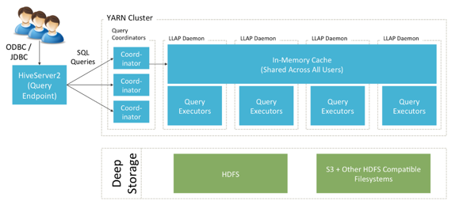
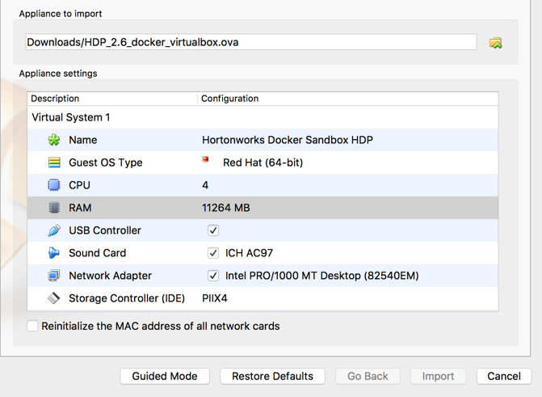
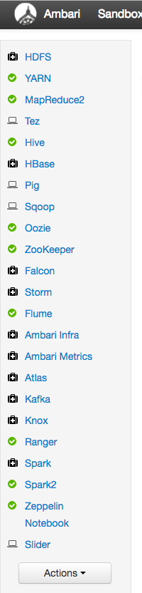
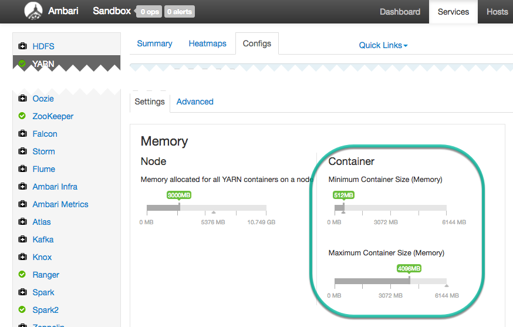
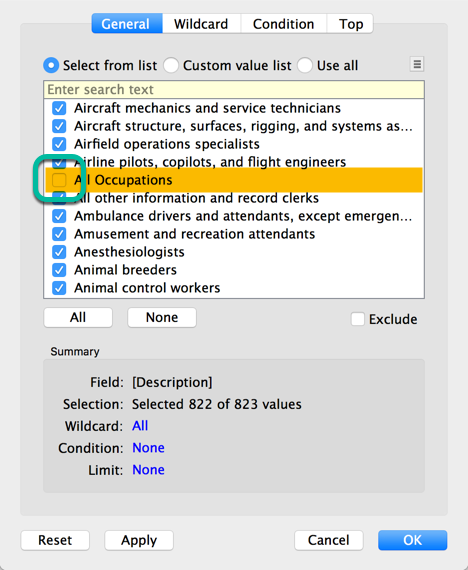
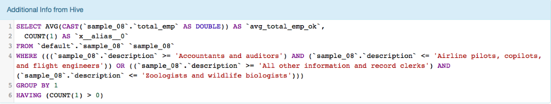

# Interactive SQL on Hadoop with Hive LLAP

## Introduction

**Hive LLAP** combines persistent query servers and intelligent in-memory caching to deliver blazing-fast SQL queries without sacrificing the scalability Hive and Hadoop are known for. This tutorial will show you how to try LLAP on your HDP Sandbox and experience its interactive performance firsthand using a BI tool of your choice (**Tableau** will be used in demo, but others will work as well).

### Benefits of Hive LLAP include:

-   LLAP uses persistent query servers to avoid long startup times and deliver fast SQL.
-   LLAP shares its in-memory cache among all SQL users, maximizing the use of this scarce resource.
-   LLAP has fine-grained resource management and preemption, making it great for highly concurrent access across many users.
-   LLAP is 100% compatible with existing Hive SQL and Hive tools.

## Goals and Objectives

The goal of this tutorial is to learn how to enable interactive SQL query performance on the HDP Sandbox using **LLAP**, then to connect a BI tool to LLAP and run interactive SQL analytics.

## Prerequisites

-   This tutorial requires [HDP 2.6 Sandbox](https://hortonworks.com/products/sandbox/).
-   Must have installed [Hortonworks ODBC Driver for Apache Hive](https://hortonworks.com/downloads/#addons)
-   Must have installed [Tableau](https://www.tableau.com/). For this tutorial, we’re using Tableau version 10.2.
-   This tutorial assumes you have a **16GB** memory (or more) computer and does its best to maximize available resources. Working on the sandbox is limited. If you’re looking to try Hive LLAP at big data scales, check out [Fast Analytics in the Cloud with Hive LLAP](https://hortonworks.com/hadoop-tutorial/fast-analytics-cloud-hive-llap/).
-   This tutorial requires making some configurations to the Sandbox and allocating additional resources. In order to run this tutorial you will need to be able to allocate **11 GB RAM** to the Sandbox virtual machine.
-   If you are not familiar with HDP Sandbox, the following tutorial provides an introduction:
[Learning the Ropes of the Hortonworks Sandbox](https://hortonworks.com/hadoop-tutorial/learning-the-ropes-of-the-hortonworks-sandbox/)

## Outline

- [1. Hive LLAP Sandbox Setup](#hive_llap_sandbox_setup)
- [2. Connect with a BI Tool and Run Queries](#connect_with_bi_tool)
- [3. Connect LLAP to the Large Dataset (Optional, Advanced)](#connect_llap)
- [4. Enhanced Monitoring for Hive and LLAP](#enhanced_monitoring)
- [Further Reading](#further-reading)

## 1. Hive LLAP Sandbox Setup 

### Increase Sandbox Memory Size

To benefit from Hive LLAP’s in-memory processing we need a bit more memory than the Sandbox offers by default. In this tutorial we’ll use **11 GB** of RAM.

When you import the Sandbox in VirtualBox, change the Appliance settings to increase RAM from 8192 to **11264 MB**. When you first select the appliance to import you will see a screen similar to this one:

-   click on **Import**
-   When import completes, start it by double-clicking the appliance.

### Enable Ambari Admin Login

We need to change the Sandbox configuration using Ambari to enable LLAP. This requires us to first [reset Ambari admin password](https://hortonworks.com/hadoop-tutorial/learning-the-ropes-of-the-hortonworks-sandbox/#setup-ambari-admin-password) and then logon.

> NOTE: Confirm you can log into Ambari as **admin** before continuing.

### Generate a Larger Dataset to Analyze (Optional)

The Sandbox ships with a few small tables, but to get a more substantial feel of LLAP we can generate a larger dataset. This part is optional and if you’re in a hurry you can skip it. For this demo we will generate 2 GB of data based on the standard TPC-H benchmark. To simplify things, all data generation and loading are handled by a single bundle you can download and run on your Sandbox.

To get started, [log into the console](http://127.0.0.1:4200/), then follow these steps:

1\. Log in to the console as root.

2\. Become the hive user:

~~~
su - hive
~~~

3\. Download the data generator bundle:

~~~
wget  https://github.com/cartershanklin/sandbox-datagen/blob/master/datagen.tgz?raw=true
~~~

4\. Extract the bundle:

~~~
tar -zxf datagen.tgz?raw=true
~~~

5\. Enter the datagen directory:

~~~
cd datagen
~~~

6\. Generate the data:

~~~
sh datagen.sh 2
~~~

This step will take up to a few minutes.

### Stop Services We Don’t Need

Ambari enables a number of HDP services we don’t need to try Hive LLAP. Since LLAP relies heavily on caching and in-memory processing we will stop these to free memory to improve performance.

When you first login you will see these services. If the services show up as yellow rather than green, wait a moment until you see green checkmarks next to these services.

To free up a bit more resources, let's stop the following services that are not needed for this tutorial:

-   Oozie
-   Flume
-   Zeppelin Notebook.

For every service (i.e. Oozie):

1\.  Select **Service Actions**, then select **Stop**

2\.  Select **Turn On Maintenance Mode** for the serice you are stopping.

### Increase YARN Memory in Ambari

We need to make sure we have sufficient memory in **YARN** to take advantage of Hive LLAP in-memory processing.

-   select **YARN** -> **Configs** -> **Setings**
-   set "Minimum Container Size (memory)" to **512 MB**
-   set "Maximum Container Size (memory)" to **4096 MB**

-   Select **Save**
-   Confirm Dependent Configurations by pressing **OK**
-   Confirm Configurations by pressing **Proceed Anyway**

> Important: Must restart YARN before continuing. **Restart** -> **Restart All Affected**.

### Enable and Configure Interactive Query (Hive LLAP)

Enabling Hive LLAP is a simple and require the following modifications. Start with **Ambari** -> **Configs** -> **Settings**:

1.  Set **Enable Interactive Query** to **Yes**
2.  Set **ACID Transactions** to **On**

-   Select **Save**
-   Accept the default location to install HiveServer2 Interactive
-   Confirm Dependent Configurations by pressing **OK**
-   Confirm Configurations by pressing **Proceed Anyway**

> Important: HiveServer2 Interactive will automatically start. Restart any other affected services. Wait for all services to restart continuing.

## 2. Connect with a BI Tool and Run Queries 

Now we’re ready to connect a BI Tool to LLAP and try things out. This demo will use Tableau. If you prefer another tool you should adapt these instructions to your choice.

### Download and Install the ODBC driver

As a prerequisite, you should already have installed the latest [Hortonworks ODBC Driver for Apache Hive](https://hortonworks.com/downloads/#addons).

If you are on Windows: Create a DSN using the ODBC Driver Manager and point it to host `127.0.0.1`, port 10500, use Username/Password authentication with the credentials `hive/hive`.

> **If you are on Mac**: Note that connecting using Tableau does not require the use of an ODBC Driver Manager, the driver will be loaded automatically. Other BI tools may require the use of an ODBC Driver Manager.

### Connect Tableau to LLAP and a Small Dataset

Start Tableau, connect “To a server” -> More Servers -> Hortonworks Hadoop Hive

When prompted, connect using:

-   Server: **127.0.0.1**
-   Port: **10500**
-   Type: **HiveServer2**
-   Authentication: **User Name and Password**
-   Transport: **SASL**
-   Username: **hive**
-   Password: **hive**

Next click `Select Schema` and click the magnifying glass to show available schema.

Select `default` and click the magnifying glass to reveal all tables.

Drag `sample_08` to the workspace.

Click on `Sheet` 1 to go to the worksheet.

This table has data on professions, numbers of people within those professions and average salaries for these professions. We can now easily explore this data interactively. For example let’s create a packed bubble chart that shows the relative numbers of people in different professions as in this chart.

To reproduce this chart:

1\. Drag the **Total Emp** measure to the bottom right section of the main pallette:

You should see a value of 405,555,870.

2\. Drag the **Description** from Dimension to the Rows shelf. The result should look like:

3\. Select the packed bubble visualization from the **Show Me** button:

This will give a visualization that makes it very easy to spot ratios. Unfortunately the All Occupations value is included, so let’s filter it out.

4\. Drag **Description** from Dimensions to the Filters section. Unselect “All Occupations” from the Filter and press Ok.

Your visualization should now look like the diagram above. You can continue to explore this dataset interactively if you want. For example, see if you can recreate this visualization, which sorts job categories by average salary and mentions how many individuals belong to each profession.

## 3. Connect LLAP to the Large Dataset (Optional, Advanced) 

If you generated the large dataset above, here’s how to load it into Tableau and explore it. The data schema has a total of 8 tables and it’s important to relate them correctly. Each BI tool will have its own way of doing that, and here we’ll talk about how to do that in Tableau.

First we optimize the dataset for analytics. This means 2 things:

1\. We convert the data to ORCFile format.
2\. We create primary and foreign keys for the dataset. This allows BI tools to do what’s called “join elimination” to greatly improve performance.

To load the data, navigate back to `http://127.0.0.1:4200/` and run:

~~~
su - hive
cd datagen
sh load_data.sh
~~~

This process will take a couple of minutes. After it’s complete, connect Tableau to the llap schema and show all tables.

There are 8 total tables here and for a realistic experience we should load all of them with the appropriate associations. Here’s the load order and associations you should make:

1.  drag `lineitem` table
   -  no join condition needed
2.  drag `orders` table
   - join condition: `L_Orderkey = O_Orderkey`
3. drag `customer` table
   - join condition: `O_Custkey = C_Custkey`
4.  drag `nation` table
   - join condition: `C_Nationkey = N_Nationkey`
5.  drag `region` table
   - join condition: `N_Regionkey = R_Regionkey`
6.  drag `partsupp` table
   - join condition: `L_Suppkey = Ps_Suppkey`
   - join condition: `L_Partkey = Ps_Partkey`
7.  drag `part` table
   - join condition: `Ps_Partkey = P_Partkey`
8.  drag `supplier` table
   - join condition: `Ps_Suppkey = S_Suppkey`

It is important to ensure these join conditions are established properly. If they aren’t, queries will run very slow. When you’re done, the table associations should look like this:

At this point it’s a good idea to save your workbook to avoid having to do this again. Here’s an example visualization you can do with this data. First drag the L_Extendedprice measure to the bottom right of the workspace. Next, drag the L_Shipinstruct Dimension to the Columns shelf and the L_Shipmode Dimension to the Rows shelf. When you’re done you should see a table like this:

As you’re interacting, these queries should take no longer than about 5 seconds on a system with adequate resources. If queries are taking longer, ensure the join conditions are set up properly, ensure you are using the latest ODBC driver and ensure the settings given above have all been applied. You can also use the Tez UI (covered below) to further diagnose queries.

## 4. Enhanced Monitoring for Hive and LLAP 

HDP 2.5 includes some nice new ways to debug and diagnose Hive and Tez jobs. First let’s look at the Tez View. In Ambari hover over the “more items” icon in the top right and click `Tez View`.

Here you’ll see a screen that includes all the queries that have been run through Hive:

If we drill into a particular query we can see the exact query text that Tableau generates:

This Tez View also includes a new Vertex Swimlane view for critical path analysis:

## Further Reading

If you’re just getting started with Hive and want to learn about its SQL capabilities or data access options, see [Getting Started with Apache Hive](https://cwiki.apache.org/confluence/display/Hive/GettingStarted) on the wiki.

For a high-level overview of Hive 2, watch [Apache Hive 2.0: SQL Speed Scale](http://www.slideshare.net/HadoopSummit/apache-hive-20-sql-speed-scale).
