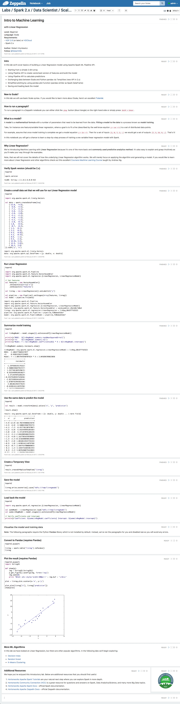

# Intro to Machine Learning with Apache Spark and Apache Zeppelin

## Introduction

In this tutorial, we will introduce you to Machine Learning with Apache Spark. The hands-on lab for this tutorial is an Apache Zeppelin notebook that has all the steps necessary to ingest and explore data, train, test, visualize, and save a model. We will cover a basic Linear Regression model that will allow us perform simple predictions on a sample data. This model can be further expanded and modified to fit your needs. Most importantly, by the end of this tutorial, you will understand how to create an end-to-end pipeline for setting up and training simple models in Spark.

## Prerequisites

-   This tutorial is a part of series of hands-on tutorials using the [Hortonworks Data Platform (HDP)](https://hortonworks.com/products/data-center/hdp/) via either the [Hortonworks Data Cloud (HDCloud)](https://hortonworks.com/products/cloud/aws/) or a pre-configured downloadable [HDP Sandbox](https://hortonworks.com/products/sandbox/).
-   The Zeppelin notebook uses mostly [Scala](http://www.dhgarrette.com/nlpclass/scala/basics.html) syntax. A pure Python version is coming soon.
-   If you are new to Zeppelin, review the following tutorial: [Getting Started with Apache Zeppelin](https://hortonworks.com/hadoop-tutorial/getting-started-apache-zeppelin/)

## Outline
-   [Tutorial Details](#tutorial-details)
-   [Environment Setup](#environment-setup)
    -   [Option 1: Setup Hortonworks Data Cloud (HDCloud) on AWS](#option-1-setup-hortonworks-data-cloud-hdcloud-on-aws)
    -   [Option 2: Download and Setup Hortonworks Data Platform (HDP) Sandbox](#option-2-download-and-setup-hortonworks-data-platform-hdp-sandbox)
-   [Notebook Preview](#notebook-preview)
-   [Start the Tutorial](#start-the-tutorial)
-   [Final Words](#final-words)

### Tutorial Details

Machine Learning models can be applied to accomplish a variety of tasks from Classification, to Collaborative Filtering, Clustering, and Regression.

We start with Linear Regression as this is one one of the most common approaches for estimating unknown parameters after training on a known dataset. In this tutorial, we are training on a 2D dataset, so our Linear Regression model can be intuitively thought as curve fitting. With more parameters, or features, we can make interesting predictions, for example, what should be a price listing range for a house with three bedrooms, two baths, 20 years old, and in a specific zip code area. Using Linear Regression for pricing houses given a set of input parameters works surprisingly well provided a large enough sample dataset. To cover edge cases, however, other Machine Learning methods might have to be used such as Random Forests or Gradient Boosted Trees, which we will cover in detail in future tutorials.

There are multiple steps in this lab we will cover.

First, the dataset will consist of pairs of inputs and expected outputs. You may think of this as (x, y) pairs, with x being the input and y being the output. We will have approximately twenty points in our small training dataset.

Next, we will construct a Linear Regression pipeline where we specify the input and output columns, and the model we want to use (i.e. Linear Regression). Once the pipeline is created, we will use the `fit` function to fit the data to a model (i.e. train the model).

Third, we will summarize the model results focusing on a) Root Mean Square Error (RMSE) as another measure of differences between predicted by model and observed values (taking in account all the differences or residuals) with lower value indicating a better fit; b) R2 or R Squared, also called coefficient of determination or goodness of fit, with the higher values indicating better fit (on a 0 to 1 scale); and c) residuals that indicate difference between the observed value and the estimated value of the quantify of interest. With these snapshot measures, a Data Scientist can quickly understand model fitness and compare different trained models to choose the best one.

Fourth, with the trained model we will make predictions and see how individual predictions compare to original (expected) values.

Finally, we will graph the model as a straight line overlaid over the original training data points. This will give you a quick visual snapshot on the fitness of the model.

To summarize, we will be 1) setting up a two dimensional dataset, 2) creating a Linear Regression model pipeline, 3) summarizing the model training, 4) predicting output using the model, 5) and finally visualizing the results.

## Environment Setup

### Option 1: Setup Hortonworks Data Cloud (HDCloud) on AWS

1a. Create an [Amazon Web Services (AWS) Account](https://aws.amazon.com/) if you don't have one

1b. Follow this step-by-step doc to [Setup and Launch a Controller on HDCloud](https://hortonworks.github.io/hdp-aws/launch/index.html)

1c. Create a *Data Science* [Cluster](https://hortonworks.github.io/hdp-aws/create/index.html) (use settings listed below)

Select/specify the following for your cluster:

  - HDP Version: HDP 2.6 or later
  - Cluster Type: "Data Science: Apache Spark 2.1+, Apache Zeppelin 0.6.2+" or later
  - Worker instance count: one or more
  - Remote Access: 0.0.0.0/0

Here's a screenshot with sample settings:

### Option 2: Download and Setup Hortonworks Data Platform (HDP) Sandbox

This option is optimal if you prefer to run everything in local environment (laptop/PC).

Keep in mind, that you will need **8GB** of memory dedicated for the virtual machine, meaning that you should have at least **12GB** of memory on your system.

2a. Download and Install [HDP Sandbox 2.6](https://hortonworks.com/products/sandbox/)

2b. Review [Learning the Ropes of HDP Sandbox](https://hortonworks.com/hadoop-tutorial/learning-the-ropes-of-the-hortonworks-sandbox/)

#### Review Zeppelin Tutorial

If you are new to Zeppelin, review the following tutorial [Getting Started with Apache Zeppelin](https://github.com/hortonworks/tutorials/blob/hdp-2.5/tutorials/hortonworks/getting-started-with-apache-zeppelin/tutorial.md)

### Notebook Preview

Before you start, here's a preview of the notebook.

A dynamic preview (allowing code copy) can be found [here](https://www.zeppelinhub.com/viewer/notebooks/aHR0cHM6Ly9yYXcuZ2l0aHVidXNlcmNvbnRlbnQuY29tL2hvcnRvbndvcmtzLWdhbGxlcnkvemVwcGVsaW4tbm90ZWJvb2tzL2hkcC0yLjYvMkNDQk5aNVlZL25vdGUuanNvbg).

## Start the Tutorial

To begin the tutorial, import the *Intro to Machine Learning* notebook into your Zeppelin environment. (If at any point you have any issues, make sure to checkout the [Getting Started with Zeppelin](https://hortonworks.com/hadoop-tutorial/getting-started-apache-zeppelin/) tutorial.)

On the Zeppelin home screen click `Import note` -> `Add from URL` and copy and paste the following URL:
https://raw.githubusercontent.com/hortonworks-gallery/zeppelin-notebooks/hdp-2.6/2CCBNZ5YY/note.json

Once your notebook is imported, you can open it from the Zeppelin home screen by clicking
`Labs` -> `Spark 2.x` -> `Data Scientist` -> `Scala` -> `101 - Intro to Machine Learning`

 Once the *Intro to Machine Learning* notebook is up, follow all the directions within the notebook to complete the tutorial.

### Final words

We hope that you've been able to successfully run this first lab introducing basic, yet very common, Linear Regression model. More advanced Machine Learning models are introduced as part of series tackling specific examples, such as Twitter sentiment analysis, article auto-classification and so on.

Make sure to checkout other [tutorials](https://hortonworks.com/tutorials/) for more examples on using Spark and Machine Learning.
