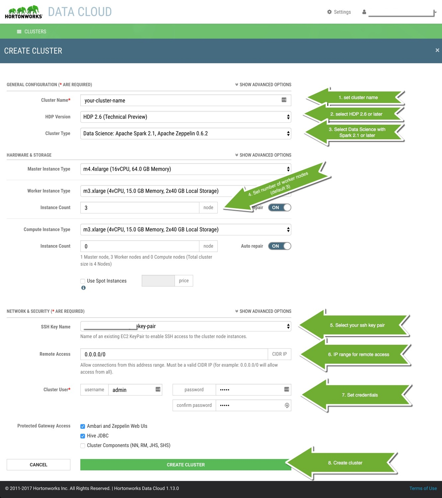

# Learning Spark SQL with Zeppelin

## Introduction

In this two-part lab-based tutorial, we will first introduce you to Apache Spark SQL. Spark SQL is a higher-level Spark module that allows you to operate on DataFrames and Datasets, which we will cover in more detail later.

In the second part of the lab, we will explore an airline dataset using high-level SQL API. We will visualize the dataset and write SQL queries to find insights on when and where we can expect highest delays in flight arrivals and departures.

The lab is part of our Apache Zeppelin based lab series, providing an intuitive and developer friendly web-based environment for data ingestion, wrangling, munging, visualization and more.

## Prerequisites

-   This tutorial is a part of series of hands-on tutorials using the [Hortonworks Data Platform (HDP)](https://hortonworks.com/products/data-center/hdp/) via either the [Hortonworks Data Cloud (HDCloud)](https://hortonworks.com/products/cloud/aws/) or a pre-configured downloadable [HDP Sandbox](https://hortonworks.com/products/sandbox/).
-   The Zeppelin notebook uses basic [Scala](http://www.dhgarrette.com/nlpclass/scala/basics.html) syntax. A Python version is coming soon.
-   (Optional) If you are new to Zeppelin, review the following tutorial: [Getting Started with Apache Zeppelin](https://hortonworks.com/hadoop-tutorial/getting-started-apache-zeppelin/)

## Outline
-   [Tutorial Details](#tutorial-details)
-   [Environment Setup](#environment-setup)
    -   [Option 1: Setup Hortonworks Data Cloud (HDCloud) on AWS](#option-1-setup-hortonworks-data-cloud-hdcloud-on-aws)
    -   [Option 2: Download and Setup Hortonworks Data Platform (HDP) Sandbox](#option-2-download-and-setup-hortonworks-data-platform-hdp-sandbox)
-   [Notebook Preview](#notebook-preview)
-   [Start Tutorial](#start-tutorial)
-   [Final Words](#final-words)

## Tutorial Details

As mentioned earlier, this is a two-part lab. In the first part of the lab, we will cover Spark SQL's Datasets and DataFrames, which are distributed collections of data conceptually equivalent to a table in a relational database or a dataframe in Python or R. Both provide rich optimizations and translate to an optimized lower-level Spark code. The main difference between the Datasets and DataFrames is that Datasets are strongly typed, requiring consistent value/variable type assignments. The Dataset is available in Scala and Java (strongly typed languages), while DataFrame additionally supports Python and R languages.

If this is a bit confusing, don't worry. Once you run through this lab you will find that both the Dataset and DataFrame APIs provide an intuitive way of interacting with the data. We will take you through several steps of exploring and selecting relevant data, and creating User Defined Functions (UDFs) to apply basic filters to columns of interest, e.g. to determine which flights were delayed.

In part two of the lab, we will create a temporary view (in Spark 1.x called a temporary table) to store our DataFrame in memory and make its contents accessible via a SQL API. This will allow us to run SQL queries against this temporary view allowing for an even richer exploration of the data with built in Zeppelin visualizations.

We will wrap up by persisting our results to a permanent table that can then be shared with other people.

One thing to remember is that in both part one and part two of the lab the queries on Datasets/DataFrames or the temporary view will translate to an underlying optimized form of Spark Resilient Distributed Datasets (RDDs) assuring that all code is executed in a parallel/distributed fashion. To learn more about RDDs, which are beyond the scope of this tutorial, see the  [Spark docs](http://spark.apache.org/docs/latest/programming-guide.html#resilient-distributed-datasets-rdds).

## Environment Setup

### Option 1: Setup Hortonworks Data Cloud (HDCloud) on AWS

1a. Create an [Amazon Web Services (AWS) Account](https://aws.amazon.com/) if you don't have one

1b. Follow this step-by-step doc to [Setup and Launch a Controller on HDCloud](https://hortonworks.github.io/hdp-aws/launch/index.html)

1c. Create a *Data Science* [Cluster](https://hortonworks.github.io/hdp-aws/create/index.html) (use settings listed below)

Select/specify the following for your cluster:

-   HDP Version: HDP 2.6 or later
-   Cluster Type: "Data Science: Apache Spark 2.1+, Apache Zeppelin 0.6.2+" or later
-   Worker instance count: one or more
-   Remote Access: 0.0.0.0/0

Here's a screenshot with sample settings:

### Option 2: Download and Setup Hortonworks Data Platform (HDP) Sandbox

This option is optimal if you prefer to run everything in local environment (laptop/PC).

Keep in mind, that you will need **8GB** of memory dedicated for the virtual machine, meaning that you should have at least **12GB** of memory on your system.

2a. Download and Install [HDP Sandbox 2.6](https://hortonworks.com/products/sandbox/)

2b. Review [Learning the Ropes of HDP Sandbox](https://hortonworks.com/hadoop-tutorial/learning-the-ropes-of-the-hortonworks-sandbox/)

#### Review Zeppelin Tutorial

If you are new to Zeppelin, review the following tutorial [Getting Started with Apache Zeppelin](https://github.com/hortonworks/tutorials/blob/hdp-2.5/tutorials/hortonworks/getting-started-with-apache-zeppelin/tutorial.md)

## Notebook Preview

Before you start, here's a preview of the notebook.

A dynamic preview (allowing code copy) can be found [here](https://www.zeppelinhub.com/viewer/notebooks/aHR0cHM6Ly9yYXcuZ2l0aHVidXNlcmNvbnRlbnQuY29tL2hvcnRvbndvcmtzLWdhbGxlcnkvemVwcGVsaW4tbm90ZWJvb2tzL2hkcC0yLjYvMkNBNTg3Szc3L25vdGUuanNvbg).

## Start Tutorial

To begin the tutorial, import the *Exploring Spark SQL Module* notebook into your Zeppelin environment. (If at any point you have any issues, make sure to checkout the [Getting Started with Zeppelin](https://hortonworks.com/hadoop-tutorial/getting-started-apache-zeppelin/) tutorial.)

On the Zeppelin home screen click `Import note` -> `Add from URL` and copy and paste the following URL: [https://raw.githubusercontent.com/hortonworks-gallery/zeppelin-notebooks/hdp-2.6/2CA587K77/note.json](https://raw.githubusercontent.com/hortonworks-gallery/zeppelin-notebooks/hdp-2.6/2CA587K77/note.json)

Once your notebook is imported, you can open it from the Zeppelin home screen by clicking
`Labs` -> `Spark 2.x` -> `Data Worker` -> `Scala` -> `101 - Intro to SparkSQL`

 Once the *Exploring Spark SQL Module* notebook is up, follow all the directions within the notebook to complete the tutorial.

## Final Words

Once you have completed part one and part two of the lab you should have a basic toolset to start exploring new datasets using a high-level  programatic Dataset or DataFrame APIs, or a SQL API. Both APIs provide the same performance while giving you the choice to choose one or both to accomplish a task demanding high performance data exploration, wrangling, munging, and visualization.

Make sure to checkout other Spark [tutorials](https://hortonworks.com/tutorials/) where you will find more hands-on tutorials with labs as well as tutorials covering Spark Streaming, Machine Learning and more.
