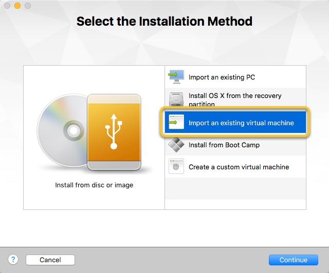
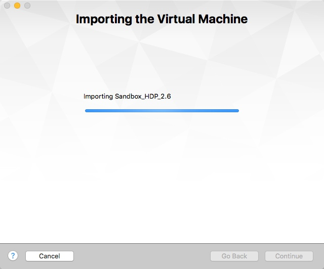

# Deploying Hortonworks Sandbox on VMWare

## Introduction

This tutorial walks through installing the Hortonworks Sandbox onto VMware on your computer.

## Prerequisites

-   [Download the Hortonworks Sandbox](https://hortonworks.com/downloads/#sandbox)
-   VMWare Installed
    -   [VMWare Workstation For Linux](http://www.vmware.com/products/workstation-for-linux.html)
    -   [VMWare Workstation For Windows](http://www.vmware.com/products/workstation.html)
    -   [VMWare Fusion For Mac](http://www.vmware.com/products/fusion.html)
-   A computer with at least **8 GB of RAM to spare**.

## Outline

-   [Import the Hortonworks Sandbox](#import-the-hortonworks-sandbox)
-   [Further Reading](#further-reading)

## Import the Hortonworks Sandbox

Open your VMWare product and elect to add a new virtual machine.

On Mac OSX:

Select "**Import an existing virtual machine**" and click the Continue button.

"**Choose File...**" to browse to and select the sandbox image you downloaded.  Click the Continue button.

Next, you're given the opportunity to save the virtual machine under a different name.  If you have no preference in renaming, you can just leave the default name and click Save.  You should then see the importing progress dialog:

Once finished, the following screen is displayed:

Click the **Finish** button and start your new virtual machine.  A window opens and displays the boot process.  Once the virtual machine fully boots up, you may begin using the sandbox.

Welcome to the Hortonworks Sandbox!

## Further Reading

-   Follow-up with the tutorial: [Learning the Ropes of the Hortonworks Sandbox](https://hortonworks.com/hadoop-tutorial/learning-the-ropes-of-the-hortonworks-sandbox)
-   [Browse all tutorials available on the Hortonworks site](https://hortonworks.com/tutorials/)
