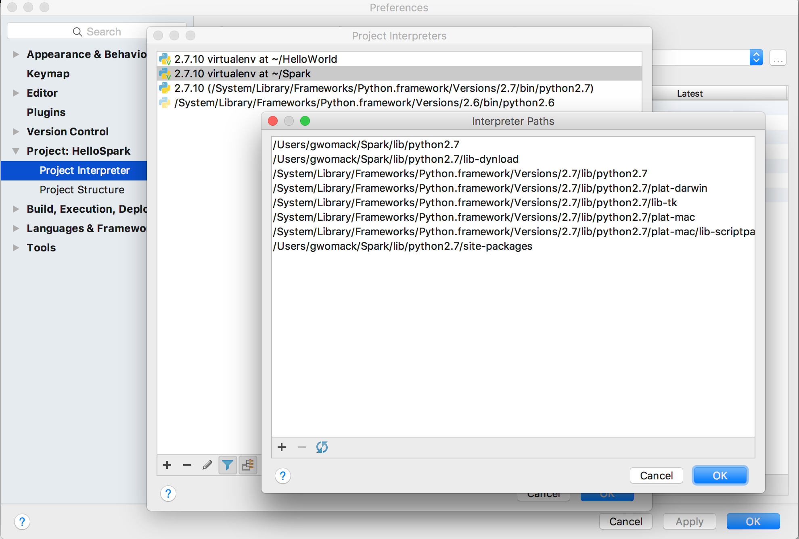

# Setting up a Spark Development Environment with Python

## Introduction

This tutorial will teach you how to set up a full development environment for developing and debugging Spark applications. For this tutorial we'll be using Python, but Spark also supports development with Java, Python, and R. The Scala version of this tutorial can be found [here](https://hortonworks.com/hadoop-tutorial/setting-spark-development-environment-scala/), and the Java version [here](https://hortonworks.com/hadoop-tutorial/setting-spark-development-environment-java/). We'll be using PyCharm Professional Edition as our IDE. PyCharm community edition can also be used, but some of the techniques we'll show you in this tutorial will only work with Professional Edition. By the end of the tutorial, you'll know how to set up Spark with PyCharm, how to deploy your code to the sandbox or a cluster, and how to debug your Spark code on a remote cluster.

## Prerequisites

-   Download the [Hortonworks Sandbox](https://hortonworks.com/downloads/)

## Outline

-   [Installing Prerequisites](#installing-prerequisites)
-   [Creating a new PyCharm Project](#creating-a-new-pycharm-project)
-   [Create a Spark Application](#create-a-spark-application)
-   [Deploying to the Sandbox](#deploying-to-the-sandbox)
-   [Deploying to the Cloud](#deploying-to-the-cloud)
-   [Debugging](#debugging)

## Installing Prerequisites

Before starting this tutorial make sure you've installed PyCharm and the Python programming language.

## Creating a new PyCharm Project

To create a new project select File > New Project. Name the project HelloSpark and locate it at ~/HelloSpark


When choosing an interpreter, click the "..." button and select Create VirtualEnv. Create a new VirtualEnv named Spark at ~/HelloSpark/VirtualEnv/Spark.


You should now have an empty project called HelloSpark. To get PyCharm to recognize Spark code and enable type-ahead we will need to register Spark with our Python interpreter. We can use SCP to copy the latest version of the source code we need from the sandbox to our local machine. The default password is hadoop as of sandbox version 2.6.

```
scp -P 2222 root@sandbox.hortonworks.com:/usr/hdp/current/spark2-client/python/lib/pyspark.zip ~/HelloSpark/
scp -P 2222 root@sandbox.hortonworks.com:/usr/hdp/current/spark2-client/python/lib/py4j-0.10.4-src.zip ~/HelloSpark/
```

 Then open project settings by clicking PyCharm -> Preferences (menus may vary depending on OS). Then select Project: HelloSpark -> Project Interpreter.


Click the "..." on the upper-right of the screen and select "More". Then select the folder button.



Then click the "+" button to upload the two files we copied from the sandbox. Pycharm should now be able to recognize Spark source code.

## Create a Spark Application

For our first "Hello World" application we're going to build a simple program that performs a word count on the collected works of Shakespeare. Download the text file [here](https://github.com/Gregw135/SparkTutorials/raw/master/setting-up-a-spark-development-environment-with-scala/assets/shakespeare.txt). Later we'll want to Spark to retrieve this file from HDFS (Hadoop Distributed File System), so let's place it there now.

To upload to HDFS, first make sure the sandbox is on, then navigate to localhost:8080 and login (default username/password is maria_dev/maria_dev). Once you've logged into Ambari Manager, mouse over the drop-down menu on the upper-right hand corner and click on Files View. Then open the tmp folder and click the upload button in the upper-right corner to upload the file. Make sure it's named shakespeare.txt.


Now we're ready to start making our application. In your IDE click New -> File and name it Main.py. Copy this code into it:

```
from pyspark import SparkContext, SparkConf

conf = SparkConf().setAppName('MyFirstStandaloneApp')
sc = SparkContext(conf=conf)

text_file = sc.textFile("hdfs:///tmp/shakespeare.txt")

counts = text_file.flatMap(lambda line: line.split(" ")) \
             .map(lambda word: (word, 1)) \
             .reduceByKey(lambda a, b: a + b)
def printLine(line):
    print(line)

counts.foreach(printLine)
counts.saveAsTextFile("hdfs:///tmp/shakespeareWordCount")
```

That's all it takes to perform a wordcount in Spark and print the results to a console. If you try to modify any of the code you should notice that PyCharm has type-ahead enabled.

## Deploying to the Sandbox

In this section we'll be deploying our code against the Hortonworks sandbox. Copy Main.py to the sandbox using SCP:

```
scp -P 2222 ./Main.py root@sandbox.hortonworks.com:/root
#(default password is hadoop)
```

Next we need to ssh into the sandbox:
```
ssh root@127.0.0.1 -p2222
```

Then use spark-submit to run our code:
```
/usr/hdp/current/spark2-client/bin/spark-submit ~/HelloSpark/Main.py
```

If you've added Shakespeare.txt to HDFS and Spark2 is turned on, you should get a word count output that looks like this:

```
...
(u'abbots;', 1)
(u"hatch'd,", 2)
(u'continuer.', 1)
(u'invocate', 1)
(u'Doublets,', 1)
(u'sanctuary!', 1)
(u"perform'd", 15)
(u'basilisk,', 1)
(u'larger', 5)
(u'bed-mate', 1)
(u'Danger', 2)
(u'Bal.', 9)
(u"bow'r,", 1)
(u'damosella', 1)
...
```

This has also been outputted to HDFS at /tmp/shakespeareWordCount, which you can see if you check the files view in Ambari.

## Deploying to the Cloud

In this section we'll learn how to deploy our code to a real cluster. If you don't have a cluster available you can quickly set one up on [AWS](https://hortonworks.com/products/cloud/aws/) using Hortonworks Data Cloud or on Azure using [HDInsight](https://azure.microsoft.com/en-us/services/hdinsight/) (which is powered by Hortonworks). These services are designed to let you quickly spin up a cluster for a few hours (perhaps on cheaper spot instances), run a series of jobs, then spin the cluster back down to save money. If you want a permanent installation of Hadoop that will run for months without being shutdown, you should download Hortonworks Data Platform from [here](https://hortonworks.com/downloads/) and install it on your servers.

After setting up a cluster the process of deploying our code is similar to deploying to the sandbox. We need to scp our code to the cluster:
```
scp -P 2222 -i "key.pem" ~/HelloSpark/Main.py root@[ip address of a master node]:root
```

Then open a second terminal window and ssh into the master node:
```
ssh -p 2222 -i "key.pem" root@[ip address of a master node]
```

Then use spark-submit to run our code:
```
/usr/hdp/current/spark2-client/bin/spark-submit ~/Main.py --master yarn --deploy-mode client
```

Notice that we specified the parameters ``--master yarn`` instead of ``--master local``. ``--master yarn`` means we want Spark to run in a distributed mode rather than on a single machine, and we want to rely on YARN (a cluster resource manager) to fetch available machines to run the job. If you aren't familiar with YARN, it is especially important if you want to run several jobs simultaneously on the same cluster. When configured properly, a YARN queue will provide different users or process a quota of cluster resources they're allowed to use. It also provides mechanisms for allowing a job to take full use of the cluster when resources are available and scaling existing jobs down when additional users or jobs begin to submit jobs.

The parameter ``--deploy-mode client`` indicates we want to use the current machine as the driver machine for Spark. The driver machine is a single machine that initiates a Spark job, and is also where summary results are collected when the job is finished. Alternatively, we could have specified ``--deploy-mode cluster``, which would have allowed YARN to choose the driver machine.

It's important to note that a poorly written Spark program can accidentally try to bring back many Terabytes of data to the driver machine, causing it to crash. For this reason you shouldn't use the master node of your cluster as your driver machine. Many organizations submit Spark jobs from what's called an edge node, which is a separate machine that isn't used to store data or perform computation. Since the edge node is separate from the cluster, it can go down without affecting the rest of the cluster. Edge nodes are also used for data science work on aggregate data that has been retrieved from the cluster. For example, a data scientist might submit a Spark job from an edge node to transform a 10 TB dataset into a 1 GB aggregated dataset, and then do analytics on the edge node using tools like R and Python. If you plan on setting up an edge node, make sure that machine doesn't have the DataNode or HostManager components installed, since these are the data storage and compute components of the cluster. You can check this on the host tab in Ambari.

Tutorial By Greg Womack (Twitter: @gregw134)
