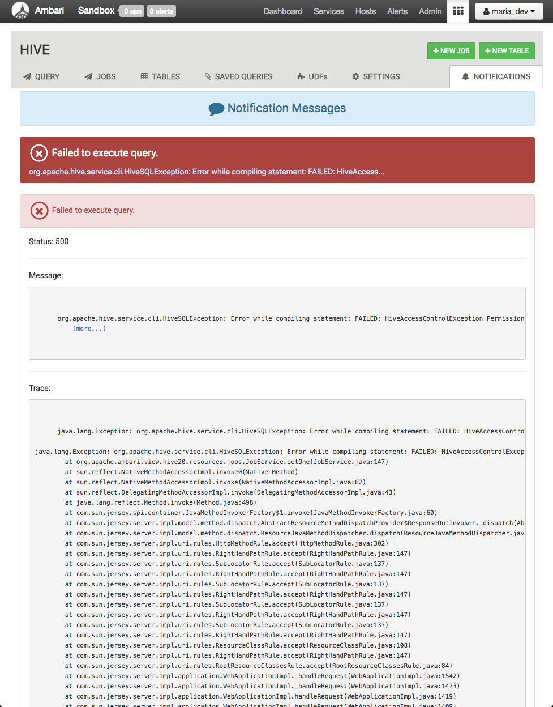
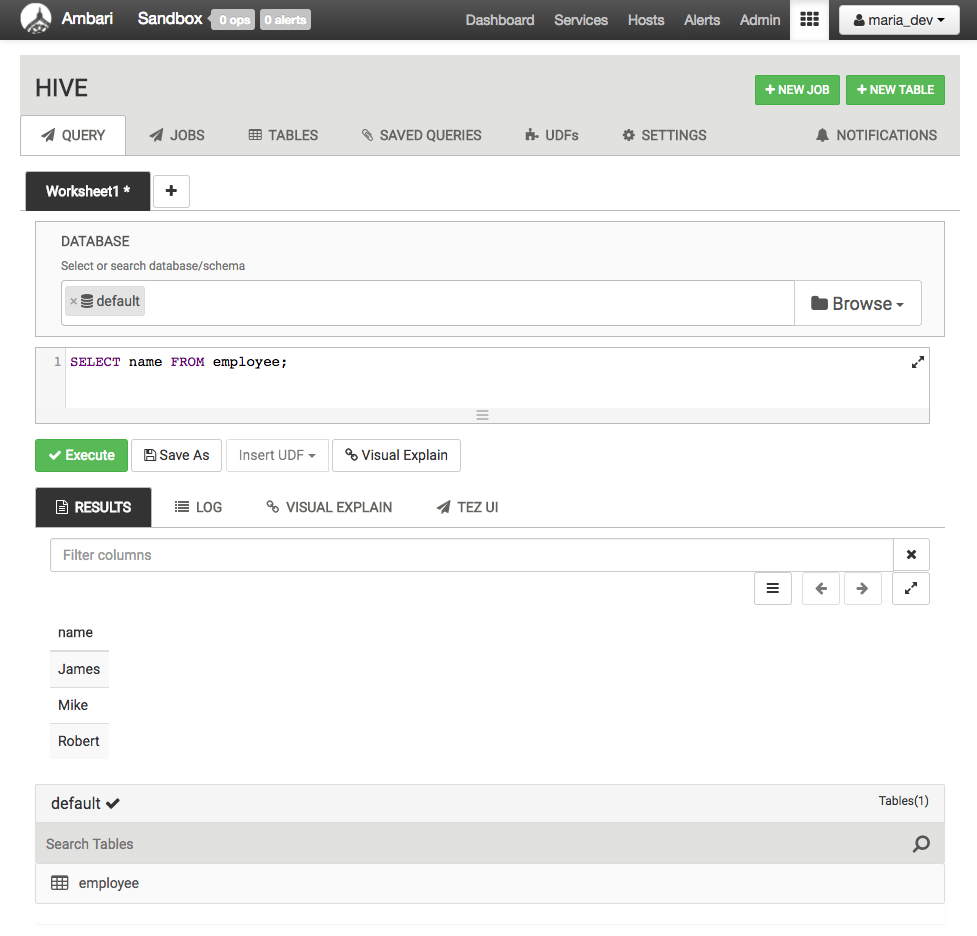
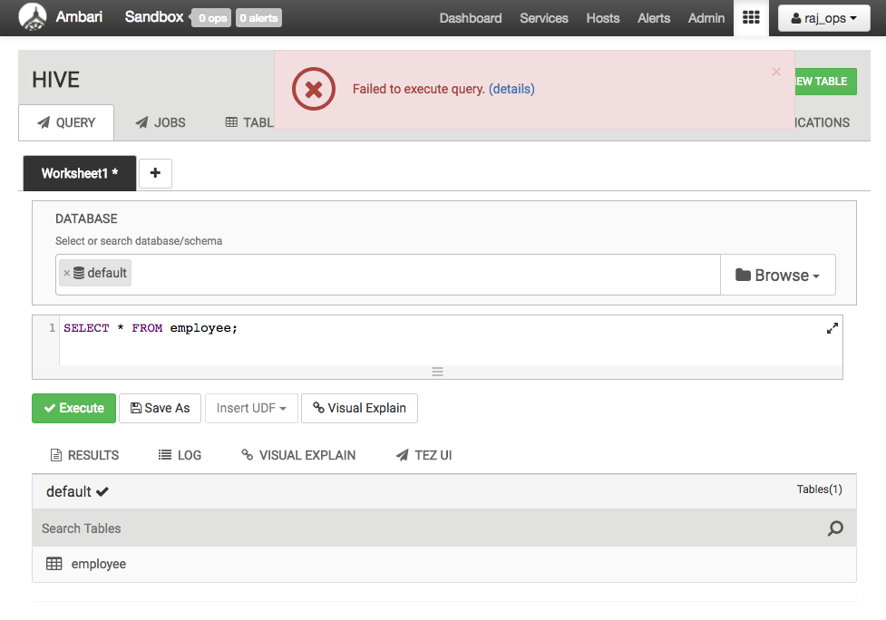
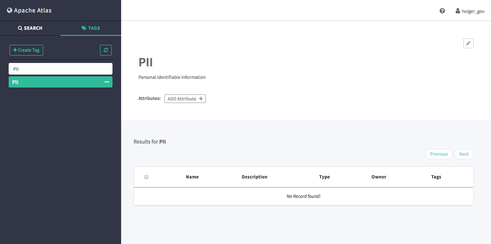
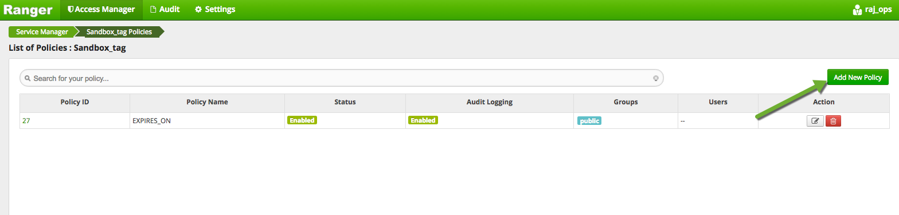
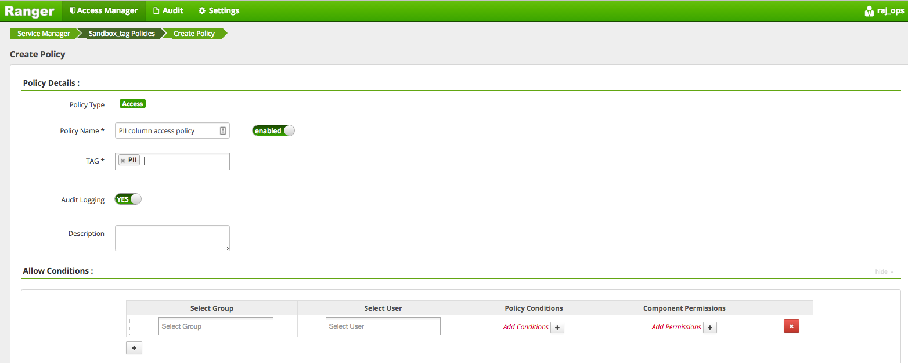

# Tag Based Policies with Apache Ranger and Apache Atlas

## Introduction

Hortonworks has recently announced the integration of Apache Atlas and Apache Ranger, and introduced the concept of tag or classification based policies. Enterprises can classify data in Apache Atlas and use the classification to build security policies in Apache Ranger.

This tutorial walks through an example of tagging data in Atlas and building a security policy in Ranger.

## Prerequisites

-   [Download Hortonworks 2.5 Sandbox](https://hortonworks.com/downloads/#sandbox)
-   Complete the [Learning the Ropes of the Hortonworks Sandbox tutorial,](https://hortonworks.com/hadoop-tutorial/learning-the-ropes-of-the-hortonworks-sandbox/) you will need it for logging into Ambari.

## Outline

-   [1. Start Kafka, HBase, Ambari Infra, Ranger and Atlas](#start-services)
    -   [1.1 View the Services Page](#view-service-page)
    -   [1.2 Enable Ranger Audit to Solr](#ranger-audit-to-solr)
    -   [1.3 Start Kafka, HBase, Ambari Infra, Ranger and Atlas Service](#start-kafka)
    -   [1.4 Restart Hive Service](#restart-hive)
-   [2. General Information](#general-information)
-   [3. Sample Ranger Policy for Different User Personas](#sample-ranger-policy)
-   [4. Access Without Tag Based Policies](#access-without-tag)
-   [5. Create Tag and Tag Based Policy](#create-tag-based-policy)
-   [Summary](#summary)

## 1. Start Kafka, HBase, Ambari Infra, Ranger and Atlas 

### 1.1 View the Services Page 

Start by logging into Ambari as raj_ops user.

### 1.2 Enable Ranger Audit to Solr 

Click on the **Ranger** Service from the Ambari Stack of services on the left side column.

Select the **Configs** tab.

Select the **Ranger Audit** tab. Turn ON Ranger's Audit to Solr feature by clicking on the OFF configuration under **Audit to Solr**.

**Save** the configuration. In the **Save Configuration** window that appears, write `Turn ON Audit to Solr Feature`, then click **Save** in that window. click **OK** button on Dependent Configurations window. click **Proceed Anyway.**

Now restart the Ranger service for the configuration to take effect. Click on **Service Actions**, **Restart All**, **Confirm Restart All**. We need this configuration updated, so we can use Ranger Audit.

### 1.3 Start Kafka Service 

From the Kafka page, click on `Service Actions -> Start`

Check the box and click on `Confirm Start`:

Wait for Kafka to start (It may take a few minutes to turn green)

Now start other required services as well. Ranger Tagsync is stopped by default so please restart Ranger as well. Finally, start Atlas at the end. Your Ambari dashboard page should look like this:

Let's start HBase, Ambari Infra and Atlas.

### 1.4 Restart Hive Service <a id="restart-hive"

From within the Hive service, click on `Service Actions -> Restart`

Since we will be monitoring user activity in Hive using Ranger, we need to restart Hive since it was an affected component during the Ranger configuration change.

## 2. General Information 

Ranger can be accessed using the following credentials:

User id – **raj_ops**
Password – **raj_ops**

And for Atlas:

User id – **holger_gov**
Password – **holger_gov**

In the tutorial steps below, we are going to be using user ids raj_ops and maria_dev. You can login into Ambari view using the following credentials

User id – **raj_ops**
Password – **raj_ops**

User id – **maria_dev**
Password – **maria_dev**

## 3. Sample Ranger Policy for Different User Personas 

Navigate to Ranger UI by typing `127.0.0.1:6080` on browser, you will see a Ranger login page:

Use username - raj_ops and password - raj_ops

Press `Sign In` button, the home page of Ranger will be displayed. Click on `Sandbox_hive`.

You will now see a list of policies under Sandbox_hive repository. Click on the box of last policy which is **policy for raj_ops, holger_gov, maria_dev and amy_ds**

This policy is meant for these 4 users and is applied to all tables and all columns of a `foodmart` database.

To check the type of access that this policy imposed on these users, scroll down:

You can give any access to the users as per their roles in the organization.

## 4. Access Without Tag Based Policies 

Let’s create a hive table employee from Ambari `Hive View 2.0`.

Go back to Ambari and then to Hive View 2.0 from 9 square menu icon, and type the following create table query:

~~~sql
create table employee (ssn string, name string, location string)
row format delimited
fields terminated by ','
stored as textfile;
~~~

And click on green `Execute` button.

You can check whether your table gets created or not by going to the **TABLES** tab, then refreshing the list of tables in the database. Select default database, you will see a new employee table.

Now let’s put some records into this table.

First SSH into the Hortonworks Sandbox with the command:

~~~
ssh root@127.0.0.1 -p 2222
~~~

Create a new file called `employeedata.txt` from the terminal:

~~~
vi employeedata.txt
~~~

And put following data:

~~~
111-111-111,James,San Jose
222-222-222,Mike,Santa Clara
333-333-333,Robert,Fremont
~~~

Exit the vi shell by typing Esc-->wq!
Now copy this file to HDFS where employee table data is being stored.

~~~
hdfs dfs -copyFromLocal employeedata.txt /apps/hive/warehouse/employee
~~~

Now let’s go back to hive view to view this data.

Go to **TABLES** tab, note down the employee table name, then head back to **QUERY** tab and write the hive script:

~~~sql
select * from employee;
~~~

You will be able to see the data.

In the first scenario, you have an `employee` data table in Apache Hive with `ssn, name and location` as part of the columns. The ssn and location information is deemed sensitive and users should not have access to it.

You need to create a Ranger policy which allows for access to name column except ssn and location. This policy will be assigned to both raj_ops and maria_dev user for now.

Go to Ranger UI on:
`127.0.0.1:6080`

Go back to `Sandbox_hive` and then `Add New Policy`:

Enter following values:

~~~
Policy Names - policy to restrict employee data
Hive Databases - default
table - employee
Hive_column - ssn, location (NOTE : Do NOT forget to exclude these columns)
Description - Any description
~~~

In the `Allow Conditions`, it should have the following values:

~~~
Select Group – blank, no input
Select User – raj_ops, maria_dev
Permissions – Click on the + sign next to Add Permissions and click on select and then green tick mark.
~~~

You should have your policy configured like this:

Click on `Add` and you can see the list of policies that are present in `Sandbox_hive`.

You have to disable the `Hive Global Tables Allow` to test out the one that you just created. Go inside to this policy and toggle to disable it. Disable the **Policy Name.**

To check the access, get back to Ambari as `maria_dev` user.

Go directly to `Hive View 2.0`, then **QUERY** tab, write the hive script to load the data from employee table.

~~~sql
select * from employee;
~~~

Click on the **NOTIFICATIONS** tab:

You will get an authorization error. This is expected as the user does not have access to 2 columns in this table (ssn and location). To verify this, you can also view the **Audits** in Ranger. Go back to Ranger and click on `Audits=>Access` and select `Sandbox_hive` in Service Name. You will see the entry of Access Denied for maria_dev.

Now coming back to `Hive View 2.0`, try running a query for selective column.

~~~sql
SELECT name FROM employee;
~~~

The query runs successfully.
Even, **raj_ops** user cannot not see all the columns for the location and SSN. We would provide access to this user to all columns later.

## 5. Create Tag and Tag Based Policy 

As a first step, login into ATLAS web app using `http://127.0.0.1:21000/` and use username **holger_gov** and password **holger_gov**.

Go to `Tags` tab and press `Create Tag` button.
Give it a name as **PII** and description as **Personal Identifiable Information**.

Now go to `Search` tab and write `employee` in the box. It will give all the entities related to word employee.
Click on employee

You can view the details of an employee hive table.

Go to `Schema` tab to assign specific columns to PII tag.

Press blue + button to assign the tag to `SSN`. Then, Select `PII` from the list of tags and click Save.

Repeat the same for the `location` row from the above list. Refresh the page, now you should see both ssn and location columns are marked with `PII` tag. What essentially it means that we have classified any data in the ssn and location columns as PII.

Now let’s go back to Ranger UI. The tag and entity relationship will be automatically inherited by Ranger. In Ranger, we can create a tag based policy by accessing it from the top menu. Go to `Access Manager → Tag Based Policies`.

You will see a page like given below.

Click `+` button to create a new tag service.

Give it a name `Sandbox_tag` and click `Add`.

Click on `Sandbox_tag` to add a policy.

Click on `Add New Policy` button.
Give following details:

~~~
Policy Name – PII column access policy
Tag – PII
Description – Any description
Audit logging – Yes
~~~

In the Allow Conditions, it should have the following values:

~~~
Select Group - blank
Select User - raj_ops
Component Permissions - Select Hive
~~~

You can select the component permission through this popup:

Please verify that Allow Conditions section is looking like this:

This signifies that only raj_ops is allowed to do any operation on the columns that are specified by PII tag. Click `Add`.

Now click on `Resource Based Policies` and edit `Sandbox_hive` repository by clicking on the button next to it.

Click on `Select Tag Service` and select `Sandbox_tag`. Click on `Save`.

The Ranger tag based policy is now enabled for **raj_ops** user. You can test it by running the query on all columns in employee table.

The query executes successfully. The query can be checked in the Ranger audit log which will show the access granted and associated policy which granted access. Select Service Name as `Sandbox_hive` in the search bar.

> **NOTE**: There are 2 policies which provided access to raj_ops user, one is a tag based policy and the other is hive resource based policy. The associated tags (PII) is also denoted in the tags column in the audit record).

## Summary 

Ranger traditionally provided group or user based authorization for resources such as table, column in Hive or a file in HDFS.
With the new Atlas -Ranger integration, administrators can conceptualize security policies based on data classification, and not necessarily in terms of tables or columns. Data stewards can easily classify data in Atlas and use in the classification in Ranger to create security policies.
This represents a paradigm shift in security and governance in Hadoop, benefiting customers with mature Hadoop deployments as well as customers looking to adopt Hadoop and big data infrastructure for first time.
