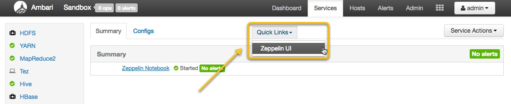
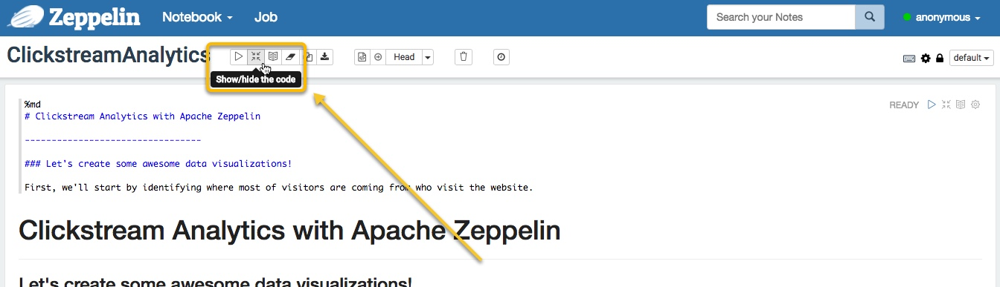

# Visualize Log Data with Apache Zeppelin

## Introduction

In this section, we will use Apache Zeppelin to access refined clickstream data.


## Prerequisites

-   Have sample retail data already loaded [by completing this tutorial](https://hortonworks.com/hadoop-tutorial/loading-data-into-the-hortonworks-sandbox)


## Outline

-   [Import a Notebook into Apache Zeppelin](#import-a-notebook-into-apache-zeppelin)
-   [Identify the State with the Most Customers](#identify-the-state-with-the-most-customers)
-   [Understand Customer Demographics](#understand-customer-demographics)
-   [Analyze Interest Category Distribution](#analyze-interest-category-distribution)
-   [Summary](#summary)
-   [Further Reading](#further-reading)


## Import a Notebook into Apache Zeppelin

If you don't have access to Microsoft Excel Professional Plus, you can also utilize Apache Zeppelin to do you data visualization as well.

Open up Ambari and make sure Zeppelin is running.  As shown in the screenshot below, use the "**Quick Links**" dropdown menu to access the **Zeppelin UI**.



Once the Zeppelin UI is open, click on "**Import note**".


Import ClickstreamAnalytics.json, which you can find here: [ClickstreamAnalytics.json](assets/ClickstreamAnalytics.json).

Once Zeppelin opens up, click on the correct icon in the navigation bar to display the code that goes along with the visualized data.  See the following screenshot for this icon's location.




## Identify the State with the Most Customers

Let's take a look at the first graph in the notebook.  Take note of the following:

1. The code in the paragraph that is run
2. The fields that are visualized (click "**settings**" to open this panel)
3. The type of graph rendered


## Understand Customer Demographics

Scroll down and check out the next section with a graph.  Let's dive a bit deeper and see how we achieve the visualizion.

1. Write the query to filter demographics (age, gender, category)
```sql
%jdbc(hive)
select age, gender_cd, category from webloganalytics where age is not NULL LIMIT 1000
```
2. Open **settings**, make sure
    -   `age` is dragged into the **Keys** area,
    -   `gender_cd` is dragged into **Groups** area,
    -   `category COUNT` is dragged into **Values** area

3. Select `area chart` as the visualization.

Those steps produce the following:


The majority of users who visit the website are within age range of 20-30. Additionally, there seems to be an even split between both genders.


## Analyze Interest Category Distribution

Finally, let's check out the last graph in this notebook.  It looks like clothing is clearly the most popular reason customers visit the website.


## Summary

You have successfully analyzed and visualized log data with Apache Zeppelin.  This, and other BI tools can be used with the Hortonworks Data Platform to derive insights about customers from various data sources.

The data stored in the Hortonworks Data Platform can be refreshed frequently and used for basket analysis, A/B testing, personalized product recommendations, and other sales optimization activities.


## Further Reading

-   [Zeppelin Notebook for Analysing Web Server Logs](https://community.hortonworks.com/content/repo/56765/zeppelin-notebook-for-analysing-web-server-logs.html)
-   [Zeppelin in Hortonworks Blog](https://hortonworks.com/apache/zeppelin/#blog)
