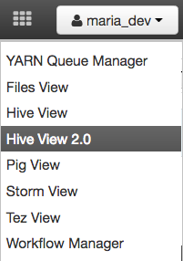
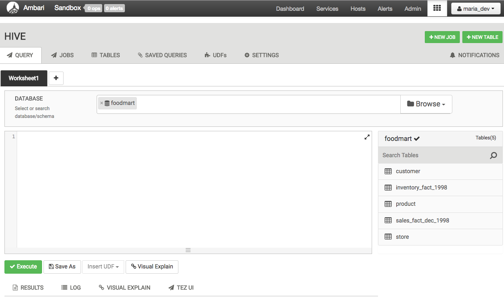
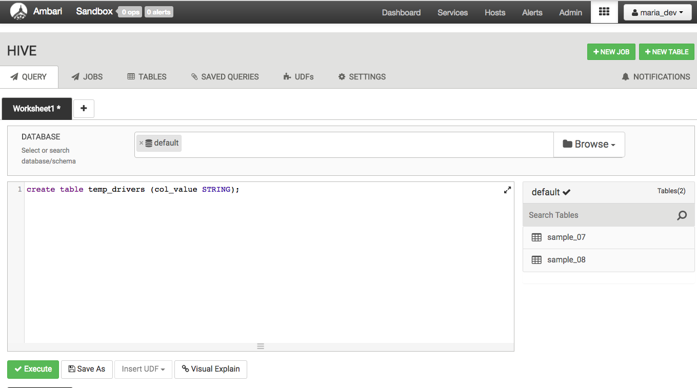
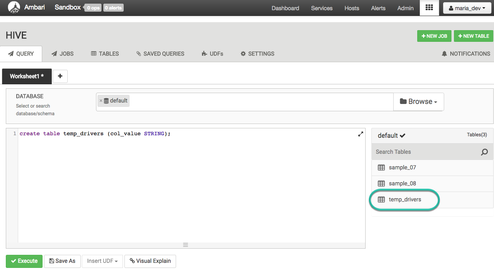
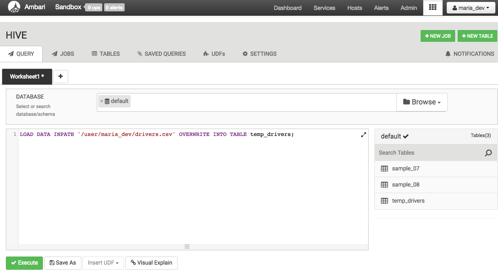
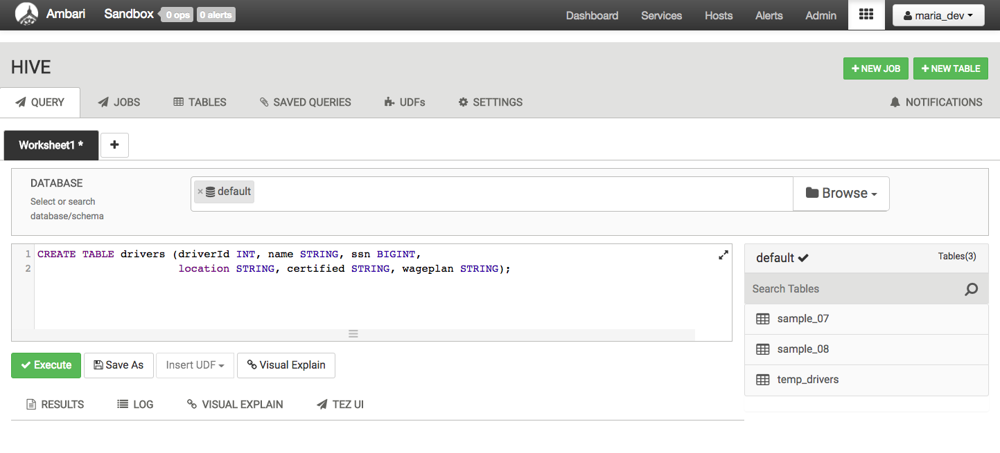
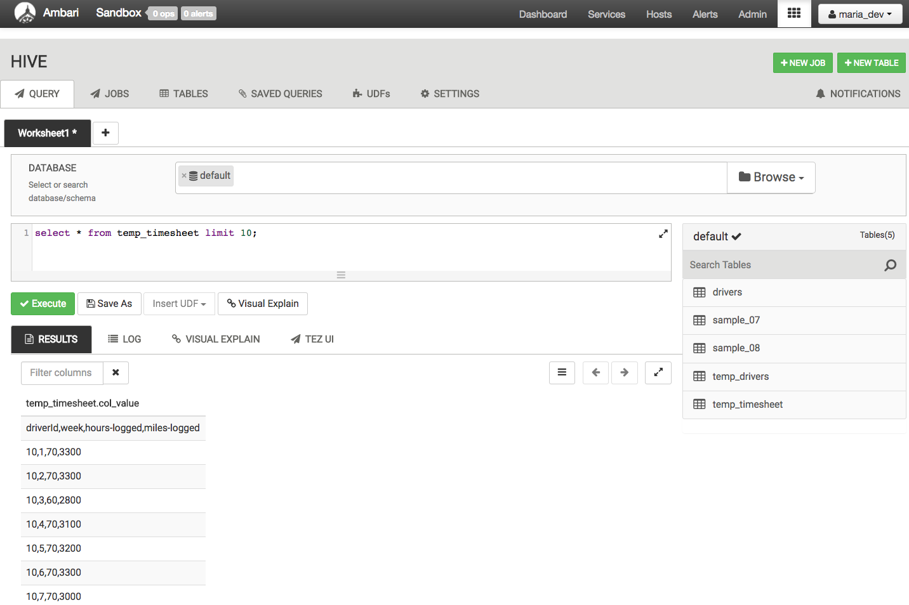
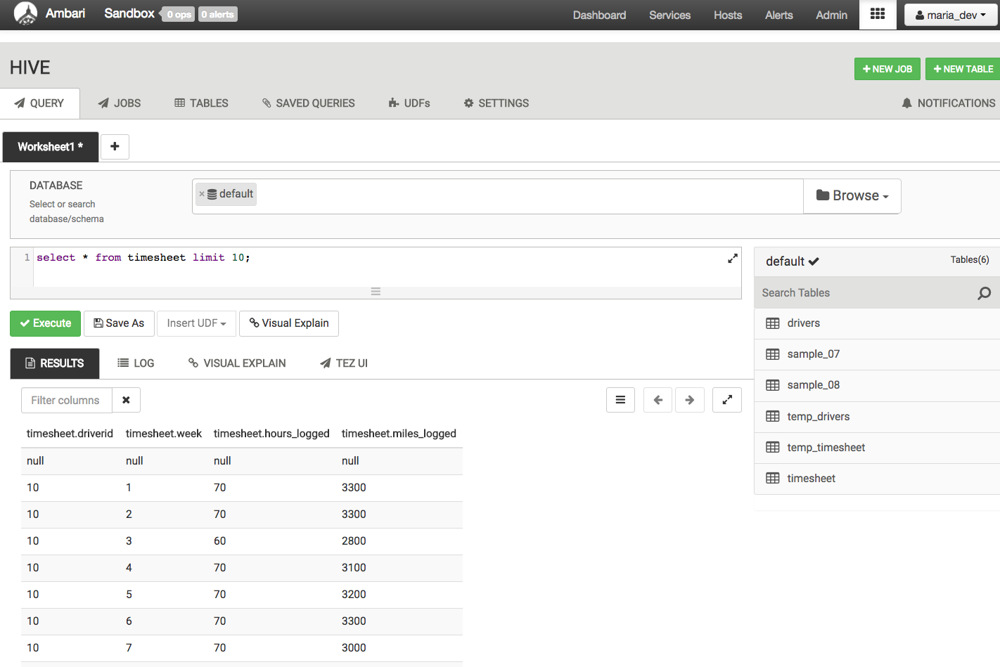
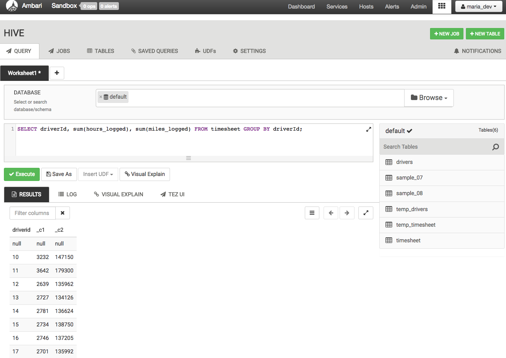
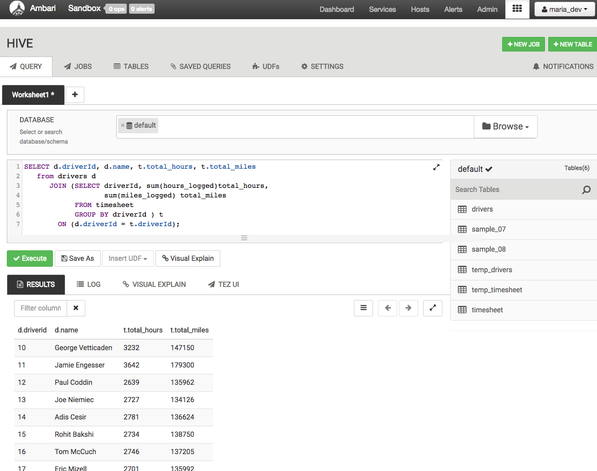

# How to Process Data with Apache Hive

## Introduction

In this tutorial, we will use the [Ambari](https://hortonworks.com/hadoop/ambari/) HDFS file view to store data files of truck drivers statistics. We will implement [Hive](https://hortonworks.com/hadoop/hive/) queries to analyze, process and filter that data.

## Prerequisites
-   Downloaded and Installed latest [Hortonworks Sandbox](https://hortonworks.com/downloads/#sandbox)
-   [Learning the Ropes of the Hortonworks Sandbox](https://hortonworks.com/tutorial/learning-the-ropes-of-the-hortonworks-sandbox/)
-   Allow yourself around one hour to complete this tutorial

## Outline
-   [Hive](#hive)
-   [Hive or Pig?](#hive-or-pig)
-   [Our Data Processing Task](#our-data-processing-task)
-   [Step 1: Download The Data](#download-the-data)
-   [Step 2: Upload The Data Files](#upload-the-data-files)
-   [Step 3: Start the Hive View](#start-the-hive-view)
-   [Summary](#summary)
-   [Further Reading](#further-reading)

## Hive 

Apache Hive is a component of [Hortonworks Data Platform](https://hortonworks.com/hdp/)(HDP). Hive provides a SQL-like interface to data stored in HDP. In the previous tutorial, we used Pig, which is a scripting language with a focus on dataflows. Hive provides a database query interface to Apache Hadoop.

## Hive or Pig? 

People often ask why do [Pig](https://hortonworks.com/hadoop/pig/) and [Hive](https://hortonworks.com/hadoop/hive/) exist when they seem to do much of the same thing. Hive because of its SQL like query language is often used as the interface to an Apache Hadoop based data warehouse. Hive is considered friendlier and more familiar to users who are used to using SQL for querying data. Pig fits in through its data flow strengths where it takes on the tasks of bringing data into Apache Hadoop and working with it to get it into the form for querying. A good overview of how this works is in Alan Gates posting on the Yahoo Developer blog titled [Pig and Hive at Yahoo!](http://yahoohadoop.tumblr.com/post/98256601751/pig-and-hive-at-yahoo). From a technical point of view, both Pig and Hive are feature complete, so you can do tasks in either tool. However, you will find one tool or the other will be preferred by the different groups that have to use Apache Hadoop. The good part is they have a choice and both tools work together.

## Our Data Processing Task 

We are going to do the same data processing task as we just did with Pig in the previous tutorial. We have several files of truck driver statistics and we are going to bring them into Hive and do some simple computing with them. We are going to compute the sum of hours and miles logged driven by a truck driver for an year. Once we have the sum of hours and miles logged, we will extend the script to translate a driver id field into the name of the drivers by joining two different tables.

## Step 1: Download The Data 

Download the driver data file from [here](assets/driver_data.zip).
Once you have the file you will need to unzip the file into a directory. We will be uploading two csv files - `drivers.csv` and `timesheet.csv`.

## Step 2: Upload The Data Files 

We start by selecting the `HDFS Files view` from the Off-canvas menu at the top. The HDFS Files view allows us to view the Hortonworks Data Platform(HDP) file store. This is separate from the local file system. For the Hortonworks Sandbox, it will be part of the file system in the Hortonworks Sandbox VM.

Navigate to `/user/maria_dev` and click on the `Upload` button to select the files we want to upload into the Hortonworks Sandbox environment.

Click on the `browse` button to open a dialog box. Navigate to where you stored the `drivers.csv` file on your local disk and select `drivers.csv` and click `open`. Do the same thing for `timesheet.csv`. When you are done you will see there are two new files in your directory.

## Step 3: Start the Hive View 

Let’s open the `Hive View 2.0` by clicking on the Views icon on the top bar. Hive View 2.0 provides a user interface to the Hive data warehouse system for Hadoop.

### 3.1 Explore The Hive User Interface

Below is the `Query Editor`. A query may span multiple lines. At the bottom, there are buttons to `Execute` the query, `Visual Explain` the query, `Save As` the query with a name and to open a new Worksheet window for another query.

#### Hive and Pig Data Model Differences

Before we get started let’s take a look at how `Pig and Hive` data models differ. In the case of Pig all data objects exist and are operated on in the script. Once the script is complete all data objects are deleted unless you stored them. In the case of Hive we are operating on the Apache Hadoop data store. Any query you make, table that you create, data that you copy persists from query to query. You can think of Hive as providing a data workbench where you can examine, modify and manipulate the data in Apache Hadoop. So when we perform our data processing task we will execute it one query or line at a time. Once a line successfully executes you can look at the data objects to verify if the last operation did what you expected. All your data is live, compared to Pig, where data objects only exist inside the script unless they are copied out to storage. This kind of flexibility is Hive’s strength. You can solve problems bit by bit and change your mind on what to do next depending on what you find.

### 3.2 Create Table temp_drivers

The first task we will do is create a table to hold the data. We will type the query into the `Query Editor`. Once you have typed in the query hit the `Execute` button at the bottom.

~~~
create table temp_drivers (col_value STRING);
~~~

> **Hint:** press `CTRL` + `Space` for autocompletion

The query does not return any results because at this point we just created an empty table and we have not copied any data in it.
Once the query has executed we can refresh the `Database` by re-selecting the `Database`. We will see the new table called `temp_drivers`.

### 3.3 Create Query to Populate Hive Table temp_drivers with drivers.csv Data

The next line of code will load the data file `drivers.csv` into the table `temp_drivers`.

~~~
LOAD DATA INPATH '/user/maria_dev/drivers.csv' OVERWRITE INTO TABLE temp_drivers;
~~~

After executing `LOAD DATA` we can see table `temp_drivers` was populated with data from `drivers.csv`. Note that Hive consumed the data file `drivers.csv` during this step. If you look in the `File Browser` you will see drivers.csv is no longer there.

### 3.4 Create Table drivers

Now that we have read the data in we can start working with it. The next thing we want to do extract the data. So first we will type in a query to create a new table called `drivers` to hold the data. That table will have six columns for `driverId, name, ssn, location, certified and the wage-plan` of drivers.

~~~
CREATE TABLE drivers (driverId INT, name STRING, ssn BIGINT, location STRING, certified STRING, wageplan STRING);
~~~

### 3.5 Create Query to Extract Data from temp_drivers and Store It to drivers

Then we extract the data we want from `temp_drivers` and copy it into `drivers`. We will do this with a `regexp` pattern. To do this we are going to build up a multi-line query. The six regexp_extract calls are going to extract the `driverId, name, ssn, location, certified and the wage-plan` fields from the table temp_drivers. When you are done typing the query it will look like this. Be careful as there are no spaces in the regular expression pattern.

~~~
insert overwrite table drivers
SELECT
  regexp_extract(col_value, '^(?:([^,]*),?){1}', 1) driverId,
  regexp_extract(col_value, '^(?:([^,]*),?){2}', 1) name,
  regexp_extract(col_value, '^(?:([^,]*),?){3}', 1) ssn,
  regexp_extract(col_value, '^(?:([^,]*),?){4}', 1) location,
  regexp_extract(col_value, '^(?:([^,]*),?){5}', 1) certified,
  regexp_extract(col_value, '^(?:([^,]*),?){6}', 1) wageplan

from temp_drivers;
~~~

Execute the query and look at the `drivers` table. You should see data that looks like this.

### 3.6 Create temp_timesheet and timesheet tables similarly

Similarly, we have to create a table called `temp_timesheet`, then load the sample `timesheet.csv` file. Type the following queries one by one:

~~~
CREATE TABLE temp_timesheet (col_value string);
~~~

~~~
LOAD DATA INPATH '/user/maria_dev/timesheet.csv' OVERWRITE INTO TABLE temp_timesheet;
~~~

You should see the data like this:

Now create the table `timesheet` using the following query:

~~~
CREATE TABLE timesheet (driverId INT, week INT, hours_logged INT , miles_logged INT);
~~~

Insert the data into the table `timesheet` from `temp_timesheet` table using the same `regexp_extract` as we did earlier.

~~~
insert overwrite table timesheet
SELECT
  regexp_extract(col_value, '^(?:([^,]*),?){1}', 1) driverId,
  regexp_extract(col_value, '^(?:([^,]*),?){2}', 1) week,
  regexp_extract(col_value, '^(?:([^,]*),?){3}', 1) hours_logged,
  regexp_extract(col_value, '^(?:([^,]*),?){4}', 1) miles_logged

from temp_timesheet;
~~~

You should see the data like this:

### 3.7 Create Query to Filter The Data (driverId, hours_logged, miles_logged)

Now we have the data fields we want. The next step is to `group` the data by driverId so we can find the `sum` of hours and miles logged score for an year. This query first groups all the records by `driverId` and then selects the driver with the sum of the hours and miles logged runs for that year.

~~~
SELECT driverId, sum(hours_logged), sum(miles_logged) FROM timesheet GROUP BY driverId;
~~~

The results of the query look like this:

### 3.8 Create Query to Join The Data (driverId, name, hours_logged, miles_logged)

Now we need to go back and get the `driverId(s)` so we know who the driver(s) was. We can take the previous query and join it with the `drivers` records to get the final table which will have the `driverId, name and the sum of hours and miles logged`.

~~~
SELECT d.driverId, d.name, t.total_hours, t.total_miles from drivers d
JOIN (SELECT driverId, sum(hours_logged)total_hours, sum(miles_logged)total_miles FROM timesheet GROUP BY driverId ) t
ON (d.driverId = t.driverId);
~~~

The resulting data looks like:

So now we have our results. As described earlier we solved this problem using Hive step by step. At any time we were free to look around at the data, decide we needed to do another task and come back. At all times the data is live and accessible to us.

## Summary 

Congratulations on completing this tutorial! We just learned how to upload data into HDFS Files View and create hive queries to manipulate data. Let's review all the queries that were utilized in this tutorial: **create**, **load**, **insert**, **select**, **from**, **group by**, **join** and **on**. With these queries, we created a table _temp_drivers_ to store the data. We created another table _drivers_, so we can overwrite that table with extracted data from the _temp_drivers_ table we created earlier. Then we did the same for _temp_timesheet_ and _timesheet_.Finally, created queries to filter the data to have the result show the sum of hours and miles logged by each driver.

## Further Reading 
-   [Apache Hive](https://hortonworks.com/apache/hive/)
-   [Hive Tutorials](https://hortonworks.com/apache/hive/#tutorials)
-   [Hive Language Manual](https://cwiki.apache.org/confluence/display/Hive/LanguageManual+DDL)
