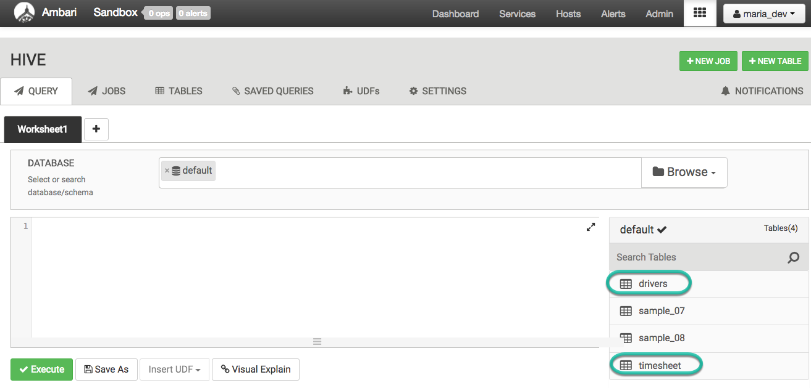
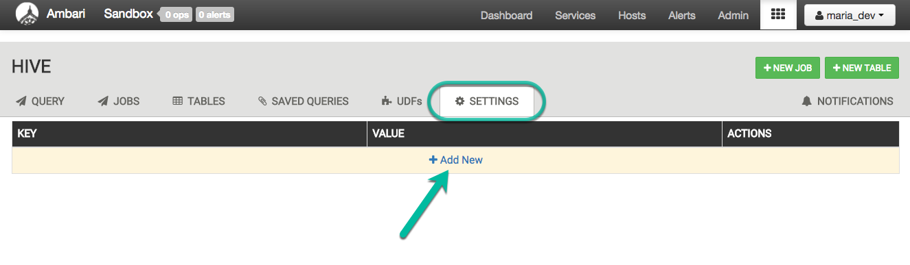
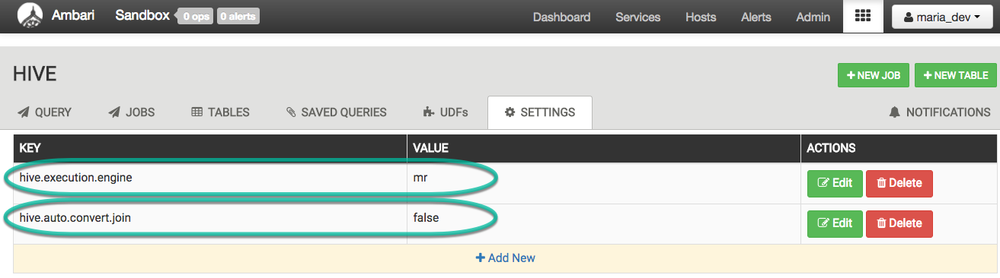
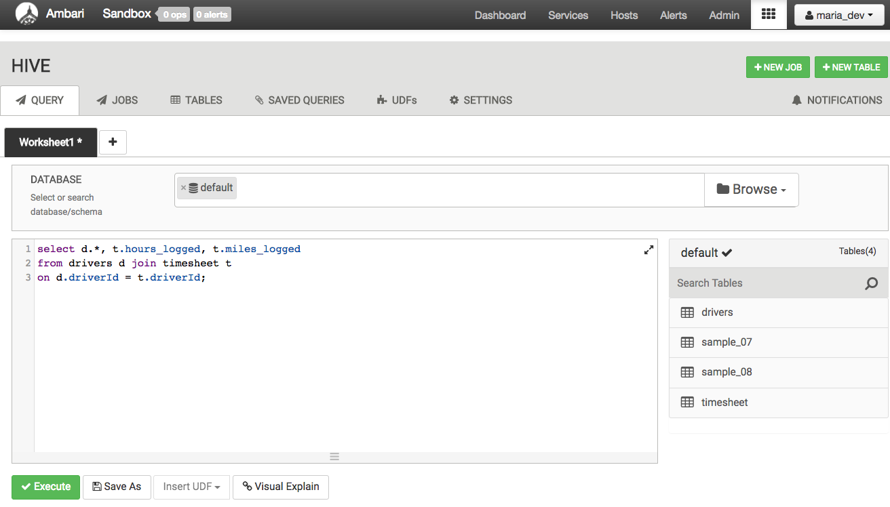
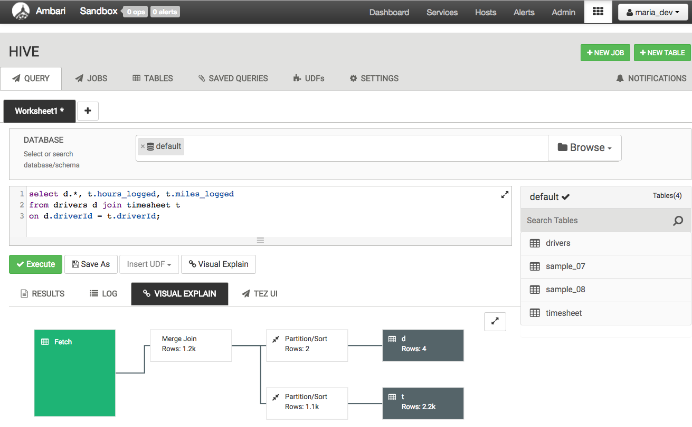
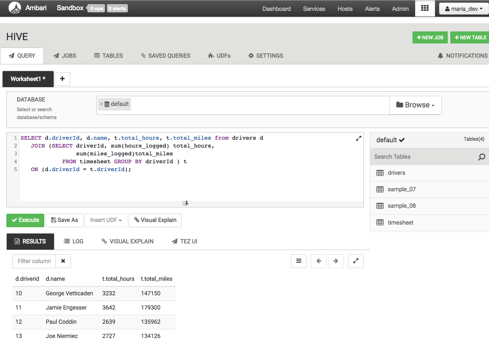
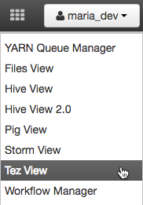
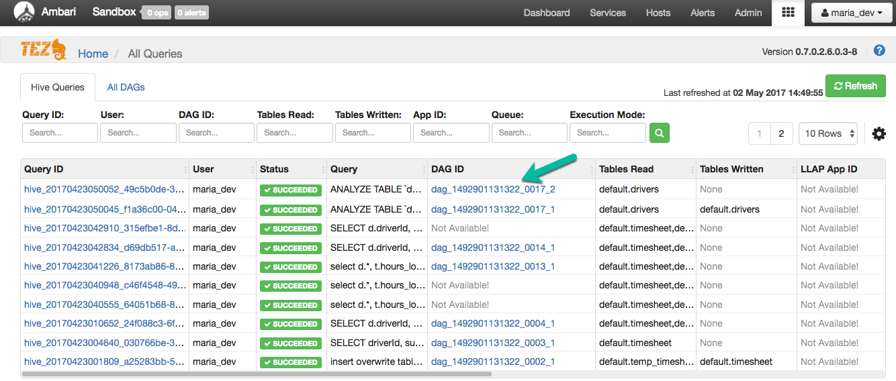
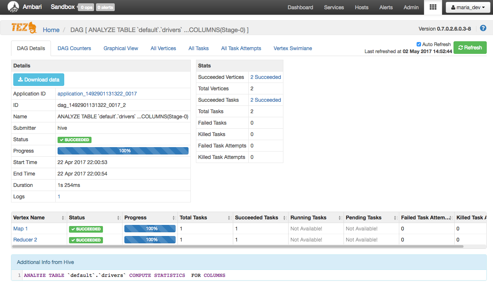

# Interactive Query for Hadoop with Apache Hive on Apache Tez

## Introduction

In this tutorial, we’ll focus on taking advantage of the improvements to [Apache Hive](https://hortonworks.com/hadoop/hive) and [Apache Tez](https://hortonworks.com/hadoop/tez) through the work completed by the community as part of the [Stinger initiative](https://hortonworks.com/labs/stinger). These features will be discussed in this tutorial:

*   Performance improvements of Hive on Tez
*   Performance improvements of Vectorized Query
*   Cost-based Optimization Plans
*   Multi-tenancy with HiveServer2
*   SQL Compliance Improvements

## Prerequisites
-  Downloaded and Installed latest [Hortonworks Sandbox](https://hortonworks.com/downloads/#sandbox)
-  [Learning the Ropes of the Hortonworks Sandbox](https://hortonworks.com/tutorial/learning-the-ropes-of-the-hortonworks-sandbox/)
-  Allow yourself around one hour to complete this tutorial

## Outline
- [Step 1: Download Data](#download-data)
- [Step 2: Upload Data Using HDFS Files View](#upload_data_using_hdfs)
- [Step 3: Create Hive Queries](#create-hive-queries)
- [Speed Improvements](#speed-improvements)
- [Step 4: Configure MapReduce as Execution Engine in Hive view Settings Tab](#configure-mapreduce-engine-in-hive-settings)
- [Step 5: Test Query on MapReduce Engine](#test-query-mapreduce-engine)
- [Step 6: Configure Tez as Execution Engine in Hive view Settings Tab](#configure-tez-engine-in-hive-settings)
- [Step 7: Test Query on Tez Engine](#test-query-on-tez-engine)
- [Step 8: Execute Query as MapReduce Then Tez Engine](#execute-query-mapreduce-tez-engine)
- [Step 9: Track Hive on Tez Jobs](#track-hive-on-tez-jobs)
- [Stats & Cost Based Optimization (CBO)](#stats-cost-optimization)
- [Multi-tenancy with HiveServer2](#multi-tenancy-hiveserver2)
- [SQL Compliance](#sql-compliance)
- [Summary](#summary)
- [Further Reading](#further-reading)

## Step 1: Download Data 

Download the driver data file from [here](assets/driver_data.zip).

Once you have the file you will need to unzip the file into a directory. We will be uploading two csv files - drivers.csv and timesheet.csv.

## Step 2: Upload Data Using HDFS Files View

Let’s use the above two csv files `(drivers.csv and timesheet.csv)` to create two new tables using the following step. Navigate to `http://sandbox.hortonworks.com:8080` using your browser. Click the HDFS `Files view` from the dropdown menu.

Go to the `/tmp` folder and if it is not already present, create a new directory called `data` using the controls toward the top of the screen. Click next to the folder and click `Permissions`. Make sure to check (blue) all of the permissions boxes.

Now, let’s upload the above data files into HDFS and create two hive tables using the following steps.
Upload the two files under `/tmp/data` using `Upload` at the top of the screen

## Step 3: Create Hive Queries 

Now head on over to the `Hive View 2.0`

We will now use hive and create the two tables. They will be named per the csv file names : `drivers` and `timesheet`.
Use the following two queries to create the tables a then load the data

### 3.1 Create Table drivers

~~~
create table drivers
(driverId int,
 name string,
 ssn bigint,
 location string,
 certified string,
 wageplan string)
ROW FORMAT DELIMITED
FIELDS TERMINATED BY ','
STORED AS TEXTFILE
TBLPROPERTIES("skip.header.line.count"="1");
~~~

### 3.2 Create Table timesheet

~~~
create table timesheet
(driverId int,
 week int,
 hours_logged int,
 miles_logged int)
ROW FORMAT DELIMITED
FIELDS TERMINATED BY ','
STORED AS TEXTFILE
TBLPROPERTIES("skip.header.line.count"="1");
~~~

Refresh the database by re-selecting the database. You will see the two newly created tables.

### 3.3 Load Data into Query Tables

We’re are now going to load the data into the two tables using the `LOAD DATA INPATH` Hive command

~~~
LOAD DATA INPATH '/tmp/data/drivers.csv' OVERWRITE INTO TABLE drivers;
LOAD DATA INPATH '/tmp/data/timesheet.csv' OVERWRITE INTO TABLE timesheet;
~~~

You should now be able to obtain results when selecting small amounts of data from either table:

## Speed Improvements 

To take a look at the speed improvements of Hive on Tez, we can run some sample queries.

By default, the Hive view runs with Tez as it's execution engine. That's because Tez has great speed improvements over the original MapReduce execution engine. But by how much exactly are these improvements? Well let's find out!

## Step 4: Configure MapReduce as Execution Engine in Hive view Settings Tab 

Click on the Hive `SETTINGS` tab. Then we’re going to need to add new settings.

Then we’re going to modify the following properties:

-   `hive.execution.engine`, use value `mr` (short for MapReduce)
-   `hive.auto.convert.join`, use value `false`

## Step 5: Test Query on MapReduce Engine 

We are now going to test a query using MapReduce as our execution engine. Execute the following query and wait for the results.

~~~
select d.*, t.hours_logged, t.miles_logged
from drivers d join timesheet t
on d.driverId = t.driverId;
~~~

This query was run using the MapReduce framework.

## Step 6: Configure Tez as Execution Engine in Hive Settings Tab 

Now we can enable Hive on Tez execution and take advantage of Directed Acyclic Graph (DAG) execution representing the query instead of multiple stages of MapReduce program which involved a lot of synchronization, barriers and IO overheads. This is improved in Tez, by writing intermediate data set into memory instead of hard disk.

Head back to the **Settings** in the Hive view and now change the `hive.execution.engine` to `tez`.

## Step 7: Test Query on Tez Engine 

Run the same query as we had run earlier in Step 5, to see the speed improvements with Tez.

~~~
select d.*, t.hours_logged, t.miles_logged
from drivers d join timesheet t
on d.driverId = t.driverId;
~~~

Take a look at the `Visual Explain` to visually see the execution plan.

Notice that the results will have appeared much quicker while having the execution engine set to Tez. This is currently the default for all Hive queries.

Congratulations! You have successfully run your Hive on Tez Job.

## Step 8: Execute Query as MapReduce Then Tez Engine 

Now let’s try a new query to work with

~~~
SELECT d.driverId, d.name, t.total_hours, t.total_miles from drivers d
JOIN (SELECT driverId, sum(hours_logged)total_hours, sum(miles_logged)total_miles FROM timesheet GROUP BY driverId ) t
ON (d.driverId = t.driverId);
~~~

Try executing the query first on MapReduce execution engine, then on Tez. You should notice a considerable gap in execution time.
Here is the result.

To experience this further, you could use your own dataset, upload to your HDP Sandbox using steps above and execute with and without Tez to compare the difference.

## Step 9: Track Hive on Tez Jobs 

You can track your Hive on Tez jobs in HDP Sandbox Web UI as well. Please go to : [http://127.0.0.1:8088/cluster](http://127.0.0.1:8088/cluster) and track your jobs while running or post to see the details.

You can click on your job and see further details.

## Stats & Cost Based Optimization (CBO) 

Cost Based Optimization(CBO) engine uses statistics within Hive tables to produce optimal query plans.

### Benefits of CBO

1.  Reduces need of a specialists to tune queries
2.  More efficient query plans lead to better cluster utilization

### Types of Stats

There are two types of stats which could be collected so that the optimizer could use it in the decision making process :

1.  Table Stats
2.  Column Stats

The ‘explain’ plan feature can be used to see if the correct stats are being used.

>Note: CBO requires column statistics.

### Phases in which stats could be collected

1.  While data is inserted: `hive.stats.autographer =  [true,  **false**]`
2.  On existing data : table level `ANALYZE TABLE table [partition(key)] COMPUTE STATISTICS;`
3.  On existing data : column level `ANALYZE TABLE table [partition(key)] COMPUTE STATISTICS FOR COLUMNS col1,col2,...;`

### Configuration to make CBO effective for your query

1.  `hive.compute.query.using.stats =  [true,  **false**];`
2.  `hive.stats.fetch.column.stats =  [true,  **false**];`
3.  `hive.stats.fetch.partition.stats =  [true,  **false**];`
4.  `hive.cbo.enable =  [true,  **false**];`

Currently, CBO for Hive is enabled by default. You can confirm this by reviewing **Ambari** -> **Hive** -> **Configs** -> **Settings**.

As you can see the CBO flag is **on**, meaning that Hive will attempt to optimize complex queries in order to shorten the execution time.

However, the only caveat is that for each table you will need to compute statistics before CBO can be utilized.

~~~
# Usage:
       # ANALYZE TABLE table [partition(key)] COMPUTE STATISTICS;
       # ANALYZE TABLE table [partition(key)] COMPUTE STATISTICS FOR COLUMNS col1,col2,...
# Example:
         ANALYZE TABLE drivers COMPUTE STATISTICS FOR COLUMNS driverId, name;
~~~

Once these two commands are both executed, Hive will utilize CBO on more complex queries.

## Multi-tenancy with HiveServer2 

There could be contentions when multiple users run large queries simultaneously. Processing queries with many containers could lead to lower latency. For this, 3 controls could be put in place:

*   Container re-use timeout
*   Tez split wave tuning
*   Round Robin Queuing setup

### Diagnose: Job Viewer

Hive Job Viewer available in Ambari is a simple exploration and troubleshooting Graphical tool for Hive jobs.

The purposes of this Job Viewer are as follows:

*   Visualize execution DAG
*   Drill Down into individual stages for:
    *   Execution status
    *   Duration
    *   Number of bytes read and written, No of containers, etc.
        DAG Viewer is releasing soon, which will be available in Ambari.

Let's generate statistics for a table `drivers`:

1.  From Hive view, select `Tables` tab
2.  select `drivers` table
3.  select `statistics`
4.  check `include columns`
5.  select `Recompute`

To see the job executions visually, you can open the **Tez View** in Ambari Views.

Tez View will take you to DAG Details, which includes all your DAG projects.

Click on `DAG ID`

>Notice the query utilized in the photo is `ANALYZE TABLE default.drivers COMPUTE STATISTICS  FOR COLUMNS`

Try clicking on the different parts above, such as **Graphical View** and explore some of the other execution information from Tez.

## SQL Compliance 

There are several SQL query enhancements in this version of Hive.

### Query Enhancements Support extensions:

*   Expanded Join Semantics – Supports from table1, table2 where table1.col1=table2.col2
*   IN, NOT IN subqueries in WHERE Clause
*   EXISTS and NOT EXISTS
*   Correlated Subqueries with equality operation only
*   Common Table Expressions (CTE)
*   The CHAR datatype – trailing White Space

### Authorization System enhancements:

*   SQL Authorizations : Actions
    *   Grant/Revoke
        *   Create
        *   Insert
        *   Select
        *   Drop
        *   Delete
        *   All
            *   Create Roles & Grant with admin option
            *   Using views to restrict data visibility

## Summary 

You learned to perform basic hive queries, compared Hive on MapReduce and Tez Engine

## Further Reading 
- [Apache Hive](https://hortonworks.com/apache/hive/)
- [Hive Language Manual](https://cwiki.apache.org/confluence/display/Hive/LanguageManual+DDL)
