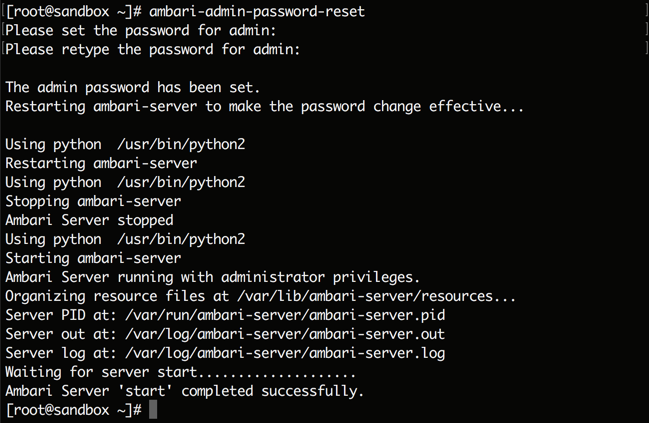

# Learning the Ropes of the Hortonworks Sandbox

## Introduction

This tutorial is aimed for users who do not have much experience in using the Sandbox.
We will install and explore the Sandbox on virtual machine and cloud environments. We will also navigate the Ambari user interface.
Let's begin our Hadoop journey.

## Prerequisites

-   Downloaded and Installed [Hortonworks Sandbox](https://hortonworks.com/downloads/#sandbox)
-   Allow yourself around one hour to complete this tutorial
-   If on mac or linux, added `sandbox.hortonworks.com` to your `/private/etc/hosts` file
-   If on windows 7, added `sandbox.hortonworks.com` to your `/c/Windows/System32/Drivers/etc/hosts` file

## Outline

-   [What is the Sandbox?](#what-is-the-sandbox)
-   [Section 1: Sandbox in VM](#section1)
-   [Step 1: Explore the Sandbox in a VM](#explore-sandbox-vm)
    -   [1.1 Install the Sandbox](#install-sandbox)
    -   [1.2 Learn the Host Address of Your Environment](#learn-host-address-environment)
    -   [1.3 Add Sandbox Hostname to Your Hosts File](#add sandbox hostname to your hosts file)
    -   [1.4 Connect to the Welcome Screen](#connect-to-welcome-screen)
    -   [1.5 Multiple Ways to Execute Terminal Commands](#ways-execute-terminal-command)
    -   [1.6 Learn Your Sandbox Version](#learn-sandbox-version)
-   [Step 2: Explore Ambari](#explore-ambari)
    -   [2.1 Use Terminal to Find the Host IP Sandbox Runs On](#find-host-ip-sandbox-runs-on)
    -   [Services Provided By the Sandbox](#services-provided-by-sandbox)
    -   [2.2 Setup Ambari admin Password Manually](#setup-ambari-admin-password)
    -   [2.3 Explore Ambari Welcome Screen 5 Key Capabilities](#explore-ambari-welcome-screen)
    -   [2.4 Explore Ambari Dashboard Links](#explore-ambari-dashboard)
-   [Section 3: New Users in Sandbox](#section3)
-   [Section 4: Troubleshoot](#section4)
-   [Step 1: Troubleshoot Problems](#troubleshoot-problems)
-   [Further Reading](#further-reading)

## What is the Sandbox? 

The Sandbox is a straightforward, pre-configured, learning environment that contains the latest developments from Apache Hadoop Enterprise, specifically Hortonworks Data Platform (HDP) Distribution. The Sandbox comes packaged in a virtual environment that can run in the cloud or on your personal machine. The Sandbox allows you to learn and explore HDP on your own.

If you want to explore Hortonworks Sandbox in Microsoft Azure, please skip to `Section 2`.

## Section 1: Sandbox in VM 

## Step 1: Explore the Sandbox in a VM 

### 1.1 Install the Sandbox 

Start the Hortonworks Sandbox following the [Installation Steps](https://hortonworks.com/tutorial/sandbox-deployment-and-install-guide/) to start the VM.

> **Note:** The Sandbox [system requirements](https://hortonworks.com/products/sandbox/) include that you have a 64 bit OS with at least 8 GB of RAM and enabled BIOS for virtualization. Find out about the newest features, known and resolved issues along with other updates on HDP and HDF from the [release notes](https://hortonworks.com/tutorial/hortonworks-sandbox-guide/).

### 1.2 Learn the Host Address of Your Environment 

Once you have installed the Sandbox VM, it resolves to the localhost on your environment, the address of which varies depending upon the Virtual Machine you are using(Vmware, VirtualBox etc). As, a general thumb rule, wait for the installation to complete and confirmation screen will tell you the localhost IP address your sandbox resolves to. For example:

In case of VirtualBox: `IP` would be `127.0.0.1`

> **Note:** In case of Azure, your **host** can be found under **Public IP Address** on the dashboard. For further clarification, check out our guide for [Deploying Hortonworks Sandbox on Microsoft Azure](https://hortonworks.com/tutorial/sandbox-deployment-and-install-guide/section/4/).

If you are using a private cluster or a cloud to run sandbox. Please find the host your sandbox resolves to.

## 1.3 Add Sandbox Hostname to Your Hosts File

To be able to access HDP services on the Sandbox from our host machine's browser, you will need to add `sandbox.hortonworks.com` mapped to your IP address to the list of hosts in your **hosts** file. The location of the **hosts** file is different for each OS.

For mac users, enter the following command in your terminal:

~~~
echo '{Host-Name} sandbox.hortonworks.com' | sudo tee -a /private/etc/hosts
~~~
> NOTE: In single machine, just replace {Host-Name} with 127.0.0.1

For most Linux users, enter the following command in your terminal:

~~~
echo '{Host-Name} sandbox.hortonworks.com' | sudo tee -a /etc/hosts
~~~
> NOTE: In single machine, just replace {Host-Name} with 127.0.0.1

1\. For Windows 10 users, open Notepad as an **administrator**. Open the "hosts" file at this path: `c:\Windows\System32\drivers\etc\hosts` and add:

~~~bash
127.0.0.1   localhost   sandbox.hortonworks.com
~~~

> Note: Make sure to remove the "#" hash symbol from the left side of the line and add "sandbox.hortonworks.com".

Then save the file.

### 1.4 Connect to the Welcome Screen 

Append the port number :8888 to your host address, open your browser, and access Sandbox Welcome page at `http://_host_:8888/.`

Click on `Launch Dashboard` to go to Ambari with a [Hello HDP tutorial](https://hortonworks.com/tutorial/hadoop-tutorial-getting-started-with-hdp/) and `Quick Links` to view some services of HDP environment.

`Launch Dashboard` opens the Ambari user interface and an additional tutorial window.  You should login to Ambari using the username and password based on the tutorials you are following in the tutorial window.  Most of the tutorials login to Ambari using `raj_ops/raj_ops` or `maria_dev/maria_dev`.

### 1.5 Multiple Ways to Execute Terminal Commands 

> **Note:** For all methods below, the login credential instructions will be the same to access the Sandbox through the terminal.

-   Login using username as **root** and password as **hadoop**.
-   After first time login, you will be prompted to retype your current password, then change your password.
-   If you are using Putty on Windows then go to terminal of your sandbox in oracle virtualBox --> Press `Alt+F5` --> enter username - **root** --> enter password - **hadoop** --> it will ask you to set new password --> set new password.

#### Secure Shell (SSH) Method:

Open your terminal (mac and linux) or putty (windows). Type the following command to access the Sandbox through SSH:

~~~
# Usage:
      ssh <username>@<hostname> -p <port>;
# Example:
      ssh root@127.0.0.1 -p 2222;
~~~

> Mac OS Terminal. When you type the password, the entry doesn't echo on the screen, it hides the user input. Carefully type correct password.

#### Shell Web Client Method:

Open your web browser. Type the following text into your browser to access the Sandbox through the shell:

~~~
# Usage:
    #  _host_:4200
Example:
      127.0.0.1:4200
~~~

> Appearance of Web Shell. When you type the password, the entry doesn't echo on the screen, it hides the user input. Carefully type correct password.

#### VM Terminal Method:

Open the Sandbox through Virtualbox or VMware. The Sandbox VM Welcome Screen will appear. For Linux/Windows users, press `Alt+F5` and for Mac, press `Fn+Alt+F5` to login into the Sandbox VM Terminal.

> VirtualBox VM Terminal. When you type the password, the entry doesn't echo on the screen, it hides the user input. Carefully type correct password.

### 1.6 Learn Your Sandbox Version 

To find information about your sandbox, execute the command:

~~~bash
sandbox-version
~~~

### 1.7 Send Data Between Sandbox CentOS & Local Machine 

Open your terminal (linux or mac) or git bash (windows). To send data, in our example HDF .tar.gz file, from your local machine to the azure sandbox, you would input the the following command. If you want to try this command, replace the HDF filename with another filename from your Downloads folder. Modify the command and execute:

~~~bash
scp -P 2222 ~/Downloads/HDF-1.2.0.1-1.tar.gz root@localhost:/root
~~~

This command sends HDF from your local machine's Downloads folder to the Sandbox's root directory. We can send any file, directory we want, we just need to specify the path. We can also choose any sandbox directory or path that we want the data to land into.

Here is the definition of the command that we used above:

~~~bash
scp -P <input-port> </input-directory-path-local-mach> <input-username@hostname-:/sandbox-dir-path>
~~~

We can also send data from sandbox to our local machine, refer to the modified command definition below:

~~~bash
scp -P <input-port> <input-username@hostname-:/sandbox-dir-path> </input-directory-path-local-mach>
~~~

What is the difference between the two command definitions above?
To send data from local machine to sandbox, the local machine directory path comes before sandbox directory. To transfer data from sandbox to local machine, the command arguments are reversed.

## Step 2: Explore Ambari 

Navigate to Ambari welcome page using the **url** given on Sandbox welcome page.

> **Note:** Both the username and password to login are **maria_dev**.

### 2.1 Use Terminal to Find the Host IP Sandbox Runs On 

If you want to search for the host address your sandbox is running on, ssh into the sandbox terminal upon successful installation and follow subsequent steps:

1.  Login using username as **root** and password as **hadoop**.
2.  Type `ifconfig` and look for **inet addr:** under eth0.
3.  Use the inet addr, append **:8080** and open it into a browser. It shall direct you to Ambari login page.
4.  This inet address is randomly generated for every session and therefore differs from session to session.

#### Services Provided By the Sandbox 

| Service | URL |
|---------|-----:|
| Sandbox Welcome Page | [http://_host_:8888]()|
| Ambari Dashboard | [http://_host_:8080]()|
| ManageAmbari | [http://_host_:8080/views/ADMIN_VIEW/2.4.0.0/INSTANCE/#/]()|
| Hive User View | [http://_host_:8080/#/main/views/HIVE/1.5.0/AUTO_HIVE_INSTANCE]()|
| Pig User View | [http://_host_:8080/#/main/views/PIG/1.0.0/Pig_INSTANCE]()|
| File User View | [http://_host_:8080/#/main/views/FILES/1.0.0/AUTO_FILES_INSTANCE]()|
| SSH Web Client | [http://_host_:4200]()|
| Hadoop Configuration | [http://_host_:50070/dfshealth.html]()   [http://_host_:50070/explorer.html]() |

#### The following Table Contains Login Credentials:

| Service | User | Password |
|---------|:------:|----------:|
| Ambari, OS | admin | refer to [step 2.1](#setup-ambari-admin-password-azure) |
| Ambari, OS | maria_dev | maria_dev |
| Ambari, OS | raj_ops | raj_ops |
| Ambari, OS | holger_gov | holger_gov |
| Ambari, OS | amy_ds | amy_ds |

Please go to [Section 3](#section3) to know more about these users.

### 2.2 Setup Ambari admin Password Manually 

1.  Start your sandbox and open a terminal (mac or linux) or putty (windows)
2.  SSH into the sandbox as root using `ssh root@127.0.0.1 -p 2222`. For Azure and VMware users, your `_host_` and `_port_` will be different.
3.  Type the following commands:

~~~
# Updates password
ambari-admin-password-reset
# If Ambari doesn't restart automatically, restart ambari service
ambari-agent restart
~~~

> **Note:** Now you can login to ambari as an admin user to perform operations, such as starting and stopping services.

### 2.3 Explore Ambari Welcome Screen 5 Key Capabilities 

Enter the **Ambari Welcome URL** and then you should see a similar screen:

1.  “**Operate Your Cluster**” will take you to the Ambari Dashboard which is the primary UI for Hadoop Operators
2.  “**Manage Users + Groups**” allows you to add & remove Ambari users and groups
3.  “**Clusters**” allows you to grant permission to Ambari users and groups
4.  “**Ambari User Views**” list the set of Ambari Users views that are part of the cluster
5.  “**Deploy Views**” provides administration for adding and removing Ambari User Views

### 2.4 Explore Ambari Dashboard Links 

Enter the **Ambari Dashboard URL** and you should see a similar screen:

Click on

1\.  **Metrics**, **Heatmap** and **Configuration**

and then the

2\.  **Dashboard**, **Services**, **Hosts**, **Alerts**, **Admin** and User Views icon (represented by 3×3 matrix ) to become familiar with the Ambari resources available to you.

## Section 2: Sandbox in Microsoft Azure 

## Step 1: Explore the Sandbox in Azure 

### 1.1 Deploy the Sandbox in Azure 

Follow the tutorial [here](https://hortonworks.com/tutorial/sandbox-deployment-and-install-guide/section/4/) to deploy the latest HDP Sandbox on Azure.

### 1.2 Connect to the Welcome Screen 

Append the port number :8888 to your host address, open your browser, and access Sandbox Welcome page at `http://_host_:8888/.`
Here, `host` is your public IP address that is generated when you deployed the HDP Sandbox in Azure. Take note of the IP address. In this example, it is 23.99.9.232. Your machine will have a different IP.

### 1.3 Multiple Ways to Execute Terminal Commands 

#### Secure Shell (SSH) Method:

Open your terminal (mac and linux) or putty (windows). Here again, `host` is the public IP address provided by Azure. Give the username and password that you provided while deploying the sandbox on Azure. Use the following command to access the Sandbox through SSH:

~~~
# Usage:
      ssh <username>@<host> -p 22;
~~~

> Mac OS Terminal. When you type the password, the entry doesn't echo on the screen, it hides the user input. Carefully type correct password.

#### Shell Web Client Method:

Open your web browser. Replace the following text by your `host` into your browser to access the Sandbox through the shell. Provide the same username and password that you gave while deploying the sandbox on Azure.

~~~
# Usage:
    #  _host_:4200
~~~

> Appearance of Web Shell. When you type the password, the entry doesn't echo on the screen, it hides the user input. Carefully type correct password.

### 1.4 Send Data Between Azure Sandbox & Local Machine 

Open your terminal (linux or mac) or git bash (windows). To send data, in our example HDF .tar.gz file, from your local machine to the azure sandbox, you would input the the following command. If you want to try this command, replace the HDF filename with another filename from your Downloads folder. Also replace james94 with your azure username you provided while deploying the sandbox. Lastly, replace the 2nd james94 folder_name with your azure username, which is the folder of your sandbox. Modify the command and execute:

~~~bash
scp -P 2222 ~/Downloads/HDF-1.2.0.1-1.tar.gz james94@localhost:/james94
~~~

This command sends HDF from your local machine's Downloads folder to the Sandbox's root directory. We can send any file, directory we want, we just need to specify the path. We can also choose any sandbox directory or path that we want the data to land into.

Here is the definition of the command that we used above:

~~~bash
scp -P <input-port> </input-directory-path-local-mach> <input-username@hostname-:/sandbox-dir-path>
~~~

We can also send data from sandbox to our local machine, refer to the modified command definition below:

~~~bash
scp -P <input-port> <input-username@hostname-:/sandbox-dir-path> </input-directory-path-local-mach>
~~~

What is the difference between the two command definitions above?
To send data from local machine to sandbox, the local machine directory path comes before sandbox directory. To transfer data from sandbox to local machine, the command arguments are reversed.

## Step 2: Explore Ambari in Azure

Navigate to Ambari welcome page using the **url** given on Sandbox welcome page.

> **Note:** Both the username and password to login are **maria_dev**.

#### Services Provided By the Sandbox in Azure

| Service | URL |
|---------|-----:|
| Sandbox Welcome Page | [http://_host_:8888]()|
| Ambari Dashboard | [http://_host_:8080]()|
| Manage Ambari | [http://_host_:8080/views/ADMIN_VIEW/2.2.1.0/INSTANCE/#/]()|
| Hive User View | [http://_host_:8080/#/main/views/HIVE/1.0.0/AUTO_HIVE_INSTANCE]()|
| Pig User View | [http://_host_:8080/#/main/views/PIG/1.0.0/Pig]()|
| File User View | [http://_host_:8080/#/main/views/FILES/1.0.0/Files]()|
| SSH Web Client | [http://_host_:4200]()|
| Hadoop Configuration | [http://_host_:50070/dfshealth.html]()   [http://_host_:50070/explorer.html]() |

#### The following Table Contains Login Credentials:

| Service | User | Password |
|---------|:------:|----------:|
| Ambari, OS | admin | refer to [step 2.1](#setup-ambari-admin-password-azure) |
| Ambari, OS | maria_dev | maria_dev |

### 2.1 Setup Ambari admin Password Manually 

1\.  Open a terminal (mac or linux) or putty (windows)

2\.  SSH into the sandbox using your username and password that you provided at the time of creating the sandbox on Azure. Your `host` is a public IP address given by Azure and sudo password is a Sandbox password.

~~~
# Usage:
      ssh <username>@<host> -p 22;
~~~

3\. Type the following commands:

~~~
# Updates password
sudo ambari-admin-password-reset
# If Ambari doesn't restart automatically, restart ambari service
ambari-agent restart
~~~

> **Note:** Now you can login to ambari as an admin user to perform operations, such as starting and stopping services.

### 2.2 Explore Ambari Welcome Screen 5 Key Capabilities 

Enter the `Manage Ambari` page using the link above or click on the Ambari id pull down and select `Manage Ambari`:

and then you should see a similar screen:

> NOTE: only the Ambari admin id has access to this page

1.  “**Operate Your Cluster**” will take you to the Ambari Dashboard which is the primary UI for Hadoop Operators
2.  “**Manage Users + Groups**” allows you to add & remove Ambari users and groups
3.  “**Clusters**” allows you to grant permission to Ambari users and groups
4.  “**Ambari User Views**” list the set of Ambari Users views that are part of the cluster
5.  “**Deploy Views**” provides administration for adding and removing Ambari User Views

### 2.3 Explore Ambari Dashboard Links 

Enter the **Ambari Dashboard URL** and you should see a similar screen:

Click on

1.  **Metrics**, **Heatmap** and **Configuration**

and then the

2.  **Dashboard**, **Services**, **Hosts**, **Alerts**, **Admin** and User Views icon (represented by 3×3 matrix ) to become familiar with the Ambari resources available to you.

## Section 3: New Users in Sandbox 

Ambari 2.4 introduced the notion of Role-Based Access Control(RBAC) for the Ambari web  interface.  Ambari now includes additional cluster operation roles providing more granular division of control of the Ambari Dashboard and the various Ambari Views.  The image below illustrates the various Ambari Roles.  Only the admin id has access to view or change these roles.  Please refer to the [HDP Ambari roles documentation](http://docs.hortonworks.com/HDPDocuments/Ambari-2.4.0.1/bk_ambari-administration/content/cluster_roles.html) for more information.

There are **4 user personas** present in Sandbox:

1\. **maria_dev** -  maria_dev is responsible for preparing and getting insight from data. She loves to explore different HDP components like Hive, Pig, HBase, Phoenix, etc.

2\. **raj_ops** - raj_ops is responsible for infrastructure build and R&D activities like design, install, configure and administration. He serves as a technical expert in the area of system administration for complex operating systems.

3\. **holger_gov** - holger_gov is primarily for the management of data elements, both the content and metadata. He has a specialist role that incorporates processes, policies, guidelines and responsibilities for administering organizations' entire data in compliance with policy and/or regulatory obligations.

4\. **amy_ds** - A data scientist who uses Hive, Spark and Zeppelin to do exploratory data analysis, data cleanup and transformation as preparation for analysis.

Some notable differences between these users in the Sandbox are mentioned below:

| Name id(s) | Role | Services |
|:----:|:----:|:--------:|
| Sam Admin | Ambari Admin | Ambari |
| Raj (raj_ops) | Hadoop Warehouse Operator | Hive/Tez, Ranger, Falcon, Knox, Sqoop, Oozie, Flume, Zookeeper |
| Maria (maria_dev) | Spark and SQL Developer | Hive, Zeppelin, MapReduce/Tez/Spark, Pig, Solr, HBase/Phoenix, Sqoop, NiFi, Storm, Kafka, Flume |
| Amy (amy_ds) | Data Scientist | Spark, Hive, R, Python, Scala
| Holger (holger_gov) | Data Steward | Atlas |

**OS Level Authorization**

| Name id(s) | HDFS Authorization | Ambari Authorization | Ranger Authorization |
|:----------:|:------------------:|:--------------------:|:--------------------:|
| Sam Admin | Max Ops | Ambari Admin | Admin access |
| Raj (raj_ops) | Access to Hive, Hbase, Atlas, Falcon, Ranger, Knox, Sqoop, Oozie, Flume, Operations | Cluster Administrator | Admin Access |
| Maria (maria_dev) | Access to Hive, Hbase, Falcon, Oozie and Spark | Service Operator | Normal User Access |
| Amy (amy_ds) | Access to Hive, Spark and Zeppelin | Service Operator | Normal User Access |
| Holger (holger_gov) | Access to Atlas | Service Administrator | Normal User Access |

**Other Differences**

<!---
| Operations     | maria_dev | amy_ds | holger_gov | raj_ops | admin |
|:--------------:|:---------:|:------:|:----------:|:-------:|:-----:|
| Sandbox Role | Service Operator | Service Operator | Service Administrator | Cluster Administrator | Ambari Administrator |
| View Configurations | Yes | Yes | Yes | Yes | Yes |
| Start/Stop/Restart Service | Yes | Yes | Yes | Yes | Yes |
| Modify Configurations | No | No | Yes | Yes | Yes |
| Add/delete services | No | No | No | Yes | Yes |
| Install Components | No | No | No | Yes | Yes |
| Manage Users/Groups | No | No | No | No | Yes |
| Manage Ambari Views | No | No | No | No | Yes |
| Atlas UI Access | No | No | Yes | No | Yes |
| [Sample Ranger Policy Access](https://hortonworks.com/hadoop-tutorial/tag-based-policies-atlas-ranger/#sample-ranger-policy) | SELECT | SELECT | SELECT, CREATE, DROP | ALL | NA |
-->

| Name id(s) | Sandbox Role | View Configurations | Start/Stop/Restart Service | Modify Configurations | Add/delete services | Install Components | Manage Users/Groups | Manage Ambari Views | Atlas UI Access | [Sample Ranger Policy Access](https://hortonworks.com/tutorial/tag-based-policies-with-apache-ranger-and-apache-atlas/#sample-ranger-policy) |
|:----------:|:------------:|:-------------------:|:--------------------------:|:---------------------:|:-------------------:|:------------------:|:-------------------:|:-------------------:|:---------------:|:--------------------:|
| Sam Admin | Ambari Admin | Yes | Yes | Yes | Yes | Yes | Yes | Yes | Yes | NA |
| Raj (raj_ops) | Cluster Administrator | Yes | Yes | Yes | Yes | Yes | No | No | No | ALL |
| Maria (maria_dev) | Service Operator | Yes | Yes | No | No | No | No | No | No | SELECT |
| Amy (amy_ds) | Service Operator | Yes | Yes | No | No | No | No | No | No | SELECT |
| Holger (holger_gov) | Service Administrator | Yes | Yes | Yes | No | No | No | No | Yes | SELECT, CREATE, DROP |

**Do not forget** to check out the [scripts](assets/user-scripts.zip) from which these users and their operations are created.

## Section 4: Troubleshoot 

## Step 1: Troubleshoot Problems 

Check [Hortonworks Community Connection](https://hortonworks.com/community/forums/)(HCC) for answers to problems you may come across during your hadoop journey.

### 1.1 Technique for Finding Answers in HCC 
-   Insert quotes around your tutorial related problem
-   Be specific by including keywords (error, tutorial name, etc.)

## Further Reading 

-   To learn more about Hadoop please explore the [HDP Getting Started documentation](http://docs.hortonworks.com/HDPDocuments/HDP2/HDP-2.2.4/bk_getting-started-guide/content/ch_about-hortonworks-data-platform.html).
-   To get started with Hortonworks Data Platform, explore [Hadoop Tutorial - Getting Started with HDP](https://hortonworks.com/tutorial/hadoop-tutorial-getting-started-with-hdp/)
-   If you have questions, feedback or need help getting your environment ready visit  [Hortonworks](https://hortonworks.com/).
-   Please also explore the [HDP documentation](http://docs.hortonworks.com/).
