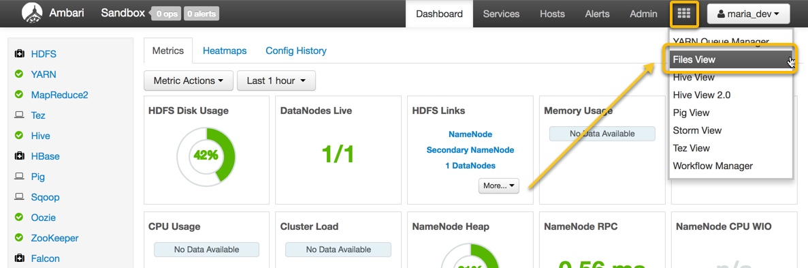
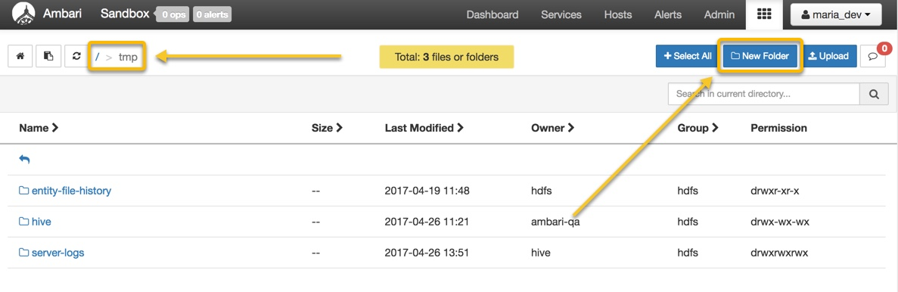
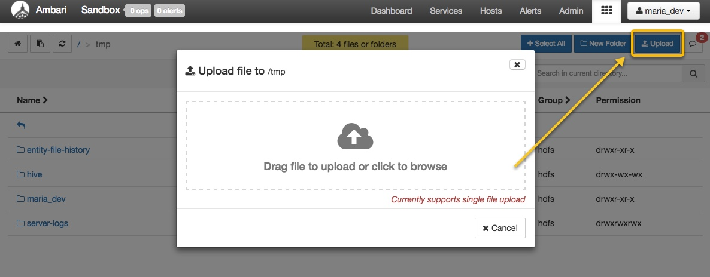
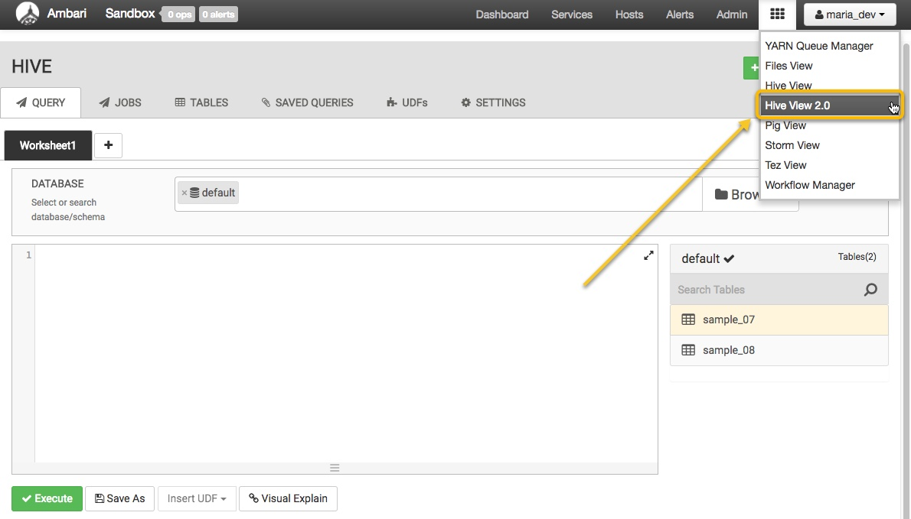
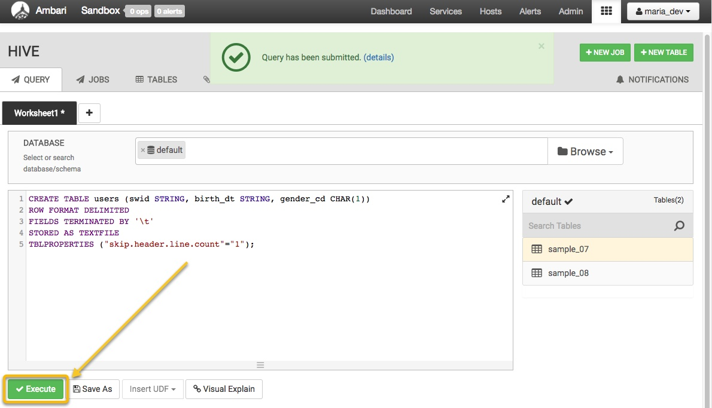
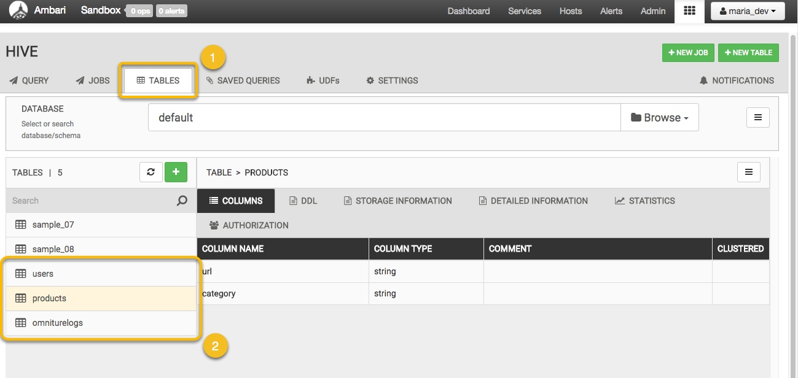
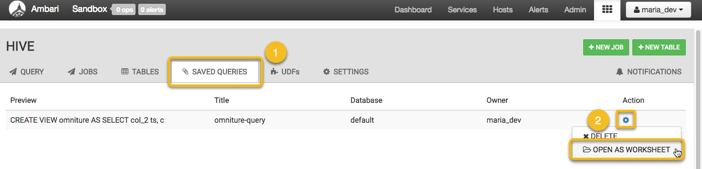

# Loading and Querying Data with Hadoop

## Introduction

The HDP Sandbox includes the core Hadoop components, as well as all the tools needed for data ingestion and processing.  You are able to access and analyze data in the sandbox using any number of Business Intelligence (BI) applications.

In this tutorial, we will go over how to load and query data for a fictitious web retail store in what has become an established use case for Hadoop: deriving insights from large data sources such as web logs. By combining web logs with more traditional customer data, we can better understand customers and understand how to optimize future promotions and advertising.

We will describe how to ingest data into HDFS, to create tables and perform queries on those tables with Hive to analyze the web logs from that data. By the end of the tutorial, we will have a better understanding of how to perform web log analysis on clickstream data, so we can better understand the habits of our customers.


## Prerequisites

-   Downloaded and installed the [HDP 2.6 Sandbox](https://hortonworks.com/downloads/#sandbox)
-   Completed the [Learning the Ropes of the Hortonworks Sandbox](https://hortonworks.com/tutorial/learning-the-ropes-of-the-hortonworks-sandbox/) tutorial


## Outline

-   [Download Sample Data](#download-sample-data)
-   [Upload Data Into HDFS](#upload-sample-data-into-hdfs)
-   [Create Hive Tables](#create-hive-tables)
-   [Load Data Into Tables](#load-data-into-tables)
-   [Save and Execute a Query](#save-and-execute-a-query)
-   [Join Data From Multiple Tables](#join-data-from-multiple-tables)
-   [Summary](#summary)
-   [Further Reading](#further-reading)


## Download Sample Data

Download the sample data for this tutorial: [retail-store-logs-sample-data.zip](assets/retail-store-logs-sample-data.zip)

Extract the archive anywhere you'd like - we will upload the contents into our sandbox in the following step.  You should see the following files after the archive is extracted:

```
omniture-logs.tsv
products.tsv
users.tsv
```


## Upload Data Into HDFS

Select the HDFS `Files View` from the Views menu on the navigation bar. The Files View allows you to view the Hortonworks Data Platform (HDP) file store.  The HDFS file system is separate from the local file system.



Navigate to `/tmp` by clicking on the "**tmp**" folder.  Select "**New Folder**" and name it `maria_dev`.



Navigate to `/tmp/maria_dev` by clicking on the "**maria_dev**" folder.  Then click on the "**Upload**" button at the top right of the screen.  Upload all three files you extracted in the previous step: `omniture-logs.tsv`, `products.tsv` and `users.tsv`.




## Create Hive Tables

Let's create some Hive tables for our data.  Open the "Hive View 2.0" from the Views menu on the navigation bar.



Once there, create three tables by copy/pasting the queries below into the query editor and clicking "**Execute**".



3.2) Create the tables users, products and omniturelogs.

```
CREATE TABLE users (swid STRING, birth_dt STRING, gender_cd CHAR(1))
ROW FORMAT DELIMITED
FIELDS TERMINATED BY '\t'
STORED AS TEXTFILE
TBLPROPERTIES ("skip.header.line.count"="1");
```

```
CREATE TABLE products (url STRING, category STRING)
ROW FORMAT DELIMITED
FIELDS TERMINATED BY '\t'
STORED AS TEXTFILE
TBLPROPERTIES ("skip.header.line.count"="1");
```

```
CREATE TABLE omniturelogs (col_1 STRING,col_2 STRING,col_3 STRING,col_4 STRING,col_5 STRING,col_6 STRING,col_7 STRING,col_8 STRING,col_9 STRING,col_10 STRING,col_11 STRING,col_12 STRING,col_13 STRING,col_14 STRING,col_15 STRING,col_16 STRING,col_17 STRING,col_18 STRING,col_19 STRING,col_20 STRING,col_21 STRING,col_22 STRING,col_23 STRING,col_24 STRING,col_25 STRING,col_26 STRING,col_27 STRING,col_28 STRING,col_29 STRING,col_30 STRING,col_31 STRING,col_32 STRING,col_33 STRING,col_34 STRING,col_35 STRING,col_36 STRING,col_37 STRING,col_38 STRING,col_39 STRING,col_40 STRING,col_41 STRING,col_42 STRING,col_43 STRING,col_44 STRING,col_45 STRING,col_46 STRING,col_47 STRING,col_48 STRING,col_49 STRING,col_50 STRING,col_51 STRING,col_52 STRING,col_53 STRING)
ROW FORMAT DELIMITED
FIELDS TERMINATED by '\t'
STORED AS TEXTFILE
TBLPROPERTIES ("skip.header.line.count"="1");
```


## Load Data Into Tables

Let's run a simple query to take the data we stored in HDFS and populate our new Hive tables.  To do so, execute the following query:

```
LOAD DATA INPATH '/tmp/maria_dev/products.tsv' OVERWRITE INTO TABLE products;
LOAD DATA INPATH '/tmp/maria_dev/users.tsv' OVERWRITE INTO TABLE users;
LOAD DATA INPATH '/tmp/maria_dev/omniture-logs.tsv' OVERWRITE INTO TABLE omniturelogs;
```

You can verify that the data was loaded properly by browsing information about the different Hive tables in the "**TABLES**" tab.




##  Save and Execute a Query

Suppose we want to write a query, but not necessarily execute it immediately or perhaps we want to save it for future multiple uses.  In the "**QUERY**" tab, copy/paste the following and click "**Save As**".

```
CREATE VIEW omniture AS
SELECT col_2 ts, col_8 ip, col_13 url, col_14 swid, col_50 city, col_51 country, col_53 state
FROM omniturelogs
```


To view your saved queries, navigate to the "**SAVED QUERIES**".  For now, let's open our saved query.



The "QUERY" tab should automatically open up, with your saved query preloaded.  Click "**Execute**" to run this query, which will create a Hive view named "omniture", a refined subset of data with only a handful of fields.


## Join Data From Multiple Tables

Let's play with our data further, taking specific fields from different tables and creating a custom table from them.

```
CREATE TABLE webloganalytics as
SELECT to_date(o.ts) logdate, o.url, o.ip, o.city, upper(o.state) state,
o.country, p.category, CAST(datediff(from_unixtime(unix_timestamp()), from_unixtime(unix_timestamp(u.birth_dt, 'dd-MMM-yy'))) / 365 AS INT) age, u.gender_cd
FROM omniture o
INNER JOIN products p
ON o.url = p.url
LEFT OUTER JOIN users u
ON o.swid = concat('{', u.swid , '}');
```


## Summary

Excellent!  We've learned how to upload data into HDFS, create tables and load data into them, and run queries for data refinement and enrichment by using Ambari's convenient and robust Hive View 2.0.


## Further Reading

-   Follow up on this tutorial, by performing more analytics and using visualization tools to find value in the tutorial [Visualizing Website Clickstream Data](https://hortonworks.com/tutorial/visualize-website-clickstream-data/)
-   Check out [more Hive tutorials](http://hortonworks.com/hadoop/hive/#tutorials).
-   For information on Hive operators, functions and the language, check out the [LanguageManual DDL](https://cwiki.apache.org/confluence/display/Hive/LanguageManual+DDL) and [LanguageManual UDF](https://cwiki.apache.org/confluence/display/Hive/LanguageManual+UDF).
