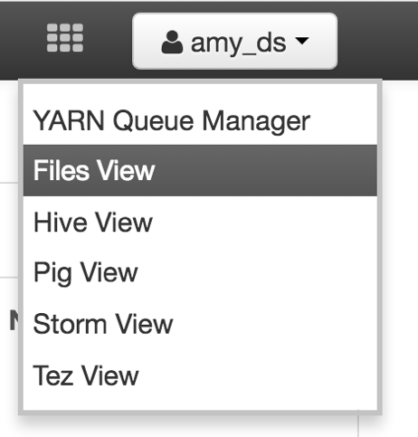
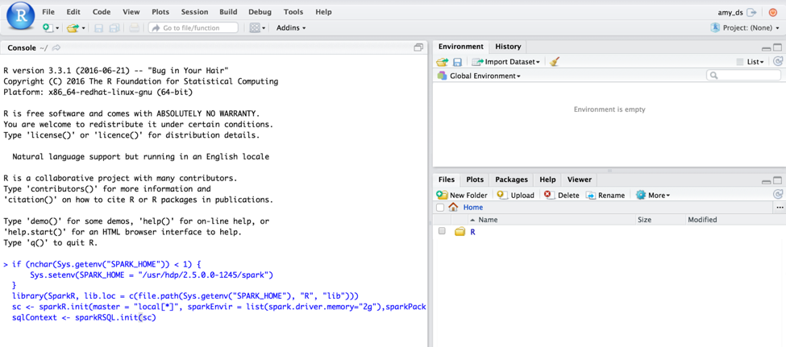
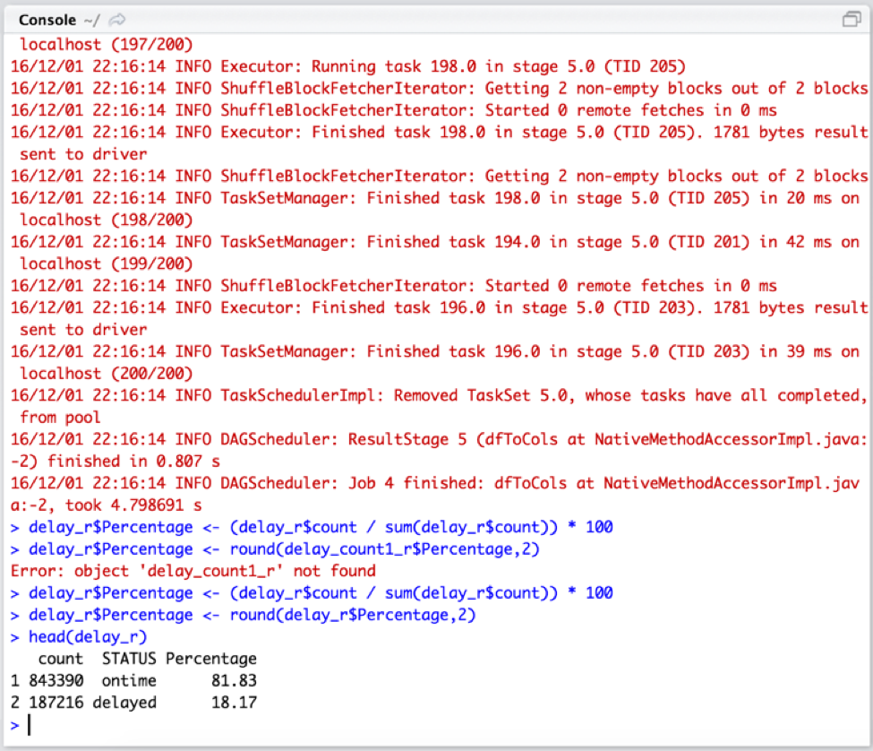
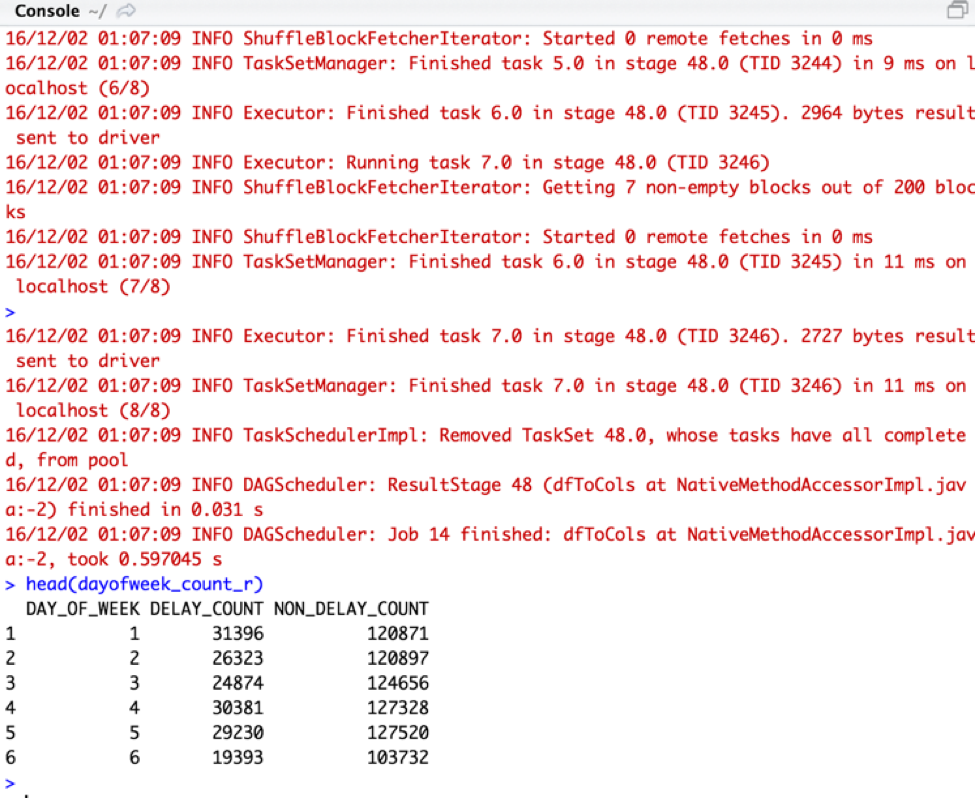
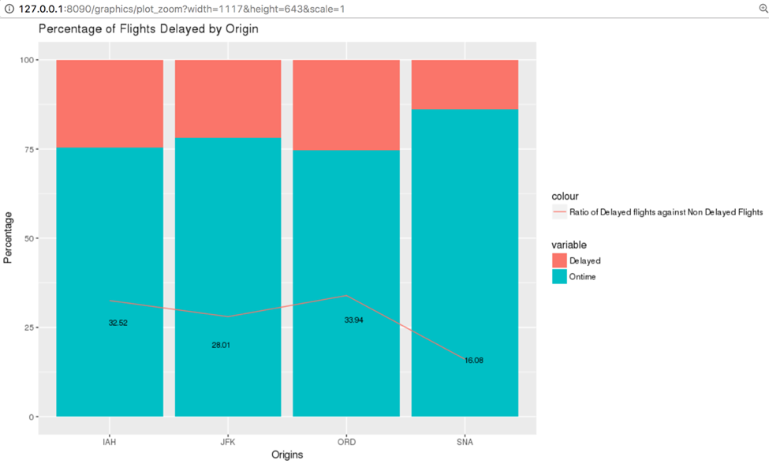
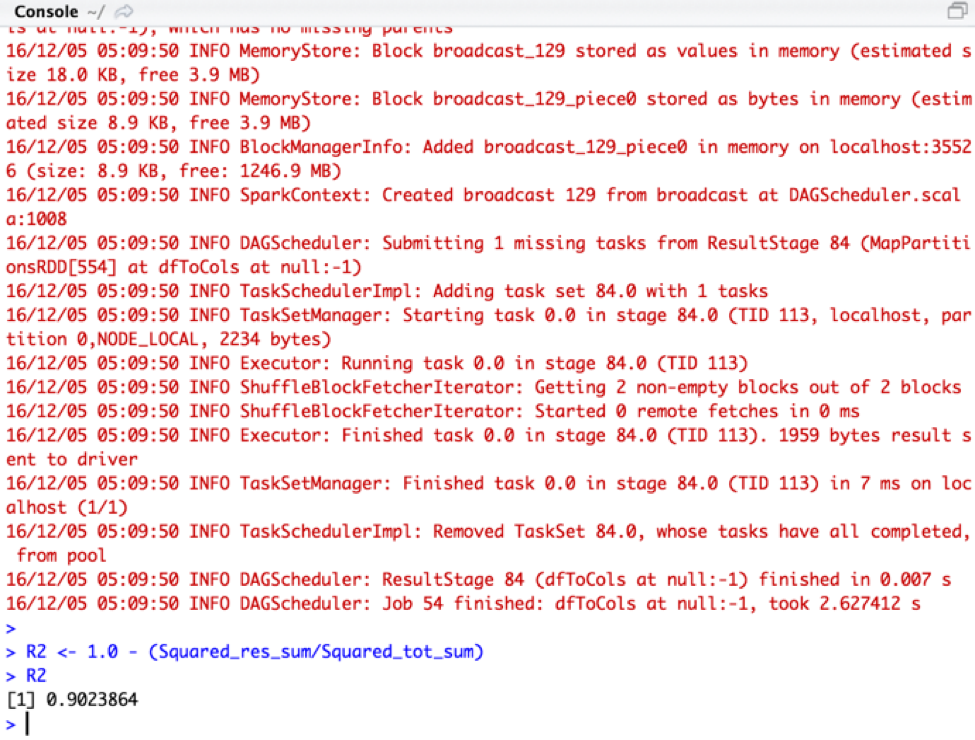

# Predicting Airline Delays using SparkR

## Introduction

R is a popular tool for statistics and data analysis. It has rich visualization capabilities and a large collection of libraries that have been developed and maintained by the R developer community. One drawback to R is that it’s designed to run on in-memory data, which makes it unsuitable for large datasets.

Spark is a distributed engine for processing many Terabytes of data. It is a versatile tool with capabilities for data processing, SQL analysis, streaming and machine learning. Because Spark is a distributed framework a Hortonworks cluster running Spark can process many Terabytes of data in a short amount of time.

SparkR combines the benefits of Spark and R by allowing Spark jobs to be called from within R. This allows the analyst to leverage Spark’s ability to build aggregate statistics over large, multi-Terabyte datasets and then bring the smaller aggregated data back into R for visualization and analysis.

In this tutorial we’ll show you how to use SparkR to predict flight delays using Logistic Regression. We’ll be using RStudio as our IDE for building R models.

## Prerequisites

-   Download and install the latest [Hortonworks Sandbox](https://hortonworks.com/downloads/)
-   [Learning the Ropes of the Hortonworks Sandbox](https://hortonworks.com/tutorial/learning-the-ropes-of-the-hortonworks-sandbox/) to get used to Sandbox.
-   Follow this [article](https://community.hortonworks.com/content/kbentry/69424/setting-up-rstudio-on-hortonworks-docker-sandbox-2.html) on Hortonworks Community to install RStudio on the Sandbox.

## Outline
-   [Step 1 : Download the Dataset](#step-1--download-the-dataset)
-   [Step 2 : Setup SparkR on RStudio](#step-2--setup-sparkr-on-rstudio)
-   [Step 3 : Prepare a Training Dataset](#step-3--prepare-a-training-dataset)
-   [Step 4 : Exploratory Data Analysis](#step-4--exploratory-data-analysis)
-   [Step 5 : Regression Model to predict Airline delay](#step-5--regression-model-to-predict-airline-delay)
-   [Step 6 : Logistic Regression to predict Airline delay](#step-6--logistic-regression-to-predict-airline-delay)
-   [Summary](#summary)

## Step 1 : Download the Dataset

Every year approximately 20% of airline flights are delayed or cancelled, resulting in significant costs to both travelers and airlines. As our example use-case, we will build a supervised learning model that predicts airline delay from historical flight data. [Download the dataset from here](assets/airline_data.zip) and which includes details about flights in the US for 2015. Every row in the dataset has 16 attributes:

-   Year
-   Month
-   Day of Month
-   Day of Week
-   Flight Number
-   Origin
-   Destination
-   Departure Time
-   Departure Delay
-   Arrival Time
-   Arrival Delay
-   Cancelled
-   Cancellation Code
-   Air Time
-   Distance

After you download the file, unzip it and upload train_df.csv and test_df.csv to the /tmp directory of HDFS using Files View. Open Ambari by going to 127.0.0.1:8888 and click on “Launch Dashboard”. Once in Ambari, select “Files View” from the second menu in the upper right hand corner.



Click on /tmp folder and upload these two files. Your screen should look like this:


## Step 2 : Setup SparkR on RStudio

Next, let us login to RStudio using credentials amy_ds/amy_ds. We have to create a SparkContext object which connects the R program to the cluster. You can create it using sparkR.init(). We also need a SqlContext object to work with data frames which can be created from SparkContext.

Let us start with creating an environment variable SPARK_HOME which has the location of Spark Libraries. We will load the SparkR package and we invoke sparkR.init() function to create SparkContext. We are also adding some Spark Driver properties and csv package so that the SparkR data frame can read csv files.

Type the following lines on RStudio console:

```
if (nchar(Sys.getenv("SPARK_HOME")) < 1) {
  Sys.setenv(SPARK_HOME = "/usr/hdp/current/spark-client")
}
library(SparkR, lib.loc = c(file.path(Sys.getenv("SPARK_HOME"), "R", "lib")))
sc <- sparkR.init(master = "local[*]", sparkEnvir = list(spark.driver.memory="2g"),sparkPackages="com.databricks:spark-csv_2.10:1.4.0")
sqlContext <- sparkRSQL.init(sc)

```


Press Enter

## Step 3 : Prepare a Training dataset

Before moving ahead, check out the SparkR documentation here to get used to SparkR API. You can either create a SparkR dataframe from the local R data frame or data sources in formats like csv or from Hive tables. We are going to use read.df() function to read the file from a data source (HDFS in our case), retain the schema and create the SparkR data frame. Type this line to create a dataframe taking the data from /tmp/train_df.csv file with headers included

`train_df <- read.df(sqlContext,"/tmp/train_df.csv","csv", header = "true", inferSchema = "true")`

After it gets loaded, you can view the dataframe by:

`head(train_df)`


It shows the top 6 records of the dataframe, you can also see the variables and the type of variables to the right side of the screen.


Next, let us try to add some more columns to our dataframe to make the data more powerful and informative.

We will begin with deciding whether the following data is weekend or not. If it is weekend, enter 1 or else 0. The weekend starts from Friday and ends on Sunday. Enter the following:

`train_df$WEEKEND <- ifelse(train_df$DAY_OF_WEEK == 5 | train_df$DAY_OF_WEEK == 6 | train_df$DAY_OF_WEEK == 7,1,0)`

It uses ifelse() function which checks whether the value of DAY_OF_WEEK variable is 5, 6 or 7 and adds the value(1,0) to the new column WEEKEND corresponding to that.

Next, create a new column called DEP_HOUR which will have extracted hour value from DEP_TIME column.

`train_df$DEP_HOUR <- floor(train_df$DEP_TIME/100)`

Now, let us introduce one more column called DELAY_LABELED which has value 1 if the arrival delay(ARR_DELAY) is more than 15 minutes and 0 if ARR_DELAY is less than 15 minutes. That means all flights which are arrived 15 minutes delayed are considered to be delayed.

```
train_df$DELAY_LABELED <- ifelse(train_df$ARR_DELAY > 15, 1, 0)
train_df$DELAY_LABELED <- cast(train_df$DELAY_LABELED,"integer")
```

We will keep only those flight records where it did not get cancelled. In the next statement, we are filtering out those records where the value of CANCELLED was 1

`train_df <- train_df[train_df$CANCELLED == 0,]`

Next cleansing will be for NA values. After looking a dataset for a while, you will see that there are lot of NA values in ARR_DELAY column. We should keep only those where we have valid readings of ARR_DELAY.

`train_df <- train_df[train_df$ARR_DELAY != "NA",]`

Next, if you want to know the datatype of columns in SparkR dataframe, just type
`printSchema(train_df)`

You should see following console output:


We should convert the type of ARR_DELAY and DEP_DELAY from string to integer so that we can perform mathematical operations on that.

```
train_df$ARR_DELAY <- cast(train_df$ARR_DELAY,"integer")
train_df$DEP_DELAY <- cast(train_df$DEP_DELAY,"integer")
```

Type `head(train_df)` to view the prepared dataframe.


## Step 4 : Exploratory Data Analysis

At the end of this tutorial, we will be able to predict which flight is likely to be delayed. We can classify our dataset into two values- 0 or 1 (0 for flights on time and 1 for flights delayed). But before creating a model, let us visualize the data what we have right now.

We create a new dataframe called delay which will have two columns, DELAY_LABELED and the count of it. Basically it will have a count of delayed flights and ontime flights. We will be using aggregate function of SparkR where we group the dataframe by DELAY_LABELED and calculating the count using n().

`delay <- agg(group_by(train_df, train_df$DELAY_LABELED), count = n(train_df$DELAY_LABELED))`

Introduce a new column called STATUS which will have value ontime if DELAY_LABELED is 0 and delayed if DELAY_LABELED is 1.

`delay$STATUS <- ifelse(delay$DELAY_LABELED == 0, "ontime", "delayed")`

Delete a first column DELAY_LABELED because we do not need it anymore.

`delay <- delay[,-1]`

Next, let us convert this SparkR dataframe to R dataframe using as.data.frame() function to visualize it using ggplot, let us call this new dataframe delay_r.

`delay_r <- as.data.frame(delay)``

Add Percentage as one more column to this new dataframe.

`delay_r$Percentage <- (delay_r$count / sum(delay_r$count)) * 100`
`delay_r$Percentage <- round(delay_r$Percentage,2)`

View the dataframe:

`head(delay_r)`



Next, install and import the package called ggplot2. ggplot2 is a plotting system for R based on the grammar of graphics. You can plot graphs like bar chart, stacked bar chart, line chart, pie chart, scatter plot and histograms.

```
install.packages("ggplot2")
library(ggplot2)
```

Wait for it to get completed. Create a blank theme to delete the axis titles and ticks and setting the size for plot title.

```
blank_theme <- theme_minimal()+
    theme(
        axis.title.x = element_blank(),
        axis.title.y = element_blank(),
        panel.border = element_blank(),
        panel.grid=element_blank(),
        axis.ticks = element_blank(),
        plot.title=element_text(size=14, face="bold")
    )
```

We will draw a pie chart showing the percentage of delayed and ontime flights.


```
ggplot(delay_r, aes(x="",y=Percentage,fill=STATUS)) + geom_bar(stat="identity",width=1,colour="green") + coord_polar(theta="y",start=0) + blank_theme + ggtitle("Pie Chart for Flights") + theme(axis.text.x=element_blank()) + geom_text(aes(y = Percentage/2,label = paste0(Percentage,"%"),hjust=2))
```


Click on Zoom at the top of the chart to have a clearer view.

This graph shows that around 18.17% flights are getting delayed which is a very big figure.

Let us explore what effect Day_Of_Week has on the dataset. We will create two new dataframes called delay_flights and non_delay_flights which will have details for delayed and ontime flights respectively.


```
delay_flights <- filter(train_df,train_df$DELAY_LABELED == 1)
non_delay_flights <- filter(train_df,train_df$DELAY_LABELED == 0)
```

Next, we will find the count of delayed and ontime flights grouped by Day_Of_Week.

```
delay_flights_count <- agg(group_by(delay_flights,delay_flights$DAY_OF_WEEK), DELAY_COUNT = n(delay_flights$DELAY_LABELED))
non_delay_flights_count <- agg(group_by(non_delay_flights,non_delay_flights$DAY_OF_WEEK), NON_DELAY_COUNT = n(non_delay_flights$DELAY_LABELED))
```

Now, we can merge both delay_flights_count and non_delay_flights_count dataframes.

```
dayofweek_count <- merge(delay_flights_count, non_delay_flights_count, by.delay_flights_count = DAY_OF_WEEK, by.non_delay_flights_count = DAY_OF_WEEK)
```

When you merge two dataframes, you get common column twice in the dataframe which is not required. Let us delete that by typing:

`dayofweek_count$DAY_OF_WEEK_y <- NULL`

Rename the column using withColumnRenamed() function.

`dayofweek_count <- withColumnRenamed(dayofweek_count,"DAY_OF_WEEK_x","DAY_OF_WEEK")`

Convert this SparkR Dataframe to R dataframe so that we can run visualization on it:

`dayofweek_count_r <- as.data.frame(dayofweek_count)`

Let us view this new R dataframe:
`head(dayofweek_count_r)`



Introduce two columns, Delayed and Ontime, which have the percentage values for DELAY_COUNT and NON_DELAY_COUNT respectively.

```
dayofweek_count_r$Delayed <- (dayofweek_count_r$DELAY_COUNT/(dayofweek_count_r$DELAY_COUNT+dayofweek_count_r$NON_DELAY_COUNT)) * 100
dayofweek_count_r$Ontime <- (dayofweek_count_r$NON_DELAY_COUNT/(dayofweek_count_r$DELAY_COUNT+dayofweek_count_r$NON_DELAY_COUNT)) * 100
dayofweek_count_r <- dayofweek_count_r[,-2:-3]
```

Next, add one more column which represents the ratio of delayed flights against ontime flights.

```
dayofweek_count_r$Ratio <- dayofweek_count_r$Delayed/dayofweek_count_r$Ontime * 100
dayofweek_count_r$Ratio <- round(dayofweek_count_r$Ratio,2)
```

Now, if you look closely, our data is in wide format. The data is said to be in wide format if there is one observation row per subject with each measurement present as a different variable. We have to change it to long format which means there is one observation row per measurement thus multiple rows per subject. In R, we use reshape to do this:

```
library(reshape2)
DF1 <- melt(dayofweek_count_r, id.var="DAY_OF_WEEK")
DF1$Ratio <- DF1[15:21,3]
```

View this new long format dataframe:

`DF1`


We will change this dataframe just to make the plot more clearer.

```
DF1 <- DF1[-15:-21,]
DF1[8:14,4] <- NA
```

Next, run the following line to see the stacked bar chart:

```
install.packages("ggrepel")
library(ggrepel)
ggplot(DF1, aes(x=DAY_OF_WEEK,y=value,fill=variable)) + geom_bar(stat="identity") + geom_path(aes(y=Ratio,color="Ratio of Delayed flights against Non Delayed Flights")) + geom_text_repel(aes(label=Ratio), size = 3) + ggtitle("Percentage of Flights Delayed") + labs(x="Day of Week",y="Percentage")
```

Click on Zoom button.


As you can see here, most delays are happening on Monday and Thursday. It drops during the start of the weekend but again rises up by Sunday.

Now we will look over Destination effect on the delays,

Create two new dataframes from delay_flights and non_delay_flights  dataframes respectively which will have the count of flights specific to some Destinations like LAX, SFO, HNL, PDX.

```
destination_delay_count <- agg(group_by(delay_flights,delay_flights$DEST), DELAY_COUNT = n(delay_flights$DELAY_LABELED))
destination_delay_count <- destination_delay_count[(destination_delay_count$DEST == "LAX" | destination_delay_count$DEST == "SFO" | destination_delay_count$DEST == "HNL" | destination_delay_count$DEST == "PDX") ,]

destination_non_delay_count <- agg(group_by(non_delay_flights,non_delay_flights$DEST), NON_DELAY_COUNT = n(non_delay_flights$DELAY_LABELED))
destination_non_delay_count <- destination_non_delay_count[(destination_non_delay_count$DEST == "LAX" | destination_non_delay_count$DEST == "SFO") | destination_delay_count$DEST == "HNL" | destination_delay_count$DEST == "PDX" ,]

```

Lets merge these two new dataframes into one.

```
destination_count <- merge(destination_delay_count, destination_non_delay_count, by.destination_delay_count = DEST, by.destination_non_delay_count = DEST)
destination_count$DEST_y <- NULL
destination_count <- withColumnRenamed(destination_count,"DEST_x","DEST")
```

And convert it into R Dataframe.

`destination_count_r <- as.data.frame(destination_count)``

Bring up two new columns(Delayed and Ontime) which has the percentage values

```
destination_count_r$Delayed <- (destination_count_r$DELAY_COUNT/(destination_count_r$DELAY_COUNT+destination_count_r$NON_DELAY_COUNT)) * 100
destination_count_r$Ontime <- (destination_count_r$NON_DELAY_COUNT/(destination_count_r$DELAY_COUNT+destination_count_r$NON_DELAY_COUNT)) * 100
destination_count_r <- destination_count_r[,-2:-3]
```

Introduce one more column called Ratio which has the proportion of delayed flights against ontime flights on the four aforementioned destinations
```
destination_count_r$Ratio <- destination_count_r$Delayed/destination_count_r$Ontime * 100
destination_count_r$Ratio <- round(destination_count_r$Ratio,2)
```

As earlier, let us melt down this dataframe too to create a stacked bar chart. Use melt function of reshape package.

```
DF2 <- melt(destination_count_r, id.var="DEST")
DF2$Ratio <- DF2[9:12,3]
DF2 <- DF2[-9:-12,]
DF2[5:8,4] <- NA
```

Draw a stacked bar chart:
```
ggplot(DF2, aes(x=DEST,y=value,fill=variable)) + geom_bar(stat="identity") + geom_path(aes(y=Ratio,color="Ratio of Delayed flights against Non Delayed Flights"),group = 1) + geom_text_repel(aes(label=Ratio), size = 3) + ggtitle("Percentage of Flights Delayed by Destination") + labs(x="Destinations",y="Percentage")
```


Looks like smaller city Destination has the most delayed ratio. Let us do the same thing with Origins also. Create two new dataframes having records only where Origins are SNA, ORD, JFK and IAH.

```
origin_delay_count <- agg(group_by(delay_flights,delay_flights$ORIGIN), DELAY_COUNT = n(delay_flights$DELAY_LABELED))
origin_delay_count <- origin_delay_count[(origin_delay_count$ORIGIN == "SNA" | origin_delay_count$ORIGIN == "ORD" | origin_delay_count$ORIGIN == "JFK" | origin_delay_count$ORIGIN == "IAH") ,]
origin_non_delay_count <- agg(group_by(non_delay_flights,non_delay_flights$ORIGIN), NON_DELAY_COUNT = n(non_delay_flights$DELAY_LABELED))
origin_non_delay_count <- origin_non_delay_count[(origin_non_delay_count$ORIGIN == "SNA" | origin_non_delay_count$ORIGIN == "ORD" | origin_delay_count$ORIGIN == "JFK" | origin_delay_count$ORIGIN == "IAH") ,]
```

Merge dataframes by using merge function of SparkR API and convert it into R Dataframe:

```
origin_count <- merge(origin_delay_count, origin_non_delay_count, by.origin_delay_count = ORIGIN, by.origin_non_delay_count = ORIGIN)
origin_count$ORIGIN_y <- NULL
origin_count <- withColumnRenamed(origin_count,"ORIGIN_x","ORIGIN")
origin_count_r <- as.data.frame(origin_count)
```

Add three columns - Delayed(Percentage), Ontime(Percentage) and Ratio(Delayed/Ontime)

```
origin_count_r$Delayed <- (origin_count_r$DELAY_COUNT/(origin_count_r$DELAY_COUNT+origin_count_r$NON_DELAY_COUNT)) * 100
origin_count_r$Ontime <- (origin_count_r$NON_DELAY_COUNT/(origin_count_r$DELAY_COUNT+origin_count_r$NON_DELAY_COUNT)) * 100
origin_count_r <- origin_count_r[,-2:-3]
origin_count_r$Ratio <- origin_count_r$Delayed/origin_count_r$Ontime * 100
origin_count_r$Ratio <- round(origin_count_r$Ratio,2)
```

As earlier, make the dataframe in long format using melt() and draw the stacked bar chart:

```
DF3 <- melt(origin_count_r, id.var="ORIGIN")
DF3$Ratio <- DF3[9:12,3]
DF3 <- DF3[-9:-12,]
DF3[5:8,4] <- NA

ggplot(DF3, aes(x=ORIGIN,y=value,fill=variable)) + geom_bar(stat="identity") + geom_path(aes(y=Ratio,color="Ratio of Delayed flights against Non Delayed Flights"),group = 1) + geom_text_repel(aes(label=Ratio), size = 3) + ggtitle("Percentage of Flights Delayed by Origin") + labs(x="Origins",y="Percentage")
```



As you can see here, smaller city Origin(SNA) has a least delay ratio.

## Step 5 : Regression Model to Predict Airline Delay

Now that we have explored the data, let’s predict how much delayed the flight would be.
SparkR allows the fitting of generalized linear models over DataFrames using the glm() function. Under the hood, SparkR uses MLlib to train a model of the specified family. The gaussian and binomial families are supported in 1.6 version.
We are going to choose some variables as independent variables to predict the output variable which in our case is ARR_DELAY.

`train_df_glm <- glm(ARR_DELAY ~ MONTH + DEP_HOUR + DEP_DELAY + WEEKEND + ORIGIN + DEST, data = train_df,  family = "gaussian")``

You should get a note that your job has been finished. Now, you return the summary of your model which is same as R’ native model summary.

`summary(train_df_glm)`


It returned a list of devianceResiduals and coefficients. Deviance Residuals signifies the maximum and minimum value that ARR_DELAY can have. We also see that DEP_DELAY variable has a positive effect on ARR_DELAY which means if there is a departure delay, then the arrival delay will be there most of the time. As the value of Month increases from 1 towards 8, the ARR_DELAY decreases. Same is happening with DEP_HOUR but these are very small impacts. The variable WEEKEND is making a good negative impact, we can infer that there are less delays during weekends.

In Origins and Destinations, if you see clearly, most of the origins has a negative effect but destinations has a positive effect on the ARR_DELAY.

We can also make predictions based on the model on the test data. Let us create a test data which has airline data from the month September to December of 2015. Follow the same procedure which we did during the preparation of training data.

```
test_df <- read.df(sqlContext,"/tmp/test_df.csv","csv", header = "true", inferSchema = "true")
test_df$WEEKEND <- ifelse(test_df$DAY_OF_WEEK == 5 | test_df$DAY_OF_WEEK == 6 | test_df$DAY_OF_WEEK == 7,1,0)
test_df$DEP_HOUR <- floor(test_df$DEP_TIME/100)
test_df$DELAY_LABELED <- ifelse(test_df$ARR_DELAY > 15, 1, 0)
test_df$DELAY_LABELED <- cast(test_df$DELAY_LABELED,"integer")
test_df <- test_df[test_df$CANCELLED == 0,]
test_df <- test_df[test_df$ARR_DELAY != "NA",]
test_df <- test_df[test_df$ORIGIN != "SBN",]
test_df <- test_df[test_df$DEST != "SBN",]
test_df$ARR_DELAY <- cast(test_df$ARR_DELAY,"integer")
test_df$DEP_DELAY <- cast(test_df$DEP_DELAY,"integer")
```

Next, calculate the predicted probability of ARR_DELAY  bu using predict function.

`predictions <- predict(train_df_glm, newData = test_df)`

We can compare the actual values with the predicted values, type this:

`head(select(predictions, "ARR_DELAY", "prediction"))`


As you have already noticed, the summary function do not provide enough details as of now. Since we do not have enough information, we should calculate R2 of our model. R-squared is a statistical measure of how close the data are to the fitted regression line.

Firstly, we will calculate the mean of ARR_DELAY that will be used as a reference to the base predictor model.

```
ARR_DELAY_mean <- collect(agg(
    train_df,
    AVG_ARR_DELAY=mean(train_df$ARR_DELAY)
))$AVG_ARR_DELAY
```

The mean value turns out to be 4.496468
Let's add the squared residuals and squared totals so later on we can calculate R2.

```
predictions$Squared_res <- (predictions$ARR_DELAY - predictions$prediction)**2
predictions$Squared_tot <- (predictions$ARR_DELAY - ARR_DELAY_mean)**2
```

Let us view the predictions data frame now.

`head(select(predictions, "ARR_DELAY", "prediction", "Squared_res", "Squared_tot"))`


Next, take out the sum of squared residuals and squared totals,

```
Squared_res_sum <- collect(agg(
predictions,
SUM_SQUARED_RES=sum(predictions$Squared_res)
))$SUM_SQUARED_RES

Squared_tot_sum <- collect(agg(
predictions,
SUM_SQUARED_TOT=sum(predictions$Squared_tot)
))$SUM_SQUARED_TOT
```

Now the formula to calculate R2 is

`R2 <- 1.0 - (Squared_res_sum/Squared_tot_sum)`



It comes out to be 0.9023864. An R2 of 1 indicates that the regression line perfectly fits the data.

## Step 6 : Logistic Regression to predict Airline Delay

So far we have predicted the continuous variable by the above model. Now it is time to predict whether the flight will be delayed or not. It will be like a binary classification where we will bucket flights into delayed and ontime. But before ahead towards the development of the model, we have to some transformation to our dataset. The first transformation that we have to do is to convert the categorical variables into dummy variables. Five categorical variables are:
    1.	Day of Week
    2.	Carrier
    3.	Destination
    4.	Origin
    5.	Departure Hour

We are going to use a function in R called model.matrix() where each value of these columns will be a separate column and will carry only either two values - 0 or 1. Lets subset the training data into just these five variables and DELAY_LABELED which again is the categorical variable and our output variable in this case.

`dummy <- subset(train_df, select = c(4,5,7,8,18,19))`

Next, we are going to typecast DAY_OF_WEEK and DEP_HOUR from integer to string so that it gets broken down easily.

```
dummy$DAY_OF_WEEK <- cast(dummy$DAY_OF_WEEK,"string")
dummy$DEP_HOUR <- cast(dummy$DEP_HOUR,"string")
```

Subsetting the dataset further to only include specific origins and destinations.

```
dummy <- dummy[(dummy$ORIGIN == "SNA" | dummy$ORIGIN == "ORD" | dummy$ORIGIN == "HNL") ,]
dummy <- dummy[(dummy$DEST == "LAX" | dummy$DEST == "SFO" | dummy$DEST == "JFK") ,]
```

Now, convert this SparkR dataframe into R dataframe to make use of model.matrix() function

```
dummy_r <- as.data.frame(dummy)
dummy_matrix1 <- model.matrix(~DAY_OF_WEEK+CARRIER+DEST+ORIGIN,data=dummy_r)
dummy_matrix1 <- dummy_matrix1[,-1]
```

As there are lot of values for DEP_HOUR, we are going run to model.matrix() separately and combine these two matrices later.

```
dummy_matrix2 <- model.matrix(~DEP_HOUR,data=dummy_r)
dummy_matrix2 <- dummy_matrix2[,-1]
```

Use cbind function to join two matrices

`dummy_matrix <- cbind(dummy_matrix1,dummy_matrix2)`

Convert the matrix to the dataframe so that you can create the model on that.

`dummy_df <- as.data.frame(dummy_matrix)`

We need DELAY_LABELED from the previous dataframe and add it to this new dataframe

```
dummy_df <- cbind(dummy_df,dummy_r$DELAY_LABELED)
colnames(dummy_df)[ncol(dummy_df)] <- "DELAY_LABELED"
```

In order to create a Logistic Regression model out of this dataframe, we will convert it into SparkR dataframe

`dummy_df_sparkR <- createDataFrame(sqlContext,dummy_df)`

It is important to know how your dataframe looks like right now.

`head(dummy_df_sparkR)`


Run the model having DELAY_LABELED as the output variable and all other variables as input/independent variables.

`dummy_df_glm <- glm(DELAY_LABELED ~ ., data = dummy_df_sparkR,  family = "gaussian")`

Check the summary of the model:

`summary(dummy_df_glm )`


You can notice effects of different variables here.

Prepare your test data from last 4 months data. Follow the same procedure what we did in preparing the training data.

```
dummy_test <- subset(test_df, select = c(4,5,7,8,18,19))
dummy_test$DAY_OF_WEEK <- cast(dummy_test$DAY_OF_WEEK,"string")
dummy_test$DEP_HOUR <- cast(dummy_test$DEP_HOUR,"string")
dummy_test <- dummy_test[(dummy_test$ORIGIN == "SNA" | dummy_test$ORIGIN == "ORD" | dummy_test$ORIGIN == "HNL") ,]
dummy_test <- dummy_test[(dummy_test$DEST == "LAX" | dummy_test$DEST == "SFO" | dummy_test$DEST == "JFK") ,]
dummy_test_r <- as.data.frame(dummy_test)
dummy_test_matrix1 <- model.matrix(~DAY_OF_WEEK+CARRIER+DEST+ORIGIN,data=dummy_test_r)
dummy_test_matrix1 <- dummy_test_matrix1[,-1]
dummy_test_matrix2 <- model.matrix(~DEP_HOUR,data=dummy_test_r)
dummy_test_matrix2 <- dummy_test_matrix2[,-1]

dummy_test_matrix <- cbind(dummy_test_matrix1,dummy_test_matrix2)
dummy_test_df <- as.data.frame(dummy_test_matrix)
dummy_test_df <- cbind(dummy_test_df,dummy_test_r$DELAY_LABELED)
colnames(dummy_test_df)[ncol(dummy_test_df)] <- "DELAY_LABELED"

dummy_test_df_sparkR <- createDataFrame(sqlContext,dummy_test_df)
```

Next, use predict function to predict the values

`predictions <- predict(dummy_df_glm, newData = dummy_test_df_sparkR)`

View the actual value along with the predicted value.

`head(select(predictions, "DELAY_LABELED", "prediction"))`


Let us see how accurate our model is. As you can see, minimum value of predicted value is -0.70 and maximum value is 1.06. Introduce a new column binary which will have value 1 when prediction is more than threshold(0.3 in our case) and 0 when it is less than 0.3.

`predictions$binary <- ifelse(predictions$prediction > 0.3 , 1, 0)`

Create two new dataframes which has the count of actual and predicted values respectively.
```
actualResults <- agg(group_by(predictions,predictions$label), Actual = n(predictions$label))
predictedResults <- agg(group_by(predictions,predictions$binary), Predicted = n(predictions$binary))

```
Join these dataframes and delete one of the common column.
`results <- join(actualResults, predictedResults, actualResults$label == predictedResults$binary)`
`results$binary <- NULL`

Print the dataframe to check the prediction.
`head(results)`


This signifies that the flight got delayed 1635 times but predicted 2146 by the model. They were ontime 5849 times but predicted 5338 times by the model.

## Summary

Congratulations, you now know how to use SparkR.  If you want to learn more about using Apache Spark for machine learning and processing large datasets please check out these tutorials:
-   [5-Minute tour of Apache Spark](https://hortonworks.com/tutorial/hands-on-tour-of-apache-spark-in-5-minutes/)
-   [Intro to Machine Learning with Spark](https://hortonworks.com/tutorial/intro-to-machine-learning-with-apache-spark-and-apache-zeppelin/)
