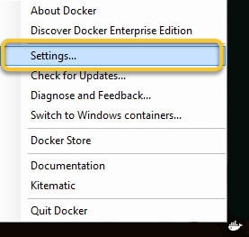
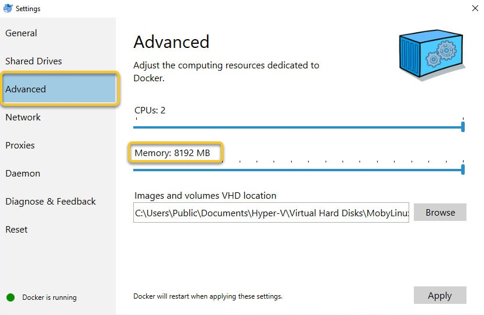
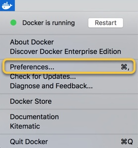
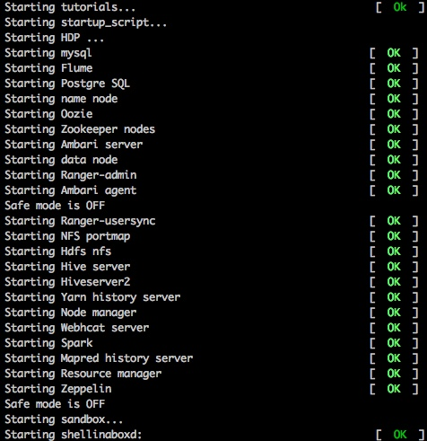

# Deploying Hortonworks Sandbox on Docker

## Introduction

This tutorial walks through the general approach for installing the Hortonworks Sandbox (HDP or HDF) onto Docker on your computer.


## Prerequisites

-   [Download the Hortonworks Sandbox](https://hortonworks.com/downloads/#sandbox)
-   Docker Installed
    -   [Docker For Linux](https://docs.docker.com/engine/installation/linux/)
    -   [Docker For Windows](https://docs.docker.com/docker-for-windows/install/)
    -   [Docker For Mac](https://docs.docker.com/docker-for-mac/install/)
-   A computer with at least **8 GB of RAM to spare**.


## Outline

-   [Configure Docker Memory](#configure-docker-memory)
    -   [For Linux](#for-linux)
    -   [For Windows](#for-windows)
    -   [For Mac](#for-mac)
-   [Load Sandbox Into Docker](#load-sandbox-into-docker)
-   [Start Sandbox](#start-sandbox)
    -   [For HDP 2.6 Sandbox](#for-hdp-2.6-sandbox)
    -   [For HDF 3.0 Sandbox](#for-hdf-3.0-sandbox)
-   [Further Reading](#further-reading)


## Configure Docker Memory


### For Linux

No special configuration needed for Linux.


### For Windows

After [installing Docker For Windows](https://docs.docker.com/docker-for-windows/install/), open the application and click on the Docker icon in the menu bar.  Select **Settings**.



Select the **Advanced** tab and adjust the dedicated memory to **at least 8GB of RAM**.




### For Mac

After [installing Docker For Mac](https://docs.docker.com/docker-for-mac/install/), open the application and click on the Docker icon in the menu bar.  Select **Preferences**.



Select the **Advanced** tab and adjust the dedicated memory to **at least 8GB of RAM**.


## Load Sandbox Into Docker

Open up a console and use the following command to load in the sandbox image you downloaded from <https://hortonworks.com/downloads/#sandbox>.

```
docker load -i /path/to/image/sandbox_docker_image.tar.gz
```

Some users will see an error related to ```no space left on device``` similar the one below:

```
Error processing tar file(exit status 1): write /usr/hdp/2.6.0.3-8/pig/lib/hive-exec-1.2.1000.2.6.0.3-8-core.jar: no space left on device
```

If you see this error, there are two HCC articles that walk you through resolving the issue:
- [Increase the size of base Docker for Mac VM image](<https://community.hortonworks.com/content/kbentry/65901/how-to-increase-the-size-of-the-base-docker-for-ma.html>)
- [Modify default Docker configuration for CentOS 7 to import HDP Sandbox](<https://community.hortonworks.com/content/kbentry/65714/how-to-modify-the-default-docker-configuration-on.html>)

To check that the image was imported successfully, run the following command.  You should see the sandbox docker image on the list.

```
docker images
```


## Start Sandbox

Download one of the following scripts and save it somewhere on your computer.


### For HDP 2.6 Sandbox

-   For Linux/Mac: Use this [start_sandbox-hdp.sh](assets/start_sandbox-hdp.sh)
-   For Windows: Use this [start-start_sandbox-hdp.ps1](assets/start_sandbox-hdp.ps1)


### For HDF 3.0 Sandbox

-   For Linux/Mac: Use this [start_sandbox-hdf.sh](assets/start_sandbox-hdf.sh)
-   For Windows: Use this [start_sandbox-hdf.ps1](assets/start_sandbox-hdf.ps1)

For HDF 3.0 users, if the "docker load command does not work", then run the command:

~~~bash
docker import [docker-name.tar]
~~~

For HDF 3.0 users, if your Docker Image name is not "sandbox-hdf", then run the commands:

~~~bash
docker tag [IMAGE-ID] sandbox-hdf
~~~

Untag the previous docker REPOSITORY called "sandbox":

~~~bash
docker rmi sandbox
~~~

Run the script you just downloaded.  It will start the sandbox for you, creating the sandbox docker container in the process if neceesary.

You should see something like the following:



The sandbox is now created and ready for use.

Welcome to the Hortonworks Sandbox!


## Further Reading

-   Follow-up with the tutorial: [Learning the Ropes of the Hortonworks Sandbox](https://hortonworks.com/tutorial/learning-the-ropes-of-the-hortonworks-sandbox)
-   [Browse all tutorials available on the Hortonworks site](https://hortonworks.com/tutorials/)
