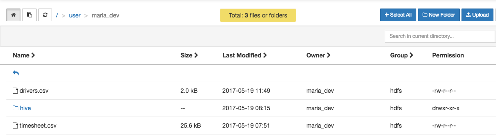
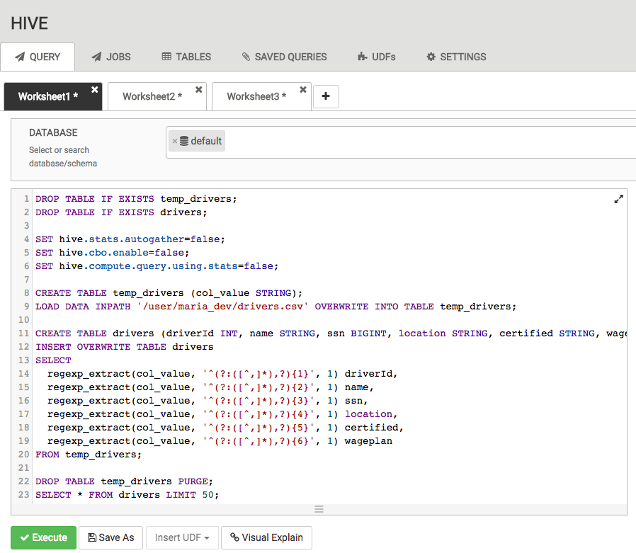
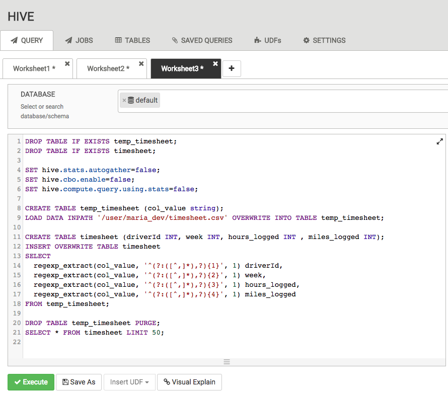
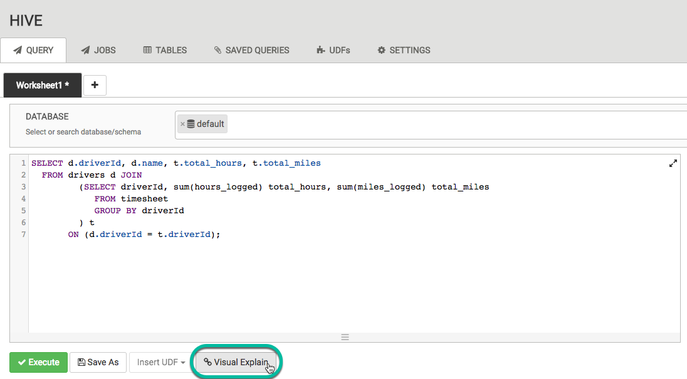
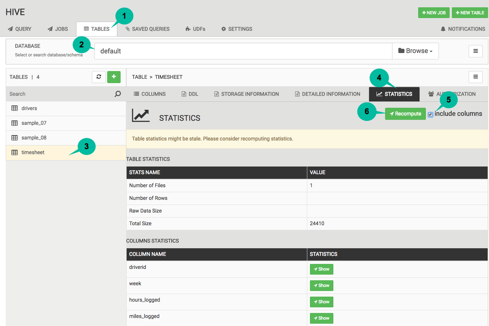
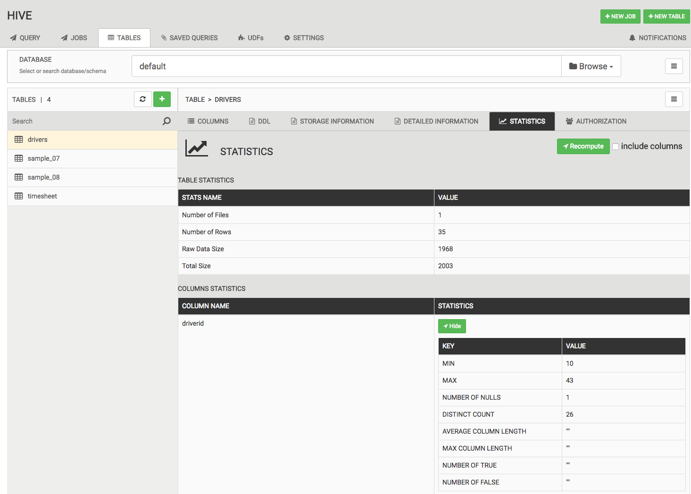
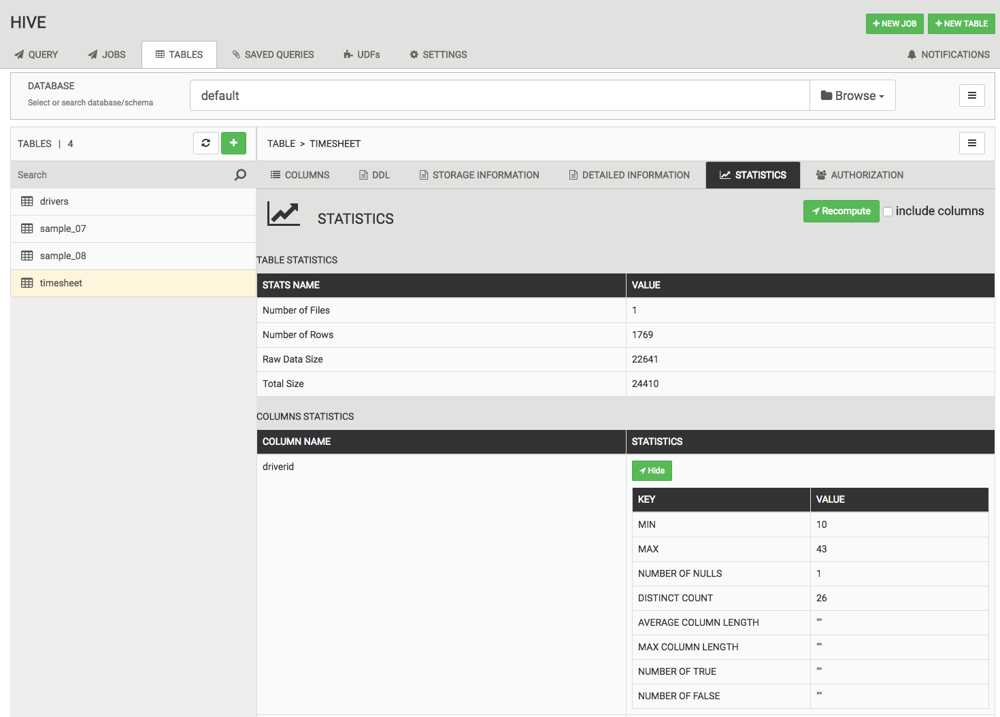
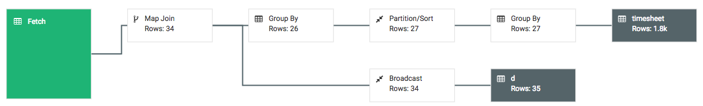

# Hive Statistics

## Introduction

Statistics such as the number of rows of a table or partition and the histograms of a particular interesting column are important in many ways. One of the key use cases of statistics is query optimization. Statistics serve as the input to the cost functions of the optimizer so that it can compare different plans and choose among them.

Hive’s Cost-Based Optimizer (CBO) is a core component in Hive’s query processing engine. Powered by Apache Calcite, the CBO optimizes and calculates the cost of various plans for a query. It attempts to cut down execution time and reduce resources by examining table and conditions specified in the query.

Missing column statistics is one of the leading causes of sub-optimal query performance on Hadoop.

## Prerequisites

-   Complete [How to Process Data with Apache Hive](https://hortonworks.com/tutorial/how-to-process-data-with-apache-hive/) tutorial

## Outline

-   [Environment Setup](#environment-setup)
-   [Visual Explain without Statistics](#visual-explain-without-statistics)
-   [Compute Statistics](#compute-statistics)
-   [Visual Explain with Statistics](#visual-explain-with-statistics)
-   [Compare Plans](#compare-plans)
-   [Summary](#summary)
-   [Further Reading](#further-reading)

## Environment Setup

We will use the same tables as in [How to Process Data with Apache Hive](https://hortonworks.com/tutorial/how-to-process-data-with-apache-hive/) tutorial (**drivers** and **timesheet**).

For the time being, we will create tables without computing statistics. Later, we will comparing plans generated with and without statists.

1\. Download [driver-data](assets/driver_data.zip) file.

2\. Upload **drivers.csv** and **timesheet.csv** to **/usr/maria_dev** on the Hortonworks Sandbox environment using Ambari -> Files View:

3\. From Hive View 2.0, run the following SQL to create **drivers** table (without statistics).

~~~sql
DROP TABLE IF EXISTS temp_drivers;
DROP TABLE IF EXISTS drivers;

SET hive.stats.autogather=false;
SET hive.cbo.enable=false;
SET hive.compute.query.using.stats=false;

CREATE TABLE temp_drivers (col_value STRING);
LOAD DATA INPATH '/user/maria_dev/drivers.csv' OVERWRITE INTO TABLE temp_drivers;

CREATE TABLE drivers (driverId INT, name STRING, ssn BIGINT, location STRING, certified STRING, wageplan STRING);
INSERT OVERWRITE TABLE drivers
SELECT
  regexp_extract(col_value, '^(?:([^,]*),?){1}', 1) driverId,
  regexp_extract(col_value, '^(?:([^,]*),?){2}', 1) name,
  regexp_extract(col_value, '^(?:([^,]*),?){3}', 1) ssn,
  regexp_extract(col_value, '^(?:([^,]*),?){4}', 1) location,
  regexp_extract(col_value, '^(?:([^,]*),?){5}', 1) certified,
  regexp_extract(col_value, '^(?:([^,]*),?){6}', 1) wageplan
FROM temp_drivers;

DROP TABLE temp_drivers PURGE;
SELECT * FROM drivers LIMIT 50;
~~~

4\. From Hive View 2.0, run the following SQL to create **timesheet** table (without statistics).

~~~sql
DROP TABLE IF EXISTS temp_timesheet;
DROP TABLE IF EXISTS timesheet;

SET hive.stats.autogather=false;
SET hive.cbo.enable=false;
SET hive.compute.query.using.stats=false;

CREATE TABLE temp_timesheet (col_value string);
LOAD DATA INPATH '/user/maria_dev/timesheet.csv' OVERWRITE INTO TABLE temp_timesheet;

CREATE TABLE timesheet (driverId INT, week INT, hours_logged INT , miles_logged INT);
INSERT OVERWRITE TABLE timesheet
SELECT
  regexp_extract(col_value, '^(?:([^,]*),?){1}', 1) driverId,
  regexp_extract(col_value, '^(?:([^,]*),?){2}', 1) week,
  regexp_extract(col_value, '^(?:([^,]*),?){3}', 1) hours_logged,
  regexp_extract(col_value, '^(?:([^,]*),?){4}', 1) miles_logged
FROM temp_timesheet;

DROP TABLE temp_timesheet PURGE;
SELECT * FROM timesheet LIMIT 50;
~~~

>NOTE: For newly created tables and/or partitions (that are populated through the INSERT OVERWRITE command), statistics are automatically computed by default. The user has to explicitly set the boolean variable hive.stats.autogather to false so that statistics are not automatically computed and stored into Hive MetaStore.

## Visual Explain without Statistics

As you may recall, the following query will summarize total hours and miles driven by driver. Insert the following query in the Hive View 2.0 editor. Instead of executing the query, let's click on **Visual Explain**.

~~~sql
SELECT d.driverId, d.name, t.total_hours, t.total_miles
  FROM drivers d JOIN
         (SELECT driverId, sum(hours_logged) total_hours, sum(miles_logged) total_miles
            FROM timesheet
            GROUP BY driverId
         ) t
       ON (d.driverId = t.driverId);
~~~

Visual Explain makes it easy to find and fix expensive operations by providing a high-level view of the query’s execution plan that focuses on the cost of each step. Expensive operations like Merge Joins are immediately visible, letting you know when settings changes or query re-writes are appropriate. When you need more detail, drill down to any operator of the plan to see detailed cost, vectorization and execution engine information.

## Compute Statistics

To generate statistics from **Hive View 2.0** for a specific table, we need:

1.  select **TABLES** tab
2.  select Database
3.  select table
4.  select **STATISTICS** tab
5.  select **include columns**
6.  click on **Recompute**

Let's compute statistics for table **drivers**:

Let's compute statistics for table **timesheet**:

## Visual Explain with Statistics

Now that we've computed statistics, let's re-run **Visual Explain** using the same query:

~~~sql
SELECT d.driverId, d.name, t.total_hours, t.total_miles
  FROM drivers d JOIN
         (SELECT driverId, sum(hours_logged) total_hours, sum(miles_logged) total_miles
            FROM timesheet
            GROUP BY driverId
         ) t
       ON (d.driverId = t.driverId);
~~~

Notice anything different?

## Compare Plans

No statisitcs:

With statistics:

For this particular query and dataset, the optimizer did a great job generating a plan with and without statistics. As you can see, the number of rows at each node is more accurate when statistics were computed.

As your queries become more complex, you need to make a habit of computing statistics.

## Summary

Congratulations in completng this tutorial. You should see the benefits of generating statistics for tables and columns.

## Further Reading

-   [Cost-based optimization in Hive](https://cwiki.apache.org/confluence/display/Hive/Cost-based+optimization+in+Hive)
-   [Apache Hive Performance Tuning](https://docs.hortonworks.com/HDPDocuments/HDP2/HDP-2.6.0/bk_hive-performance-tuning/content/ch_hive-perf-tuning-intro.html)
