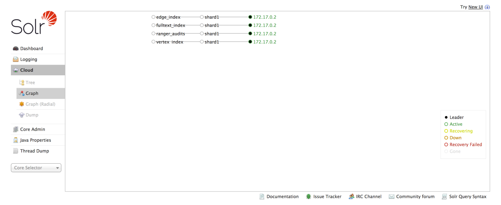
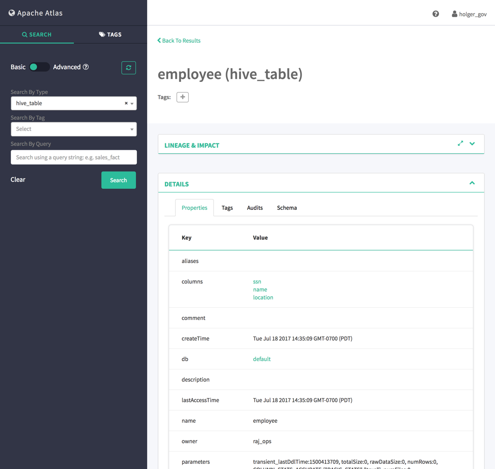

# Apache RangerとApache Atlasによるタグベースのポリシー

## はじめに

Apache AtlasとApache Rangerの統合を検討し，タグまたは分類ベースのポリシーの概念を紹介します．企業はApache Atlasでデータを分類し，Apache Rangerでセキュリティポリシーを構築できます．

このチュートリアルでは，Atlasでデータにタグを付与し，Rangerでセキュリティポリシーを作成する例を紹介します．

## 前提条件

-   [Hortonworks 2.6 Sandbox](https://hortonworks.com/downloads/#sandbox)のダウンロード
-   [Hortonworks 2.6 Sandbox](https://hortonworks.com/tutorial/sandbox-deployment-and-install-guide/section/3/)のインストール
-   サンドボックスのホスト名をホストファイルに追加する方法については，[Learning the Ropes of Hortonworks Sandbox](https://github.com/hortonworks/data-tutorials/blob/master/tutorials/hdp/learning-the-ropes-of-the-hortonworks-sandbox/tutorial.md) section **1.3 Add Sandbox Hostname to Your Hosts File** を参照してください．

-   (任意) Ambariのパスワードを設定します． [Learning the Ropes of Hortonworks Sandbox](https://github.com/hortonworks/data-tutorials/blob/master/tutorials/hdp/learning-the-ropes-of-the-hortonworks-sandbox/tutorial.md), section **2.2 Setup Ambari admin Password Manually**を参照してください．

## 目次

-   [Step 1: Ranger Audit to Solrを有効にする](#step-1-enable-ranger-audit-to-solr)
-   [Step 2: 関連する全てのサービスを再起動する](#step-2-restart-all-services-affected)
-   [Step 3: 一般情報について](#step-3-explore-general-information)
-   [Step 4: サンドボックスユーザポリシーを探す](#step-4-explore-sandbox-user-personas-policy)
-   [Step 5: タグベースのポリシーなしのアクセス](#step-5-access-without-tag-based-policies)
-   [Step 6: Hiveデータへのアクセスを制限するRangerのポリシーを作成する](step-6-create-a-ranger-policy-to-limit-access-of-hive-data)
-   [Step 7: Atlasタグを作成してデータを分類する](#step-7-create-atlas-tag-to-classify-data)
-   [Step 8: Rangerのタグベースのポリシーの作成](#step-8-create-ranger-tag-based-policy)
-   [まとめ](#summary)
-   [参考文献](#further-reading)

### Step 1: Ranger Audit to Solrを有効にする

Ambariに`raj_ops`ユーザとしてログインします．ユーザ名/パスワードは`raj_ops/raj_ops`です．

**Figure 1: Ambari Dashboard**

左側のAmbariのサービス一覧から**Ranger**をクリックしてください．

**Configs**タブを選択します．

**Ranger Audit**を選択します．RangerのAudit to Solrの機能を**ON**にします．**ON**にするためには，**Audit to Solr**の**OFF**ボタンをクリックします．

**Save**ボタンをクリックして構成を保存します．表示される**Save Configurtion**ウィンドウのNotesに`Enable Audit to Solr Feature`と入力し，そのウィンドウで**Save**ボタンをクリックします．次にDependent Configrationsウィンドウの**OK**ボタンをクリックし，続いて**Proceed Anyway**ボタンをクリックします．**Save Configration Changes**ウィンドウで**OK**をクリックします．

**Figure 2: Ranger 'Audit to Solr' Config**

### Step 2: 関連する全てのサービスを再起動する

Ranger Audit to Solrを有効にした後，HDPサンドボックスで変更を有効にするために再起動が必要なサービスがあります．

**Figure 3: Affected Services After Ranger Audit Config Set**

Ambariのサービス一覧からサービスを再起動しましょう．

### 2.1: Restart HDFS Service

1\. HDFSを再起動します．まずはHDFSをクリックします．**Service Actions**，**Restart All**をクリックして，HDFSの全てのコンポーネントを再起動します．HDFSに関連する全てのコンポーネントも再起動します．

**Figure 4: Restart All HDFS Components**

2\. **Confirmation**ウィンドウで，**Confirm Restart All**をクリックします．

**Figure 5: Confirm HDFS Restart**

HDFSが現在再起動中であることを示す**Background Operation Runnning**ウィンドウが表示されます．

**Figure 6: Background Operation Running Window**

右上隅の**X**ボタンをクリックします．

3\. HDFSの再起動が完了すると，コンポーネントの状態を確認することができます．

**Figure 7: Summary of HDFS Service's That Were Restarted**

まだ再起動の必要があるコンポーネントが確認できます．**SNameNode**は**Stopped**と表示されます．その名前をクリックします．

**Host Summary**ページが表示されます．サンドボックスホストのAmbariサービス一覧の全てのサービスに関連する全てのコンポーネントがリストされます．

4\. **SNameNode**を検索し，**Stopped**ドロップダウンボタンをクリックし，**Start**をクリックします．

**Figure 8: SNameNode Start**

SNameNodeの起動により，Ranger Auditの設定は最近の変更から更新されます．

5\. Background Operationsウィンドウを終了します．右上のAmbariのアイコンをクリックしてください．

6\. **HDFS**サービスの**Summary**ページに戻ります．**Service Actions**ドロップダウンをクリックし，**Turn off Maintenance Mode**をクリックします．

7\. **Confirmation**ウィンドウが表示されたら，**Turn off Maintenance Mode**を確認し，**OK**をクリックします．

**Information**ウィンドウが表示されるので，**OK**をクリックします．

**Figure 9: HDFS Summary of Final Restart Result**

**HDFS**のサービスが正常に再起動しました．初めは，**Restart All**を実行して殆どのコンポーネントを再起動しましたが，**SNameNode**のように一部のコンポーネントを手動で再起動する必要がありました．

### 2.2: タグベースポリシーで利用されていないサービスを停止する

残りのサービスを再起動する前にタグベースポリシーのチュートリアルの一部で利用されないサービスを停止する必要があります．

サービスを停止するには，セクション**2.1**同様の手段を利用しますが，**Restart All**をする代わりに，**Service Actions**にある**Stop**ボタンをクリックします．

1\. **(1) Oozie**，**(2) Flume**，**(3) Spark2**，**(4) Zeppelin**を停止します．

### 2.3: Ranger Configに影響を受けるサービスを再起動する

1\. 残りの影響を受けるサービスをセクション**2.1**同様に次の順序で再起動します． **(1) YARN**, **(2) Hive**, **(3) HBase**, **(4) Storm**, **(5) Ambari Infra** **(6) Atlas**, **(7) Kafka**, **(8) Knox**, **(9) Ranger**.

**Figure 10: Remaining Affected Services that Need to be Restarted**

> Note: **HBase**，**Atlas**，**Kafka**のMaintenance Modeもオフにしてください．

2\. **Background Operations Running**ウィンドウで，上記の全てのサービス**(1-9)**が再起動されていることを確認します．

**Figure 11: Remaining Affected Services Restart Progress**

**Figure 12: Result of Affected Services Restarted**

> Note: **Atlas Metadata Server**が再起動に失敗することがあります．その場合コンポーネントを個別に再起動される必要があります．

### 2.4 作成したInfra Solr Collectionの"ranger_audits"を確認する

Rangerを再起動すると，Infra Solrに入り，新しいSolrを作成する必要があります．
下の図のように"ranger_audits"というコレクションがあります．

### Step 3: 一般情報について

このセクションでは，このチュートリアルで利用するRanger，Atlas，Ambariに利用するユーザを紹介します．

以前はras_opsユーザとしてログインしました．以下に各ユーザの簡単な役割を紹介します．

- raj_ops: Big Data Operations
- maria_dev: Big Data Developer
- holger_gov: Big Data Governance

次の認証情報でRangerにアクセスします：

User id – **raj_ops**
Password – **raj_ops**

Atlas:

User id – **holger_gov**
Password – **holger_gov**

Ambari:

User id – **raj_ops**
Password – **raj_ops**

User id – **maria_dev**
Password – **maria_dev**

### Step 4: サンドボックスユーザポリシーを探る

このセクションでは，サンドボックスユーザの個人向けに，事前に作成されている特定のデータベースに対しての権限を与えるRangerポリシーについて説明します．このポリシーはこれらのユーザが**foodmart**データベースの**tables**と**colums**にアクセスできるかどうかに影響します．

1\. `sandbox.hortonworks.com:6080`のRanger UI Loginページにアクセスします．

ログイン認証情報：ユーザ名/パスワード，`raj_ops`/`raj_ops`

**Figure 13: Ranger Login is raj_ops/raj_ops**

`Sign In`ボタンをクリックし，Rangerのトップページを表示します．

2\. `Sandbox_hive`をクリックし，Resource Boardを表示します．

**Figure 14: Ranger Resource Based Policies Dashboard**

3\. Sandbox_hiveリポジトリの下にある全てのポリシーのリストが表示されます．**raj_ops，holger_gov，maria_dev，amy_ds**のポリシーを選択します．

**Figure 15: Sandbox_hive Repository's Policies**

これらのポリシーはこれらの4人のユーザを対象としており，`foodmart`データベースの全てのテーブルとカラムに適用されます．

**Figure 16: Ranger Policy Details**

4\. このポリシーがユーザに許可するアクセス権限を確認するには，**Allow Conditions**セクションの表を参照してください．

**Figure 17: Ranger Policy Allow Conditions Section**

組織内の役割ごとにユーザにアクセスできます．

### Step 5: タグベースのポリシーなしのアクセス

前のセクションでは，HDFサンドボックス内のユーザがアクセスできるfoodmartデータベース内のデータを確認したので，次に`default`という別のデータベース内に`employee`というHiveテーブルを作成します．

この新しいテーブルでは，このテーブルとその列内でサンドボックスユーザがアクセスできるポリシーを承認するポリシーは作成されていません．

1\. **Hive View 2.0**にアクセスしてください．Ambariのメニューアイコンからメニューを開き**Hive View 2.0**を選択してください：

**Figure 18: Access Hive View 2.0 From Ambari Views**

2\. `employee`テーブルを作成します：

~~~sql
create table employee (ssn string, name string, location string)
row format delimited
fields terminated by ','
stored as textfile;
~~~

Then, click the green `Execute` button.
続いて，緑の`Execute`ボタンをクリックします．

**Figure 19: Hive Employee Table Created**

3\. **TABLES**タブに移動して，テーブルが正常に作成されたことを確認します：

**Figure 20: Check TABLES for Employee Table**

4\. 次に，このテーブルにデータを入力します．

5\. `sandbox.hortonworks.com:4200`でWeb Shell Clientを利用して，HDPサンドボックスのCentOSコマンドラインに入ります：

ログイン認証情報：

username = `root`
password = `hadoop` (初回にパスワードを聞かれるので，パスワードを変更してください）

**Figure 21: HDP Sandbox Web Shell Client**

5\. 次のコマンドを利用して，次のデータを含む`employeedata.txt`ファイルを作成します：

~~~bash
printf "111-111-111,James,San Jose\\n222-222-222,Mike,Santa Clara\\n333-333-333,Robert,Fremont" > employeedata.txt
~~~

**Figure 22: Shell Command to Create Data**

6\. CentOsファイルシステムからemployeedata.txtをHDFSにコピーします．ファイルが格納される特定の場所は，Hiveウェアハウスの上業員表ディレクトリです．

~~~
hdfs dfs -copyFromLocal employeedata.txt /apps/hive/warehouse/employee
~~~

**Figure 23: HDFS Command to Populate Employee Table with Data**

7\. `Hive View 2.0`に戻ります．Hiveテーブル`employee`にデータが入力されていることを確認します．

~~~sql
select * from employee;
~~~

Hiveクエリを実行して，データを読み込みます．

**Figure 24: Check That Table Is Populated with Data**

Hiveの列の一部として，`ssn, name and location`を持つ`employee`データテーブルがあることに注目してください．ssn列とlocation列には，機密情報が格納されており，殆どのユーザはその情報にアクセスできません．

### Step 6: Hiveデータへのアクセスを制限するRangerのポリシーを作成する

目的は，`ssnとlocation`カラムへのアクセスを除外し，`name`カラムに一般ユーザがアクセスできるようにRangerポリシーを作成することです．このポリシーは`maria_dev`と`raj_ops`に割り当てられます．

1\. `sandbox.hortonworks.com:6080`にアクセスしてRanger UIを表示します：

**Figure 25: Ranger Resource Board Policies Dashboard**

### 6.1 従業員テーブルのアクセスを制限するRangerポリシーの作成

2\. `Sandbox_hive`と`Add New Policy`に戻ります：

**Figure 26: Add New Ranger Policy**

3\. `Policy Details`に次の値を入力します：

~~~
Policy Names - policy to restrict employee data
Hive Databases - default
table - employee
Hive_column - ssn, location (NOTE : Do NOT forget to EXCLUDE these columns)
Description - Any description
~~~

4\. `Allow Conditions`では，以下の値を持つ必要があります：

~~~
Select Group – blank, no input
Select User – raj_ops, maria_dev
Permissions – Click on the + sign next to Add Permissions and click on select and then green tick mark.
~~~

**Figure 27: Add select Permission to Permissions Column**

ポリシーを次のように設定する必要があります．

**Figure 28: Ranger Policy Details and Allow Conditions**

5\. `Add`をクリックすると，`Sandbox_hive`にあるポリシーの一覧を見ることができます．

**Figure 29: New Policy Created**

6\. `Hive Global Tables Allow`ポリシーを無効にして，`raj_ops`と`maria_dev`の従業員のssnとlocationカラムのデータへのアクセス権限を取り除きます．このポリシーの中に入ると，`Policy Name`の右側に`disabled`に切り替えることができる`enable`ボタンがあります．それを切り替えて，**Save**ボタンをクリックします．

**Figure 30: Disabled Hive Global Tables Allow Policy**

### 6.2 Rangerポリシーが有効であることを確認する

1\. `maria_dev`が`employee`テーブルにアクセスできるかどうか確認するには，Ambariに`maria_dev`ユーザとして再ログインしてください：

**Figure 31: maria_dev trying to access employee data**

2\. `Hive View 2.0`の**QUERY**タブに直接行き，Hiveスクリプトを記述いて従業員テーブルからデータを読み込みます：

~~~sql
select * from employee;
~~~

3\. 赤いメッセージが表示されます．**NOTIFICATIONS**タブをクリックしてください：

**Figure 32: maria_dev encounters an authorization error**

承認エラーが表示されます．`maria_dev`と`raj_ops`はこのテーブルの2つのカラム（ssnとlocation）にアクセスできません．

4\. 更に確認するためにRangerの**Audits**タブを表示します．Rangerに戻り**Audits=>Access**をクリックし，`Service Name=>Sandbox_hive`を選択します．maira_devに対するアクセス拒否のエントリが表示されます．maria_devは，閲覧する権限を持たないデータにアクセスしようとしました．

**Figure 33: Ranger Audits Logged the Data Access Attempt**

5\. `Hive View 2.0`に戻り，`employee`テーブルから`name`カラムにアクセスするためのクエリを実行してください．`maria_dev`はそのデータにアクセスできるはずです．

~~~sql
SELECT name FROM employee;
~~~

**Figure 34: maria_dev queries name column of employee table**

クエリは正常に実行されます．**raj_ops**ユーザは，ssnとlocationの列を全て表示することはできません．あとでAtlas Rangerのタグベースのポリシーを利用して，このユーザが全ての列にアクセスできるようにします．

### Step 7: Atlasタグを作成してデータを分類する

このセクションの目的は，`PII`タグで，ssnとlocation列の全てのデータを分類することです．したがって，あとでRangerタグベースポリシーを作成するときはに`PII`タグを関連付けられているユーザは，Ranger Resource Boardポリシーで設定された権限を上書きできます．

1\. `http://sandbox.hortonworks:21000/`にアクセスして，Atlasウェブアプリケーションにログインします．

- username **holger_gov**，password **holger_gov**.

**Figure 35: Atlas Login**

2\. `Tags`へ移動し，`+ Create Tag`ボタンをクリックして新しいタグを作成します．

- Name the tag: `PII`
- Add Description: `Personal Identifiable Information`

**Figure 36: Create Atlas Tag - PII**

**Create**ボタンをクリックします．次に新しいタグがタグページに表示されます．

**Figure 37: Atlas Tag Available to Tag Entities**

3\. `Search`タブに移動します．`Search By Type`には`hive_table`を選択しておいてください．

**Figure 38: Atlas Search Tab**

**Figure 39: Search Hive Tables**

4\. `employee`テーブルが表示されます．それを選択してください．

**Figure 40: Selecting Employee Table via Atlas Basic Search**

- AtlasはどのようにしてHive従業員テーブルを取得しますか？

HiveはKafkaを介して情報を伝達し，それをAtlasに送信します．この情報には，作成されたHiveテーブルと，これらのテーブルに関連づけられた全ての種類のデータが含まれます．

5\. `employee`テーブルの詳細を表示します．

**Figure 41: Viewing Properties Atlas Collected on Employee Table**

6\. テーブルに関連付けられた**Schema**を表示します．この表の全ての列がリストされます．

**Figure 42: Viewing Schema Atlas Collected on Employee Table**

7\. **blue +**ボタンをクリックして，`PII`タグを`ssn`カラムに割り当てます．**save**をクリックして保存します．

**Figure 43: Tag PII to ssn Column**

8\. 同じプロセスを繰り返して`PII`タグを`location`カラムに追加します．

**Figure 44: Tag PII to Location Column**

**Figure 45: Added PII tag to Employee's ssn and Location Columns**

`ssnとlocation`カラムの全てのデータを`PII`として分類します．

### Step 8: Rangerのタグベースのポリシーの作成

RangerのUIに戻ります．タグとエンティティ（ssh，location）の関係はRangerによって自動的に継承されます．Rangerでは，トップメニューからアクセスしてタグベースのポリシーを作成できます．`Access Manager → Tag Based Policies`に移動します．

**Figure 46: Ranger Tag Based Policies Dashboard**

空のリポジトリのTAGというフォルダが表示されます．

**Figure 47: Tag Repositories Folder**

`+`ボタンをクリックして新しいタグリポジトリを作成します．

**Figure 48: Add New Tag Repository**

`Sandbox_tag`と名前をつけて，`Add`をクリックします．

**Figure 49: Sandbox_tag Repository**

`Sandbox_tag`をクリックしてポリシーを追加します．

**Figure 50: Add New Policy to Sandbox_tag Repository**

`Add New Policy`ボタンをクリックしてください．以下に詳細を記述します．

~~~
Policy Name – PII column access policy
Tag – PII
Description – Any description
Audit logging – Yes
~~~

**Figure 51: Policy Details and Allow Conditions**

許可条件には，次の値が必要です．

~~~
Select Group - blank
Select User - raj_ops
Component Permissions - Select hive
~~~

次のポップアップからコンポーネント権限を選択できます．wordコンポーネントの左側にある**checkbox**をチェックして，`PII`タグで指定されたHiveテーブル`employee`カラムに対する`select，update，create, drop，alter，index，lock，all`の操作権限を`raj_ops`に与えます．

**Figure 52: Add Hive Component Permissions to the Policy**

Allow Confitionsセクションが次のようになっていることを確認してください：

**Figure 53: Allow Conditions for PII column access policy**

これは`raj_ops`だけがPIIタグで指定された列に対して，何らかの操作を実行できることを示します．`Add`をクリックします．

**Figure 54: Policy Created for PII tag**

`Resource Based Policies`をクリックし，隣にあるボタンをクリックして`Sandbox_hive`リポジトリを編集します．

**Figure 55: Edit Button of Sandbox_hive Repository**

`Select Tag Service`をクリックして，`Sandbox_tag`を選択します．`Save`をクリックして保存します．

**Figure 56: Added Tag Service to Sandbox_hive Repository**

**raj_ops**ユーザに対してRangerタグベースのポリシーが有効になりました．従業員の全ての列に対してクエリを実行することによってテストができます．

~~~sql
select * from employee;
~~~

**Figure 57: raj_ops has access to employee data**

クエリは正常に実行されます．Rangerの監査ログで照会できます．Rangerの監査ログには，アクセスを許可されたアクセス権限と関連づけられたポリシーが表示されます．検索バーでサービス名を`Sandbox_hive`として選択します．

> 下の更新画像に注目してください．

**Figure 58: Ranger Audits Confirms raj_ops Access to employee table**

> **NOTE**: ras_opsユーザにアクセスできる2つのポリシーがあり，1つがタグベースのポリシーで，もうひとつはHiveベースのポリシーです．関連タグ（PII）も監査レコードのタグ列に表示されます．

## まとめ

Rangerは伝統的にHiveのテーブル，カラム，HDFSのファイルなどのリソースに対するグループまたはユーザベースの認可を提供していました．新しいAtlas-Rangerの統合により，管理者はデータ分類に基づいてセキュリティポリシーを概念化できますが，必ずしもテーブルや列ではありません．データ管理者はAtlasのデータを簡単に分類し，Rangerでセキュリティポリシーを作成できます．これはHadoopのセキュリティとガバナンスにおけるパラダイムシフトを表しています．成熟したHadoop展開のお客様や，H
adoopと大規模なデータインフラストラクチャを初めて採用しようとする顧客に役立っています．

## 参考文献

- RangerとSolr Auditの統合の詳細については[Install and Configure Solr For Ranger Audits](https://cwiki.apache.org/confluence/display/RANGER/Install+and+Configure+Solr+for+Ranger+Audits+-+Apache+Ranger+0.5)を参照してください．
- RangerがHadoop内のサービスの認可を提供する方法の詳細については[Ranger FAQ](http://ranger.apache.org/faq.html)を参照してください
- HDPセキュリティの詳細については[HDP Security Doc](https://docs.hortonworks.com/HDPDocuments/HDP2/HDP-2.6.1/bk_security/content/ch_hdp-security-guide-overview.html)を参照してください．
- セキュリティとガバナンスの詳細については[Integration of Atlas and Ranger Classification-Based Security Policies](https://hortonworks.com/solutions/security-and-governance/)を参照してください．
