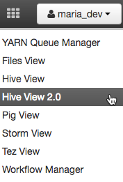
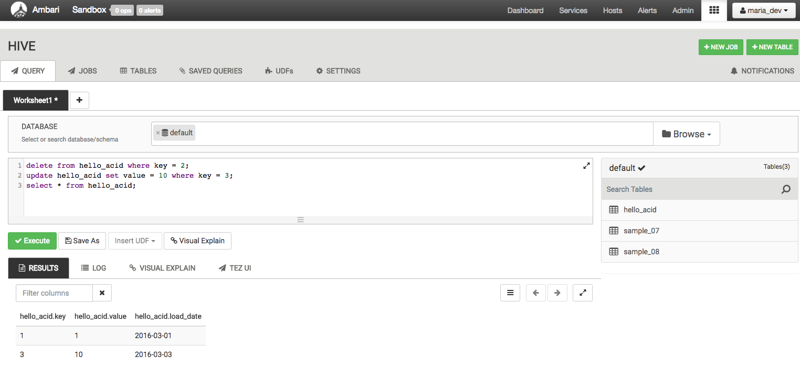

# Using Hive ACID Transactions to Insert, Update and Delete Data

## Introduction

Hadoop is gradually playing a larger role as a system of record for many workloads. Systems of record need robust and varied options for data updates that may range from single records to complex multi-step transactions.

Some reasons to perform updates may include:

- Data restatements from upstream data providers.
- Data pipeline reprocessing.
- Slowly-changing dimensions (e.g. SCD Type 1)
- Dimension history / evolution (e.g. SCD Type 2)

Standard SQL provides ACID operations through INSERT, UPDATE, DELETE, transactions, and the more recent MERGE operations. These have proven to be robust and flexible enough for most workloads. Hive offers INSERT, UPDATE and DELETE, with more of capabilities on the roadmap.

## Prerequisites

-   [Download Hortonworks Sandbox](https://hortonworks.com/downloads/#sandbox)
-   Complete the [Learning the Ropes of the Hortonworks Sandbox tutorial,](https://hortonworks.com/tutorial/learning-the-ropes-of-the-hortonworks-sandbox/) you will need it for logging into Ambari.

## Outline

-   [Concepts](#concepts)
-   [1. Enabling ACID Transactions using Ambari](#enable-acid)
-   [2. Hello ACID: Create a Partitioned ACID Table and Insert some Data](#hello-acid)
-   [3. Streaming Data Ingestion](#streaming-ingestion)
-   [4. Practical Uses of SQL ACID](#sql-acid)
-   [5. Overwriting Existing Records with New Records](#overwriting-records)
-   [6. Operational Tools for ACID](#operational-tools)
-   [7. Real-World Performance Considerations](#real-world)
-   [8. For Experts Only](#experts-only)

## Concepts

- **Transactional Tables**: Hive supports single-table transactions. Tables must be marked as transactional in order to support UPDATE and DELETE operations.
- **Partitioned Tables**: Hive supports table partitioning as a means of separating data for faster writes and queries. Partitions are independent of ACID. Large tables in Hive are almost always partitioned. Large ACID tables should be partitioned for optimal performance.
- **ACID Operations (INSERT / UPDATE / DELETE)**: Standard SQL commands that allow data inserts, updates and deletes.
- **Primary Key**: Databases use primary keys to make records easy to locate, which facilitates updates or deletes. Hive does not enforce the notion of primary keys, but if you plan to do large-scale updates and deletes you should establish a primary key convention within your application.
- **Streaming Ingest**: Data can be streamed into transactional Hive tables in real-time using Storm, Flume or a lower-level direct API.
- **Optimistic Concurrency**: ACID updates and deletes to Hive tables are resolved by letting the first committer win. This happens at the partition level, or at the table level for unpartitioned tables.
- **Compactions**: Data must be periodically compacted to save space and optimize data access. It is best to let the system handle these automatically, but these can also be scheduled in an external scheduler.

## 1. Enabling ACID Transactions using Ambari 

Log in to Ambari using user credentials **raj_ops/raj_ops**. Enabling Hive ACID is simple: **Ambari** -> **Hive** -> **Configs**. Set **ACID Transactions** to **On**. Restart all affected services.

Let’s explore these options:

* **ACID Transactions** - Turn this on to enable the creation of transactional tables globally.
* **Run Compactor** - The “Run Compactor” setting should always be set to true.
* **Number of threads used by Compactor** - This controls the maximum number of background MapReduce jobs that may run at any given time to compact tables. It is best to have this be a ratio of the number of transactional tables that are actively updated. In any event the value should always be greater than 0. Typically 5 to 10 would be appropriate in production settings. 1 thread is only applicable for sandbox environments.

If you’re building a production application you can use Ambari Blueprints to provision ACID-enabled HDP clusters in a consistent and repeatable way.

## 2. Hello ACID: Create a Partitioned ACID Table and Insert some Data 

This section is written assuming you will use the Hive View within Ambari. Log out of Ambari from **raj_ops** user and re login with credentials **maria_dev/maria_dev**.
When you have logged into Ambari, go to the Hive View 2.0 by hovering in the top right and selecting Hive View.

Let’s start by creating a transactional table. Only transactional tables can support updates and deletes. Within the Hive View query editor insert this query text:

~~~sql
drop table if exists hello_acid;
create table hello_acid (key int, value int)
partitioned by (load_date date)
clustered by(key) into 3 buckets
stored as orc tblproperties ('transactional'='true');
~~~

Within the editor it will look as below. Press `Execute` to create the table.

From here on out, everything is familiar SQL you’ve likely used for many years. Here is an example that inserts some records, deletes one record and updates one record.

~~~sql
insert into hello_acid partition (load_date='2016-03-01') values (1, 1);
insert into hello_acid partition (load_date='2016-03-02') values (2, 2);
insert into hello_acid partition (load_date='2016-03-03') values (3, 3);
select * from hello_acid;
~~~

You should see the following results:

Next let’s delete and update data in the same window execution:

~~~sql
delete from hello_acid where key = 2;
update hello_acid set value = 10 where key = 3;
select * from hello_acid;
~~~

You should see this:

This example shows the most basic ways to add data into a Hive table using INSERT, UPDATE and DELETE commands. Later we will see some more powerful ways of adding data to an ACID table that involve loading staging tables and using INSERT, UPDATE or DELETE commands, combined with subqueries, to manage data in bulk.

These DML commands are designed to deal with large amounts of data in a microbatch manner. These DML statements should not be used for record-level data management. If you have small batches of constantly arriving, you should use Streaming Data Ingestion instead.

## 3. Streaming Data Ingestion 

Many organizations have continuous data streams and would like easy ways of running complex SQL analytics on these streams. Hive provides streaming data ingestion that to make this easy by automatically landing streaming data into Hive tables and supporting simultaneous ingest and query.

Broadly there are 2 options for using Hive Streaming Data Ingestion:

1. Use an existing [Storm Hive Bolt](https://github.com/apache/storm/tree/master/external/storm-hive) or [Flume Hive Sink](https://flume.apache.org/FlumeUserGuide.html#hive-sink) integration. This route is relatively simple but also relatively “buttoned up”, focusing on moving data from point A to point B with minimal processing.
2. Use the low-level [Streaming Data Ingest API](https://cwiki.apache.org/confluence/display/Hive/Streaming+Data+Ingest) directly.

Before you use the streaming API you must create a partitioned transactional table and use it as your sink. From a query perspective everything else is identical. The rest of this document will focus on using the SQL DDL/DML approach.

## 4. Practical Uses of SQL ACID 

Inserting a couple of records helps to get acquainted but in a real setting you need to deal with thousands or millions of records at a time. This section discusses how to get deal with data batches across a number of common scenarios.

These patterns require you to establish a primary key. Hive does not enforce primary key uniqueness, you will need to do this in your application. Although Hive 2.1 introduced the notion of non-validating foreign key relationships. There are currently no integrity checks enforced by the system.

### 4.1 Searched Updates

Hive ACID supports searched updates, which are the most typical form of updates. It is important to realize that, based on Hive ACID’s architecture, updates must be done in bulk. Doing row-at-a-time updates will not work at any practical scale. Searched updates can work well when you’re doing a first pass to update a large number of records in a fixed way.

For example let’s consider a dimension table which includes a flag to indicate whether the record is the most current value. This allows tracking a dimension’s evolution over time, a common strategy for dealing with slowly-changing dimensions (SCDs). When a set of dimension table updates arrive you want to mark all existing values as old. This is easy to do with an in list and subquery on a common key.

~~~
drop table if exists mydim;
create table mydim (key int, name string, zip string, is_current boolean)
clustered by(key) into 3 buckets
stored as orc tblproperties ('transactional'='true');
~~~

~~~
insert into mydim values
  (1, 'bob',   '95136', true),
  (2, 'joe',   '70068', true),
  (3, 'steve', '22150', true);
~~~

~~~
drop table if exists updates_staging_table;
create table updates_staging_table (key int, newzip string);
insert into updates_staging_table values (1, 87102), (3, 45220);
~~~

-- **Before**

~~~
select * from mydim;
~~~

~~~
update mydim set is_current=false
  where mydim.key in (select key from updates_staging_table);
~~~

-- **After**

~~~
select * from mydim;
~~~

The result will be that records 1 and 3 have their is_current flag set to false. From there we can add the new, updated values to the end of the table with their is_current flag set to true.

### 4.2 Searched Deletes

Bulk deletes can be done easily with a staging table and in list + subquery. This requires you have a common key between the tables, similar to how you would use a primary key in RDBMS.

Example:

~~~
delete from mydim
where mydim.key in (select key from updates_staging_table);
select * from mydim;
~~~

## 5. Overwriting Existing Records with New Records 

There are situations where you need to update a batch of records to a new set of values. For example, Type 1 SCD updates or restatements of inaccurate data. Hive now supports [SQL MERGE](https://cwiki.apache.org/confluence/display/Hive/LanguageManual+DML#LanguageManualDML-Merge), which will make this task easy.

## 6. Operational Tools for ACID 

ACID transactions create a number of locks during the course of their operation. Transactions and their locks can be viewed using a number of tools within Hive.

### 6.1 Seeing Transactions:

~~~
show transactions;
~~~

This command shows active and aborted transactions. Here is some example output:

### 6.2 Seeing Locks:

~~~
show locks;
~~~

This command shows locks, along with their associated transaction IDs. Example:

Locks can be Read, Update or X locks. Update lock is compatible with Read locks but not other updates. X is not compatible with anything.

### 6.3 Aborting Transactions:

~~~sql
ABORT TRANSACTIONS transactionID;
~~~

It may be necessary to abort a transaction, for example because a transaction is running too long. You can abort a set of transactions using “abort transactions” followed by a list of numeric transaction IDs. Note that aborting a transaction won’t kill the related query immediately. Instead ACID queries periodically heartbeat, every 2.5 minutes by default, and if they detect their underlying transaction has been aborted they will exit at that time.

## 7. Real-World Performance Considerations 

These performance tips will help you survive in the real world:

1\. Partition your data. Hive compactions are not tiered: major compactions re-write all data in modified partitions, one partition at a time. Partitioning data is essential to ensure you can manage large datasets without degradation. Partitioning by date is the most common approach.

2\. Inserts are fast, updates and deletes are relatively slower. Updates and deletes perform full partition scans. Plan for this by batching data appropriately.

3\. If your workload includes a large number of updates and deletes, compact regularly. Your total data size will grow until you compact, and analytical queries will slowly degrade until compaction is done.

## 8. For Experts Only 

In the real world things go wrong. When things go wrong you need options for creative solutions. At Hortonworks we have used the information in this section to get past some very tricky problems. Warning: Improper application of this information may cause data corruption or permanent data loss. Ensure you fully understand the system before using this information, test it out on data you can afford to lose and always backup any data you really care about.

ACID tables have a hidden column called row__id. You should consider this column a system internal and assume that its name or even its presence may change at any time without warning. You should not build a long-term solution on top of this column, only use it to get you past a tough spot.

With that out of the way, this column records:
1. The transactionid that was active when the data was inserted or updated.
2. The bucketid, the bucket number where the data lives.
3. The rowid, the rowid within this transaction/bucket combo.

You can access this data as follows using beeline:

~~~
0: jdbc:hive2://sandbox.hortonworks.com:2181/> select row__id from hello_acid;
~~~

Ouptut should look like:

~~~
+---------------------------------------------+
|                   row__id                   |
+---------------------------------------------+
| {"transactionid":5,"bucketid":1,"rowid":0}  |
| {"transactionid":7,"bucketid":0,"rowid":0}  |
+---------------------------------------------+
~~~

A common need is to confirm that all records were ingested. Let’s say your upstream provider insists data is missing in Hive. Your provider (e.g. Storm Bolt) can tell you the transaction ID used to insert data. You can count the actual records using the transactionid. Replace X with your transactionid:

~~~
set hive.optimize.ppd=false;
select count(*) from hello_acid where row__id.transactionid = X;
~~~

Keep in mind that data from this transaction may have been deleted by a subsequent UPDATE or DELETE statement, so if the counts don’t match, consider if records may be altered some other way.

Use information related to this hidden field very carefully.
