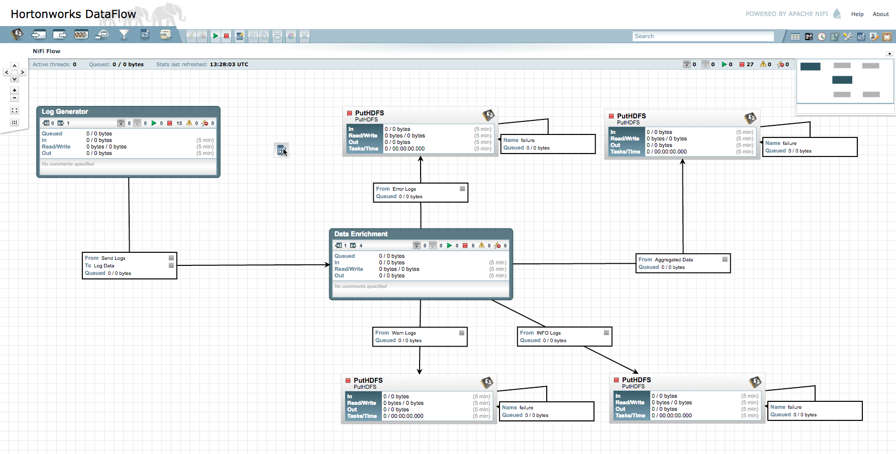
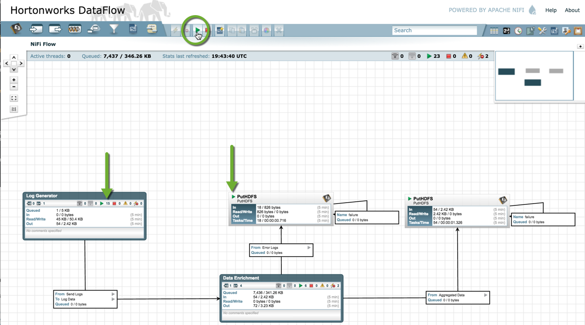

# Refine and Visualize Server Log Data

Security breaches happen. And when they do, your server logs may be your best line of defense. Hadoop takes server-log analysis to the next level by speeding and improving security forensics and providing a low cost platform to show compliance.

In this demo, we demonstrate how an enterprise security breach analysis and response might be performed.

<!--<iframe width="700" height="394" src="https://www.youtube.com/embed/BPC_mClNSXk?feature=oembed" frameborder="0" allowfullscreen="" id="player0"></iframe>-->

### In this tutorial, learn how to:

*   Stream server logs into Hadoop with [Hortonworks Dataflow](http://hortonworks.com/hdf/) powered by **Apache NiFi**
*   Use [Hive](http://hortonworks.com/hadoop/hive) to build a relational view of the data
*   Use [Pig](http://hortonworks.com/hadoop/pig) to query and refine the data
*   Use Elastic Search for high-level visualization
*   Import the data into Microsoft Excel with the [ODBC connector](http://hortonworks.com/products/hdp-2/#add_ons)
*   Visualize data with Powerview
*   Use [Oozie](http://hortonworks.com/hadoop/oozie) to automatically update a firewall
*   Visualize the data with [Apache Zeppelin](http://hortonworks.com/hadoop/zeppelin)

This Hadoop tutorial can be performed with the [Hortonworks Sandbox](http://hortonworks.com/products/sandbox) – a single-node Hadoop cluster running in a virtual machine. Download to run this and other tutorials in the series. The tutorial presented here is for Sandbox v2.0

## Background

### Server Log Data

Server logs are computer-generated log files that capture network and server operations data. They are useful for managing network operations, especially for security and regulatory compliance.

### Potential Uses of Server Log Data

IT organizations use server log analysis to answer questions about:

*   **Security** – For example, if we suspect a security breach, how can we use server log data to identify and repair the vulnerability?
*   **Compliance** – Large organizations are bound by regulations such as HIPAA and Sarbanes-Oxley. How can IT administrators prepare for system audits?

In this tutorial, we will focus on a network security use case. Specifically, we will look at how Apache Hadoop can help the administrator of a large enterprise network diagnose and respond to a distributed denial-of-service attack.

### What Is Hortonworks Dataflow and Apache NiFi?

**Apache NiFi** is a secure integrated platform for real time data collection, simple event processing, transport and delivery from source to storage. It is useful for moving distributed data to and from your Hadoop cluster. NiFi has lots of distributed processing capability to help reduce processing cost and get real-time insights from many different data sources across many large systems and can help aggregate that data into a single, or many different places.

**NiFi** lets users get the most value from their data. Specifically NiFi allows users to:

- Stream data from multiple source
- Collect high volumes of data in real time
- Guarantee delivery of data
- Scale horizontally across many machines

**How NiFi Works**. NiFi's high-level architecture is focused on delivering a streamlined interface that is easy to use and easy to set up. There is a little bit of terminology that are an integral part to understanding how NiFi works.

- **Processor**: Processors in NiFi are what makes the data move. Processors can help generate data, run commands, move data, convert data, and many many more. NiFi's architecture and feature set is designed to be extended these processors. They are at the very core of NiFi's functionality.
- **Processing Group**: When data flows get very complex, it can be very useful to group different parts together which perform certain functions. NiFi abstracts this concept and calls them processing groups.
- **FlowFile**: A FlowFile in NiFi represents just a single piece of data. It is made of different parts. **Attributes** and **Contents**. Attributes help give the data context which are made of key-value pairs. Typically there are 3 attributes which are present on all FlowFiles: **uuid**, **filename**, and **path**
- **Connections** and **Relationships**: NiFi allows users to simply drag and drop connections between processors which controls how the data will flow. Each connection will be assigned to different types of relationships for the FlowFiles (such as successful processing, or a failure to process)

A FlowFile can originate from a processor in NiFi. Processors can also receive the flowfiles and transmit them to many other processors. These processors can then drop the data in the flowfile into various places depending on the function of the processor.

### Prerequisites:

- Hortonworks Sandbox (installed and running)
- A copy of Hortonworks DataFlow - [Download here](http://hortonworks.com)
- Hortonworks ODBC driver installed and configured – See Tutorial "Installing and Configuring the Hortonworks ODBC Driver"
- Microsoft Excel 2013 Professional Plus (optional)
  - Note, Excel 2013 is not available on a Mac. However, you can still connect the Sandbox to your version of Excel via the ODBC driver, and you can explore the data through the standard charting capabilities of Excel.
- If you'd like to use Tableau to explore the data, please see this HOWTO on the Hortonworks website: [HOWTO: Connect Tableau to the Hortonworks Sandbox](http://hortonworks.com/kb/how-to-connect-tableau-to-hortonworks-sandbox/)
- Server log tutorial files (included in this tutorial)

**Notes:**

- In this tutorial, the Hortonworks Sandbox is installed on an Oracle VirtualBox virtual machine (VM).
- Install the ODBC driver that matches the version of Excel you are using (32-bit or 64-bit).
- In this tutorial, we will use the Power View feature in Excel 2013 to visualize the server log data. Power View is currently only available in Microsoft Office Professional Plus and Microsoft Office 365 Professional Plus.
- We're going to install Hortonworks DataFlow on the Sandbox, so you'll need to download the latest release on the 

### Overview

To refine and visualize server log data, we will:

- Download and configure the script which will generate our server log data
- Install, configure, and start Hortonworks DataFlow
- Generate the server log data.
- Import the server log data into Excel.
- Visualize the server log data using Excel Power View and Apache Zeppelin.

* * *

## Step 1: Download and the Script to Generate Log Data

We'll be using a python script to generate the server log data. SSH into the sandbox with the command

~~~
ssh root@localhost -p 2222
~~~

**Default Sandbox Login**

| username | password |
|----------|----------|
| root | hadoop |

Or you can choose to use the Sandbox's built-in Web-based SSH terminal **Shell-In-A-Box** which can be accessed at [http://sandbox.hortonworks.com:4200](http://sandbox.hortonworks.com:4200)

Remember the username is `root` and the password is `hadoop`.

After you log in, the command prompt will appear with the prefix `[root@Sandbox \~]\#:`

Then execute:

~~~
wget https://raw.githubusercontent.com/hortonworks/tutorials/%2370-revamp-refine-analyze-server-log-data/assets/server-logs/scripts/generate_logs.py
~~~

An exmaple for the output of these commands is below

* * *

## Step 2 – Configure and Install Hortonworks DataFlow

First thing's you'll need to do is to make sure you've [downloaded the gzipped version of Hortonworks DataFlow](http://hortonworks.com/hdp/downloads/#hdf)

Once you've downloaded HDF let's get it on the sandbox. If you're on a Mac or Unix system with the scp command available on your terminal you can simply run

~~~
scp -P 2222 $HDF_DOWNLOAD root@localhost:/root/
~~~

If you're on a windows system you can use the program [WinSCP](https://winscp.net/eng/index.php) to transfer files to the Sandbox.

After sending the HDF file to the Sandbox make sure you SSH into the Sandbox **using the instructions from step 1**.

Now that we have SSH'd into the sandbox we can run the following set of commands to set up and install HDF.

You can copy and paste these commands below, just make sure to **first set the correct `HDF_FILE` and `HDF_VERSION` environment variables** for the version of HDF that you downloaded.

~~~
export HDF_FILE=HDF-1.2.0.0-91.tar.gz
export HDF_VERSION=HDF-1.2.0.0
cd /root
mkdir hdf
mv $HDF_FILE ./hdf
cd hdf
tar -xvf $HDF_FILE
cd $HDF_VERSION/nifi
sed -i s/nifi.web.http.port=8080/nifi.web.http.port=6434/g conf/nifi.properties
cd bin/
sh nifi.sh install
cd ~
~~~

Great! HDF is now set up for our needs. You can now start NiFi with the following command:

~~~
service nifi start
~~~

First, we'll need to open up the NiFi interface in our web browser. During installation we set the port that NiFi listens on to `6434`. You'll need to forward this port in the virtual machine settings.

For a guide on forwarding a port on your VM please [see the guide in this tutorial](http://hortonworks.com/hadoop-tutorial/how-to-refine-and-visualize-sentiment-data/)

After forwarding port `6434` for NiFi you should be able to access the interface at [https://localhost:6434/nifi](https://localhost:6434/nifi)

It should look something like below:

## Step 3: Import the Flow

We're going to import a pre-made data flow from a template which you can [**download here**](/assets/server-logs/ServerLogGenerator.xml).

Use the NiFi inteface to upload the flow, and then drag it onto your workspace.

Once you've uploaded the template into NiFi you can instantiate it by dragging the template icon onto the screen. It will ask you to select your template's name and the flow will appear as in the image below.

* * *

## Step 4: Generate the Server Log Data

Now that you've imported the data flow and everything it set up, simply click the **Run** at the top of the screen. (Make you you haven't selected a specific processor, or  else only one of the processors will start)

Now that everything is running we can check in the places where we see the data being deposited in HDFS.

Log into the Ambari interface which can be found at [http://localhost:8080](http://localhost:8080)

Open up the **HDFS Files** view, and then navigate to `/tmp/server-logs/`. Files should start appearing a few seconds after you start the flow. You can click on them to view the content.

*   Next we will create an Hive table from the log file.

Open the Ambari UI and head to the views dropdown list. Select **Hive** and then past the following query.

	CREATE TABLE FIREWALL_LOGS(time STRING, ip STRING, country STRING, success BOOLEAN)
	ROW FORMAT DELIMITED
	FIELDS TERMINATED BY '|' 
	LOCATION '/tmp/server-logs';

**Note** if the query doesn't run successfully due to a permissions error you then you might need to update the permission on the directory. Run the following commands over SSH on the Sandbox

    sudo -u hdfs hadoop fs -chmod -R 777 /tmp
    sudo -u hdfs hadoop fs -chown -R admin /tmp

When the table has been created you should now be able to query the data table for data using a query like 

    Select * from FIREWALL_LOGS LIMIT 100;

* * *

## Step 5: Import the Server Log Data into Excel

In this section, we will use Excel Professional Plus 2013 to access the generated server log data. Note: if you do not have Excel 2013, you can still bring the data into other versions of Excel and explore the data through other charts. The screens may be slightly different in your version, but the actions are the same. You can complete Step 5 and then explore the data on your own.

*   In Windows, open a new Excel workbook, then select **Data > From Other Sources > From Microsoft Query**.

*   On the Choose Data Source pop-up, select the Hortonworks ODBC data source you installed previously, then click **OK**.

    The Hortonworks ODBC driver enables you to access Hortonworks data with Excel and other Business Intelligence (BI) applications that support ODBC.

*   After the connection to the Sandbox is established, the Query Wizard appears. Select the "firewall_logs" table in the Available tables and columns box, then click the right arrow button to add the entire "firewall_logs" table to the query. Click **Next** to continue.

*   On the Filter Data screen, click **Next** to continue without filtering the data.

*   On the Sort Order screen, click **Next** to continue without setting a sort order.

*   Click **Finish** on the Query Wizard Finish screen to retrieve the query data from the Sandbox and import it into Excel.

*   On the Import Data dialog box, click **OK** to accept the default settings and import the data as a table.

*   The imported query data should then appear in the Excel workbook.

Now that we have successfully imported Hortonworks Sandbox data into Microsoft Excel, we can use the Excel Power View feature to analyze and visualize the data.

* * *

## Step 6: Visualize the Sentiment Data Using Excel Power View

Data visualization can help you analyze network data and determine effective responses to network issues. In this section, we will analyze data for a denial-of-service attack:

*   Review the network traffic by country
*   Zoom in on one particular country
*   Generate a list of attacking IP addresses

We'll start by reviewing the network traffic by country.

*   In the Excel worksheet with the imported "<firewall_logs>" table, select **Insert > Power View** to open a new Power View report. (note: if this is your first time running PowerView it will prompt you to [install Silverlight](#Excel%20configuration%20for%20PowerView).

*   The Power View Fields area appears on the right side of the window, with the data table displayed on the left.

    Drag the handles or click the Pop Out icon to maximize the size of the data table, and close the Filters area.

*   In the Power View Fields area, clear checkboxes next to the **ip** and **time** fields, then click **Map** on the Design tab in the top menu. (**Note:** If you do not get data plotted on your map look at [Geolocation of data using Bing](#Geolocation%20of%20data%20using%20Bing))

*   Drag the **status** field into the **SIZE** box.

*   The map view displays a global view of the network traffic by country. The color orange represents successful, authorized network connections. Blue represents connections from unauthorized sources.

*   Let's assume that recent denial-of-service attacks have originated in Pakistan. We can use the map controls to zoom in and take a closer look at traffic from that country.

    It's obvious that this is a coordinated attack, originating from many countries. Now we can use Excel to generate a list of the unauthorized IP addresses.

*   Use the tabs at the bottom of the Excel window to navigate back to the Excel worksheet with the imported "<firewall_logs>" table.

    Click the arrow next to the **status** column header. Clear the **Select all** check box, select the **ERROR** check box, then click **OK**.

*   Now that we have a list of the unauthorized IP addresses, we can update the network firewall to deny requests from those attacking IP addresses.

We've shown how the Hortonworks Data Platform can help system administrators capture, store, and analyze server log data. With real-time access to massive amounts of data on the Hortonworks Data Platform, we were able to block unauthorized access, restore VPN access to authorized users.

With log data flowing continuously into the Hortonworks Data Platform "data lake," we can protect the company network from similar attacks in the future. The data can be refreshed frequently and accessed to respond to security threats, or to prepare for compliance audits.

----

### Visualize Server Log Data with Apache Zeppelin

First, make sure that the Apache Zeppelin service is started in Ambari. Then use the **Views Dropdown Menu** and select the Zeppelin View.

You should be greeted by the following screen where you can choose to view notes, or create a new one.

You can choose to import the note from this tutorial using the following URL:

	https://raw.githubusercontent.com/hortonworks/tutorials/hdp-2.4/data/zeppelin-notes/FlumeServerLogs.json
	
Once you've opened the note you can use the following commands to generate charts to visualize the data

	%hive
	select country from firewall_logs
	
and

	%hive
	select time, country from firewall_logs

