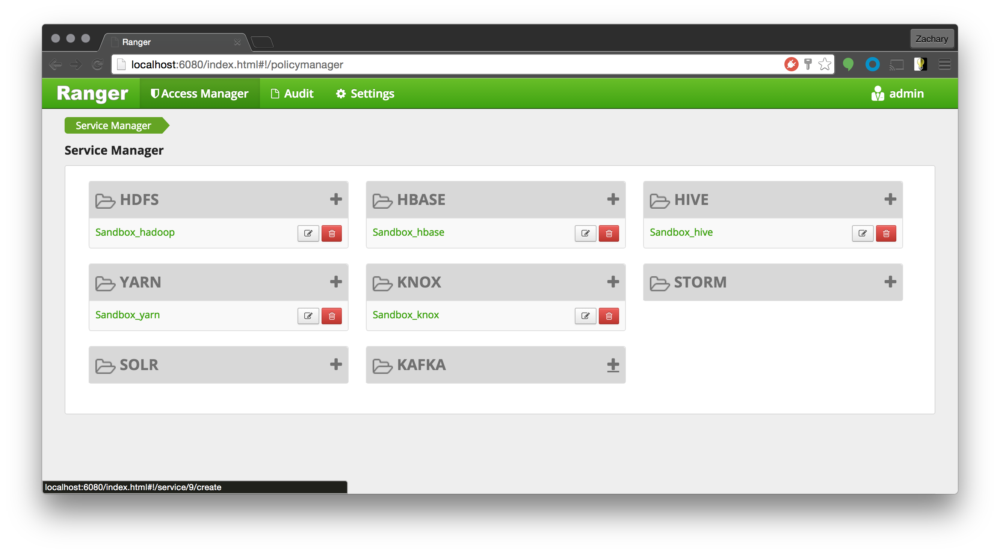
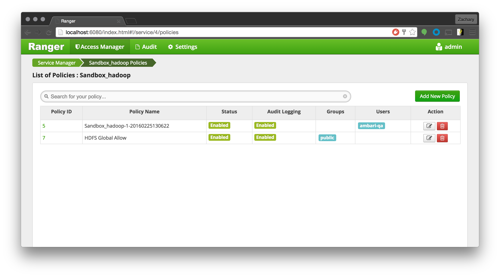
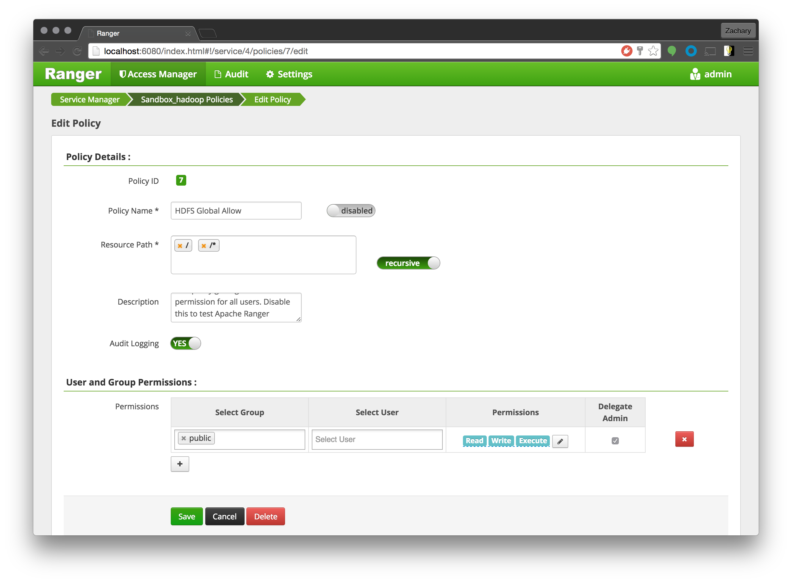
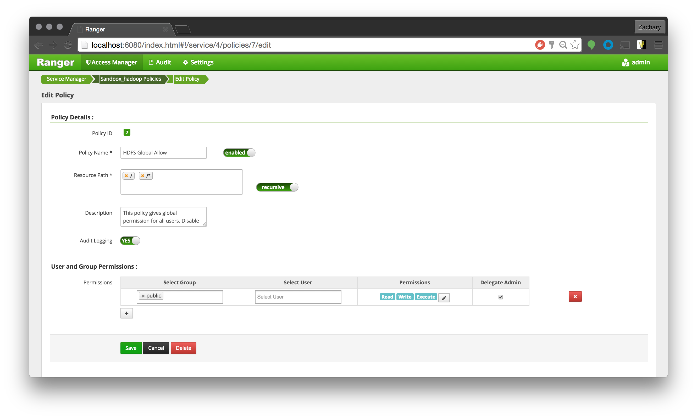
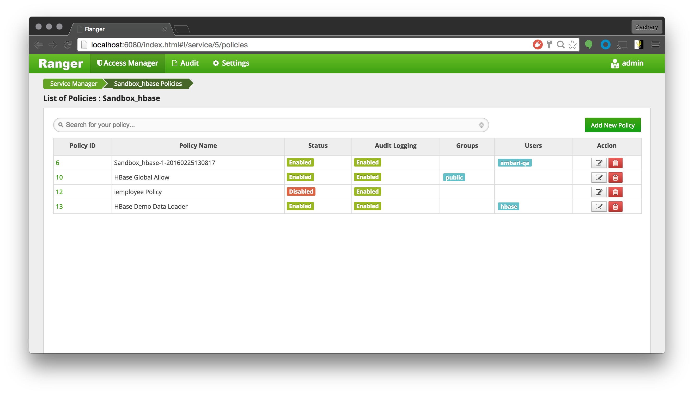

### Introduction

In this tutorial we will explore how you can use policies in Apache Ranger to protect your enterprise data lake and audit access by users to resources on HDFS, Hive and HBase from a centralized Ranger Administration Console.

### Prerequisite

*   VirtualBox
*   Download [Hortonworks Sandbox](http://hortonworks.com/products/hortonworks-sandbox/#install)

After you download the VM, import the .ova file to VirtualBox and run the VM.

You can also choose to get running

### Login to the Ranger Administration Console

Once the VM is running in VirtualBox, login to the Ranger Administration console at [http://localhost:6080/](http://localhost:6080/) from your host machine. The username is `admin` and the password is `admin`

As soon as you login, you should see list of repositories as shown below:  

### Review existing HDFS policies

Please click on `Sandbox_hadoop` link under HDFS section

User can review policy details by a single click on the policy. The policy details will appear on the right.

Click on the **HDFS Global Allow** policy. Click the slider so it is in **disable** position. Then click **Save**.

### Exercise HDFS access scenarios

To validate the policy, please login into the sandbox using username `it1`. User `it1` belongs to the `IT` group.

Login to the Sandbox VM.

You can SSH:

    ssh -p 2222 root@127.0.0.1

Or you could choose to use the VirtualBox Shell

use the password `hadoop`.

Try running the following commands:

	su it1
	id
	hdfs dfs -cat /demo/data/Customer/acct.txt
	
You should get a result similar to the following
	
	[root@sandbox ~]# su - it1
	[it1@sandbox ~]$ id uid=1018(it1)  gid=1018(IT)  groups=1018(IT)
	[it1@sandbox ~]$ hdfs dfs -cat /demo/data/Customer/acct.txt
	cat:  Permission denied:  user=it1,  access=READ,  inode="/demo/data/Customer/acct.txt":hdfs:hdfs:-rwx------

Go to the Auditing Tab and check that its access (denied) being audited. You can filter

Now, go back to the HDFS Global Allow Policy. Click the switch to enable it and try running the command again

	hdfs dfs -cat /demo/data/Customer/acct.txt

You should be greeted with many rows of data after running the command with the policy enabled.

Now head back to the audit tab in Ranger and search by user: `it1`. Here you can see that the request was Allowed through

### Review Hive Policies

Click on PolicyManager section on the top menu, then click on `Sandbox_hive` link under HIVE section to view list of Hive Policies

User can review policy details by a single click on the policy. The policy details will appear on the right.

_Disable_ the **Hive Global Tables Allow Policy** like

### Exercise Hive Access Scenarios

Run the `beeline` command to validate access for `mktg1` user to see if he can run `select  *  from  xademo.customer_details`

You can copy and paste the following commands to start beeline:

Make sure you first run `exit` to log out of the `it1` user, then run the following:

	su mktg1
	beeline -u "jdbc:hive2://localhost:10000/default" -n mktg1 -p mktg1 -d org.apache.hive.jdbc.HiveDriver
	
Then once beeline is started run:

	select * from xademo.customer_details

You should get an error like:

	0: jdbc:hive2://localhost:10000/default> select * from xademo.customer_details;
	Error: Error while compiling statement: FAILED: HiveAccessControlException Permission denied: user [mktg1] does not have [SELECT] privilege on [xademo/customer_details/balance,imei,phone_number,plan,rec_date,region,status] (state=42000,code=40000)

Go to Policy Administrator tool and see its access (denied) being audited. You can do this the same way that we checked for the `it1` user. Just search the audit log by user to see.

Re-Enable the **Global Hive Tables Allow** policy. Then try running the same beeline command again.

Go to Policy Administrator tool and see its access (granted) being audited.

### Review HBase Policies

Click on PolicyManager section on the top menu, then click on the `Sandbox_hbase` link under **HBASE** section to view list of hbase Policies

User can review policy details by a single click on the policy. The policy details will appear on the right.

Disable the **HBase Global Allow** Policy in the same manner that we did before.

### Exercise HBase access scenarios

Log out of user `mktg1` by typing `exit` into the terminal. Make sure that the prompt shows `[root@sandbox ~]#`. Run the following command to start HBasew

	./start_hbase.sh
	
You will get something like:

	[root@sandbox ~]# ./start_hbase.sh
	Starting HBase...
	Starting Postgre SQL                                      [  OK  ]
	Starting name node                                        [  OK  ]
	Starting zookeeper nodes                                  [  OK  ]
	Starting hbase master                                     [  OK  ]
	Starting hbase stargate                                   [  OK  ]
	Starting hbase thrift                                     [  OK  ]
	Starting hbase regionservers                              [  OK  ]
	====================================

	HBase autostart enabled
	To disable auto-start of HBase do
	  # chkconfig hbase-starter off

	====================================

Run the hbase shell command to validate access for `it1` user-id, who belongs to `IT` group to see if he can view table data from the `iemployee` table:
w
	su it1
	hbase shell
	
Once at the HBase Shell, run:

	get 'iemployee', '1'

You should get a message similar to:

	COLUMN                      CELL

	ERROR: org.apache.hadoop.hbase.security.AccessDeniedException: Insufficient permissions for user ‘it1',action: get, tableName:iemployee, family:payroll.

	Here is some help for this command:
	Get row or cell contents; pass table name, row, and optionally
	a dictionary of column(s), timestamp, timerange and versions. Examples:

	  hbase> get 'ns1:t1', 'r1'
	  hbase> get 't1', 'r1'
	  hbase> get 't1', 'r1', {TIMERANGE => [ts1, ts2]}
	  hbase> get 't1', 'r1', {COLUMN => 'c1'}
	  hbase> get 't1', 'r1', {COLUMN => ['c1', 'c2', 'c3']}
	  hbase> get 't1', 'r1', {COLUMN => 'c1', TIMESTAMP => ts1}
	  hbase> get 't1', 'r1', {COLUMN => 'c1', TIMERANGE => [ts1, ts2], VERSIONS => 4}
	  hbase> get 't1', 'r1', {COLUMN => 'c1', TIMESTAMP => ts1, VERSIONS => 4}
	  hbase> get 't1', 'r1', {FILTER => "ValueFilter(=, 'binary:abc')"}
	  hbase> get 't1', 'r1', 'c1'
	  hbase> get 't1', 'r1', 'c1', 'c2'
	  hbase> get 't1', 'r1', ['c1', 'c2']
	  hbase> get 't1', 'r1', {COLUMN => 'c1', ATTRIBUTES => {'mykey'=>'myvalue'}}
	  hbase> get 't1', 'r1', {COLUMN => 'c1', AUTHORIZATIONS => ['PRIVATE','SECRET']}
	  hbase> get 't1', 'r1', {CONSISTENCY => 'TIMELINE'}
	  hbase> get 't1', 'r1', {CONSISTENCY => 'TIMELINE', REGION_REPLICA_ID => 1}

	Besides the default 'toStringBinary' format, 'get' also supports custom formatting by
	column.  A user can define a FORMATTER by adding it to the column name in the get
	specification.  The FORMATTER can be stipulated:

	 1. either as a org.apache.hadoop.hbase.util.Bytes method name (e.g, toInt, toString)
	 2. or as a custom class followed by method name: e.g. 'c(MyFormatterClass).format'.

	Example formatting cf:qualifier1 and cf:qualifier2 both as Integers:
	  hbase> get 't1', 'r1' {COLUMN => ['cf:qualifier1:toInt',
	    'cf:qualifier2:c(org.apache.hadoop.hbase.util.Bytes).toInt'] }

	Note that you can specify a FORMATTER by column only (cf:qualifier).  You cannot specify
	a FORMATTER for all columns of a column family.

	The same commands also can be run on a reference to a table (obtained via get_table or
	create_table). Suppose you had a reference t to table 't1', the corresponding commands
	would be:

	  hbase> t.get 'r1'
	  hbase> t.get 'r1', {TIMERANGE => [ts1, ts2]}
	  hbase> t.get 'r1', {COLUMN => 'c1'}
	  hbase> t.get 'r1', {COLUMN => ['c1', 'c2', 'c3']}
	  hbase> t.get 'r1', {COLUMN => 'c1', TIMESTAMP => ts1}
	  hbase> t.get 'r1', {COLUMN => 'c1', TIMERANGE => [ts1, ts2], VERSIONS => 4}
	  hbase> t.get 'r1', {COLUMN => 'c1', TIMESTAMP => ts1, VERSIONS => 4}
	  hbase> t.get 'r1', {FILTER => "ValueFilter(=, 'binary:abc')"}
	  hbase> t.get 'r1', 'c1'
	  hbase> t.get 'r1', 'c1', 'c2'
	  hbase> t.get 'r1', ['c1', 'c2']
	  hbase> t.get 'r1', {CONSISTENCY => 'TIMELINE'}
	  hbase> t.get 'r1', {CONSISTENCY => 'TIMELINE', REGION_REPLICA_ID => 1}
	  
	  
	  
Now go ahead and re-enable the **HBASE Global Allow** policy. Run the same command at the hbase shell

	get 'iemployee', '1'
	
Then you should get an output like:

	hbase(main):016:0> get 'iemployee', '1'
	COLUMN                      CELL
	 insurance:dental           timestamp=1456405966724, value=metlife
	 insurance:health           timestamp=1456405966696, value=anthem
	 insurance:life             timestamp=1456405966778, value=metlife
	 insurance:vision           timestamp=1456405966751, value=visionOne
	 payroll:grade              timestamp=1456405966585, value=G16
	 payroll:salary             timestamp=1456405966613, value=250000.00
	 personal:city              timestamp=1456405966479, value=San Fransisco
	 personal:fname             timestamp=1456405966352, value=Mike
	 personal:lname             timestamp=1456405966436, value=Young
	 personal:zip               timestamp=1456405966553, value=12345
	 skills:interpersonal-ratin timestamp=1456405966669, value=medium
	 g
	 skills:management          timestamp=1456405966642, value=executive,creator,innovative
	12 row(s) in 0.0280 seconds

Don't forget to check the audit logs for this too!

### Summary

Hopefully by following this tutorial, you got a taste of the power and ease of securing your key enterprise resources using Apache Ranger.

Happy Hadooping!!!